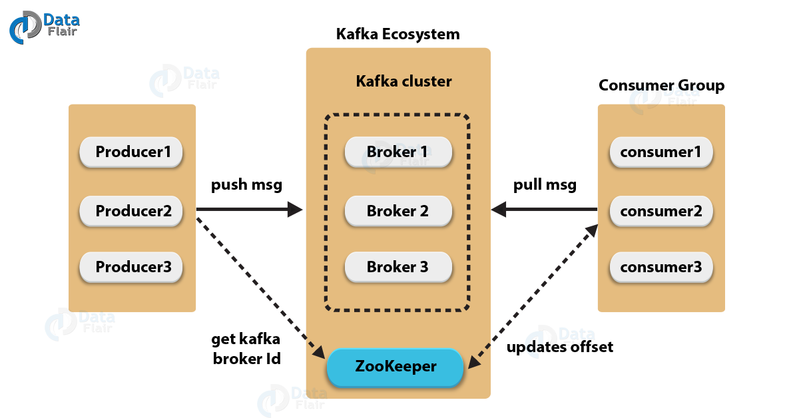

# Kafka

## 카프카 아키텍처

    1. 프로듀서(producer) 
       1. 메시지를 생산하여 브로커의 토픽으로 전달하는 역할
    2. 브로커(Broker)
       1. 카프카 애플리케이션이 설치되어있는 서버 또는 노드를 지칭
    3. 컨슈머(Consumer)
       1. 브로커의 토픽으로부터 저장된 메시지를 전달받는 역할
    4. 주키퍼(Zookeeper)
       1. 분산 애플리케이션 관리를 위한 코디네이션 시스템
       2. 분산된 노드의 정보를 중앙에 집중하고 구성관리,그룹 네이밍, 동기화 등의 서비스 수행

## 작동방식

    1. 프로듀서는 새로운 메시지를 Kafka에 전달
    2. 전달된 메시지는 브로커의 '토픽'이라는 메시지 구분자에 저장
    3. 컨슈머는 구독한 '토픽'에 접근하여 메시지를 가져옴(pull)

## 기존 메시징 시스템과 다른 점

    1. 디스크에 메시지 저장
       1. 기존 메시징 시스템은 컨슈머가 메시지를 소비하면 큐에서 바로 삭제했음
       2. 디스크에 메시지를 일정기간 보관하기 때문에 메시지의 손실이 없음
    2. 멀티 프로듀서, 멀티 컨슈머
       1. 프로듀서와 컨슈머 모두 하나 이상의 메시지를 주고 받을 수 있음
    3. 분산형 스트리밍 플랫폼
       1. 단일 시스템 대비 성능 우수.
       2. 시스템 확장 용이
    4. 페이지 캐시
       1. 잔여 메모리를 이용하지 않고, 페이지 캐시를 통한 Read/Write를 함
    5. 배치 전송 처리
       1. 메세지를 작은 단위로 묶어 배치 처리를 해서 속도 향상을 시킴

## 카프카 데이터 모델

#### 토픽(Topic)

    메시지를 논리적으로 묶은 개념.

    일종의 폴더.

    프로듀서가 메시지를 보내면 해당 토픽에 저장되고 컨슈머가 가져간다

#### 파티션

    토픽을 구성하는 데이터 저장소.

    메시지가 저장되는 위치.

    일종의 입구라고 생각? 

    프로듀서당 하나의 파티션에 연결하면 빠르다 

    하지만, 또 너무 많으면 낭비가 생김. 
    리플리케이션 (장애 복구) 시간이 증가한다
        브로커를 복제 해ㄷ두는 것. 다운되는것을 예방
        원본이 리더, 복제품이 팔로워. 팔로워는 read/write 권한없고 리더 데이터 복제만 함.
        리더와 팔로워가 묶여서 ISR(In Sync Replica) 구성. 

    한번 늘리면 줄이는 방법은 없다

    메시지는 라운드 로빈 방식으로 여러개의 파티션에 순차적으로 쌓임.

    하지만 같은 파티션 내에서의 순서는 보장되지만, 파티션끼리의 순서는 보장되지 않음.

    전체 메시지의 순서를 보장하고 싶다면, 파티션은 1개로만 설정해야 함

#### 컨슈머 그룹

    동일 토픽에 대해 여러 컨슈머가 메시지를 가져갈 수 있도록 컨슈머 그룹을 만듦.

    프로듀서가 메시지를 전달하는 속도가 컨슈머가 메시를 가져가는 속도 보다 빠를 때, 메시지가 점점 쌓이기 떄문에 

    하나의 파티션당 하나의 컨슈머가 연결

## 참조

https://velog.io/@jaehyeong/Apache-Kafka%EC%95%84%ED%8C%8C%EC%B9%98-%EC%B9%B4%ED%94%84%EC%B9%B4%EB%9E%80-%EB%AC%B4%EC%97%87%EC%9D%B8%EA%B0%80