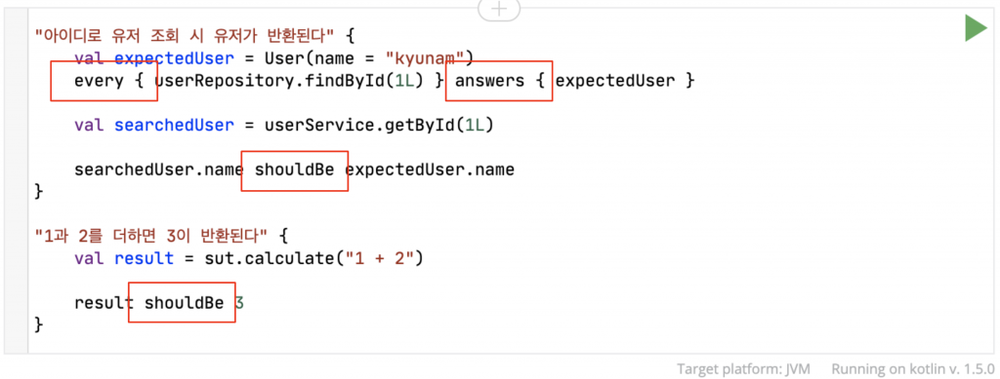

# 코틀린에서의 테스트 코드

## 코틀린 스타일로 짜자
* 기존 자바에서의 Junit, AssertJ, Mockito는 코틀린 스타일이 아님. 코틀린 DSL을 활용할 수 없음
* 코틀린에서는 DSL 스타일의 중괄호를 활용한 코드 스타일을 제공
* 

## kotest
https://kotest.io/docs/framework/framework.html

#### 사용방법

1. 의존성 추가
~~~kotlin
testImplementation("io.kotest:kotest-runner-junit5:5.5.5")
testImplementation("io.kotest:kotest-assertions-core:5.5.5")
testImplementation("io.kotest:kotest-property:5.5.5")
testImplementation("io.kotest extensions:kotest-extensions-spring:1.1.2")
~~~

2. intellij -> kotest 플러그인 설치해주기

#### 특징
* 가장 많이 사용되는 테스트 프레임워크
* 다양한 testing styles 제공 
  * String Spec
    * DomainTest용
  * ExpectSpec
    * RepositoryTest용
  * BehaviorSpec
    * ServiceTest용
    * given, when, then 사용
* Kotlin DSL 스타일의 Assertion기능

#### 
## MockK

## KotlinFixture
https://github.com/appmattus/kotlinfixture
https://jessyt.tistory.com/172
https://velog.io/@glowforever/Kotlin-Test
https://veluxer62.github.io/tutorials/take-advantage-of-kotlin-fixture/
* Test Data의 생성을 쉽게 도와주는 라이브러리
* Kotlin에서 객체를 무작위 데이터로 생성하는 도구

## 이용 방법
~~~kotlin
testImplementation("com.appmattus.fixture:fixture:<latest-version>")
~~~

## 참고
https://techblog.woowahan.com/5825/