## 출처 
https://www.youtube.com/watch?v=ewBri47JWII

## 아이템1

* 코틀린 표준 라이브러리를 익히고 사용하라
  * 모든 플랫폼에서 쓸수있는 kotlin.random.Random이 도입됨.
  * 자바와 관련된 import를 제거할 수 있음.
  * ~~~kotlin
    import kotlin.random.Random
    Random.nextInt()
    ~~~
  * 읽기전용 컬렉션과 변경 전용 컬렉션을 구별해서 제공
    * mutable list           
  
## 아이템2

* 코틀린/JVM 

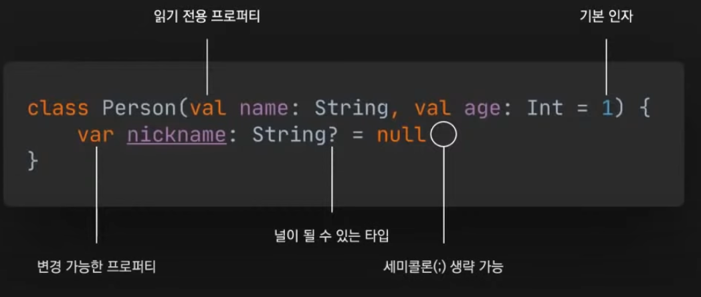

* 자바로 역컴파일하는 습관을 들여라
  * 내가 작성한 코드가 자바로 어떻게 표현되는지 확인하자
  * 역컴파일을 통해 예기치 않은 코드생성을 방지할 수 있음.
  * 문제가 발생할 때 빠르게 확인할 수 있음.
  * tools > kotlin > show kotlin bytecode > decompile

* 컴파일 과정
  * 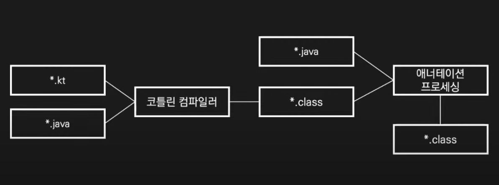
  * 1. 코틀린 컴파일이 먼저 실행
  * 2. 자바 컴파일러가 .java 와 .class를 컴파일

## 아이템3
* 롬복 대신 데이터 클래스를 사용하자
  * 애너테이션 프로세서는 코틀린 컴파일 이후에 동작.
  * 롬복에서 생성된 자바 코드는 코틀린 코드에서 접근 불가.
  * data class 
    * 주 생성자에는 하나 이상의 매개변수가 있어야 함.
    * copy()를 적절히 사용하면 데이터 클래스를 불변으로 관리가능
    * 코드가 간단해서 하나의 코틀린 파일에 여러 관련 클래스를 담는 것도 좋은 방법이다.
    * 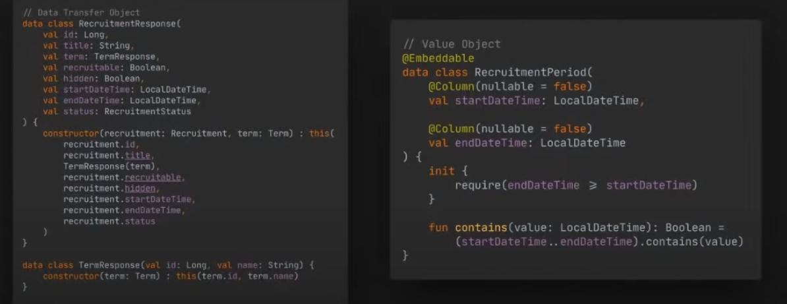

## 아이템4

#### Spring Boot

* @Configuration class may not be final 
* final 클래스
  * @SpringBootApplication은 @Configuration을 포함.
  * 스프링은 기본적으로 CGLIB을 사용하여 @Configuration 클래스에 대한 프록시를 생성
  * CGLIB는 대상 클래스를 상속하여 프록시를 만듦. 
  * final 클래스와 함수는 상속하거나 오버라이드 할 수 없으므로 프록시를 만들 수 없음.
  * 상속을 허용하고 오버라이드를 허용하려면 Kotlin에서는 open 변경자를 추가해야함.
  * 스프링 FM 5.2부터 @Configuration의 proxyBeanMethod 옵션은 사용하여 프록시 생성을 비활성화할 수 있음.
  * 그러면 모든 Class에 open을 붙여야하나

* All-open 컴파일러 플러그인
  * 지정한 애너테이션이 있는 클래스와 모든 멤버에 open변경자를 추가
  * 스프링을 사용하는 경우 all-open 컴파일러 플러그인을 래핑한 kotlin-spring 컴파일러 플러그인을 사용할 수 있음.
  * @Compnent, @Transactional, @Async 등이 기본적으로 지정됨.
  * IntelliJ : File>Project Structure>Project Settings>Modules>Kotlin>Compiler Plugins에서 지정된 애너테이션 확인 가능
  * 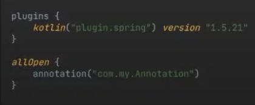
  * 스프링에서 프로젝트 생성시 기본 포함

## 아이템4

### 필드 주입이 필요하면 지연 초기화를 사용하라
* 생성자를 통해 의존성을 주입하는 것이 가장 좋지만, 때로는 필드를 통해 주입해야하기도 함. (서비스와 서비스간의 숨은 참조)
* 뒷받침하는 필드(backing field)가 존재하는 프로퍼티(getter, setter, field)는 인스턴스화가 될 때, 초기화되어야한다. 값이 들어있어야 한다.
* 프로퍼티이지만 자바로 compile하면 내부에 실제로 필드가 존재.
* 의존성이 주입될 필드를 null로 초기화 할 수 있지만, 많은 불편
* lateinit 변경자 - 프로퍼티를 나중에 초기화 가능. 해당 프로퍼티는 항상 var이어야 한다. 
* 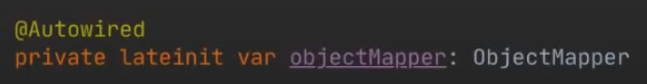

### 잭슨 코틀린 모듈 
* 잭슨은 역직렬화를 위해 매개변수가 없는 생성자가 필요
* 코틀린에서는 매개변수가 없는 생성자를 만들려면 생성자의 모든 매개변수에 기본 인자를 넣어야 한다.
* 잭슨 코틀린 모듈은 매개변수가 없는 생성자가 없더라고 직렬화와 역직렬화를 지원함. 
*  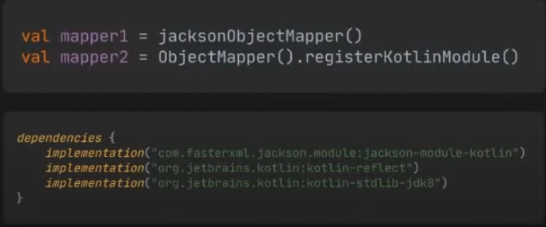
*  objectMapper를 직접생성해서 사용할 땐, 코틀린 모듈이 포함되어 있지 않기 때문에, 위처럼 해야됨.
*  스프링에서 프로젝트 생성하면 기본 포함되어있음.
*  KotlinDetector 작동.

### 코틀린 애너테이션 
* 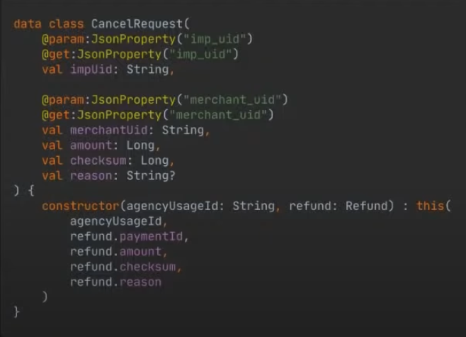
* amount라는 프로퍼티를 헤더에 쓰면
  * 필드, getter, setter, 생성자의 파라미터가 모두 됨.
  * @JsonProperty
    * 얘를 자바의 필드로 인식하고, 필드의 애너테이션이 붙게됨.
    * 어노테이션이 어디 붙을지 앞에 선언해줄수 있음.

## 아이템5
### 변경 가능성을 제한하라 
* 코틀린의 클래스와 멤버가 final인 것 처럼, 일단 val로 선언하고 필요할 때, var로 변경한다. 
* 스프링부트 2.2에서는 스프링 프로퍼티 클래스에서 생성자 바인딩을 사용할 수 있음.
* @EnableConfigurationProperties 또는 @ConfigurationPropertiesScan 사용
* 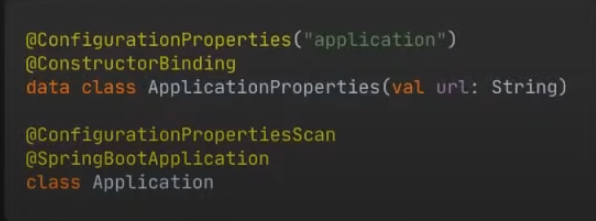
* 
 

### 뒷받침하는 프로퍼티(backing property)

* 클래스에 개념저긍로 동일하지만, 하나는 공개된 API의 일부, 다른 하나는 구현 세부사항인 2개의 프로퍼티가 있는 경우
* private 프로퍼티에는 _를 접두사로 쓴다. 
* 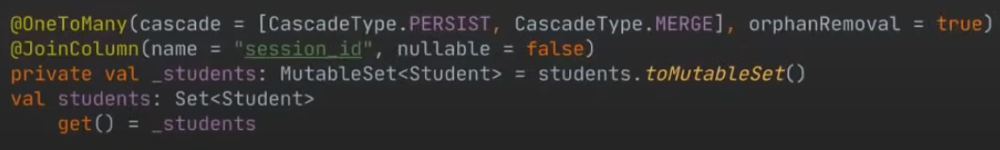
  * students(공개) 와 _students(private)
  * students는 Set타입 - immutable
  * _students는 mutableSet 타입
  * 내부에서는 students에 조작을 가할 수 있지만, 외부에서는 students 참조하려 할 때, 변경 불가능하도록 읽기전용 컬렉션을 돌려줌.
  * 코틀린과 jpa 를 사용하게 될 때 entity 연관 관계 맵핑시 1:N(One To Many) 관계를 맵핑하게 되는 경우가 있는데요 이때 mutable collection 을 private 으로 만들어 cud 조작은 숨기고 backing properties 이용해 read 시 immutable collection 으로 리턴하게 할 수 있을 텐데 이때 mutable collection 의 변수 이름 앞에 _(언더바) 를 사용하고 backing properties 의 이름은 언더바를 제거한 변수명을 사용하는 것이 컨벤션인걸로 알고 있습니다. 예를 들면 @OneToManyprivate val _customers : MutableList<Customer> = mutableListOf()val customers : List<Customer> get() = _customers의 형태로요!

### Persistence
#### No-arg 컴파일러 플러그인
* JPA에서 Entity를 생성하려면 매개변수가 없는 생성자가 필요.
* no-arg 플러그인은 지정한 annotation이 있는 클래스에 noArg 생성
* 자바/코틀린에서 그 noArg을 직접 호출할 순 없지만, 리플렉션을 사용해서 호출은 가능
* @Entity, @Embeddable, @MappedSuperclass가 기본적으로 지정됨.
* 
  
#### All-open 플러그인
* final이 붙으면 프록시 객체를 못만들고, JPA에서 지연로딩을 할 수 없음.

## 아이템6 

### 엔티티에 데이터 클래스 사용을 피해라
* Lombok의 @Data와 같은 맥락.
* data class는 생성자에 선언된 프로퍼티에 대해 자동으로 생성해줌.
* 양방향 연관 관계의 경우 toString(), hashcode()를 호출될 때 무한 순환 참조가 발생

## 아이템7
### 사용자 지정 getter를 사용하라
* 영속화하지 않은 필드는 초기화된 property가 아닌 사용자 지정 getter를 사용해야 함.
* JPA에 의해 객체가 인스턴스화될 때, 초기화 블록이 호출되지 않기 때문.
* 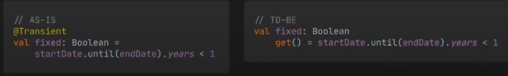
* fixed 프로퍼티 : true/false 계산 
  * @Transient -> 영속화 하지 않겠다는 의미
  * 초기화해서 관리를 하게 되면, DB에서 값을 꺼내 인스턴스화 하면, fixed에는 아무 값이 안들어있고 null이 됨.
  * 사용자 지정 getter를 정의해서 프로퍼티에 접근할 때마다 호출되도록 한다. get()
  * 뒷받침하는 필드가 존재하지 않기 때문에 AccessType.FIELD이더라고 @Transient를 사용하지 않아도 된다.

## 아이템8
### NULL이 될 수 있는 타입은 빠르게 제거하자
* nullable 타입을 사용하면 null 검사를 넣거나 !! 연산자를 써야 함. 
* ID를 0 또는 빈 문자열로 초기화하면 NULL이 될 수 있는 타입을 제거 할 수 있다.
  * 기본자료형으로 사용하면 0을 기준으로 new냐 아니냐
* 확장함수를 사용해서 반복되는 NULL 검사를 제거할 수 있음.
* 코틀린에서는 Optional 타입보다 Nullable한 타입을 쓰는 것이 좋음.
  * 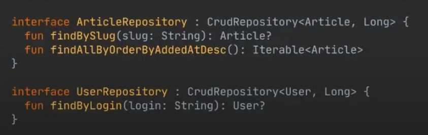
  * Article? - nullable 사용
    * 불필요한 자바 import 제거

## 샘플 프로젝트
https://github.com/woowacourse/service-apply/blob/master/build.gradle.kts

### build.gradle.kts
* kotlin dsl로 작성
  * 무조건 ""큰따옴표
  * 정적타입 언어
* testImplementation("com.ninja-squad:springmockk:2.0.3")
  * 코틀린 mocking 라이브러리
* kotlin annotation compiler -> Query DSL

### SecurityConfig.kt
* security를 kotlin dsl로 제공해줌. 

### 