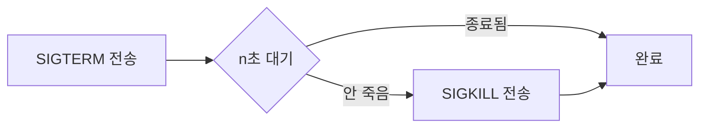

# kill — 프로세스에 시그널 보내기

> 최종 업데이트: 2026-05-20 | 기준: Linux (POSIX 시그널)

## 개념

`kill`은 이름과 달리 "프로세스를 죽이는" 명령이 아니라 **프로세스에 시그널(signal)을 보내는** 명령이다. 우리가 흔히 쓰는 `kill PID`가 기본 시그널인 `SIGTERM`(종료 요청)을 보내기 때문에 "죽이는 것처럼" 보일 뿐, 실제로는 **재시작·일시정지·로그 리로드** 같은 다양한 신호도 같은 명령으로 보낸다.

> 비유하자면 "프로세스에게 쪽지를 전달하는 우편 시스템". 어떤 쪽지(시그널)냐에 따라 받는 사람이 짐 싸서 나가거나(SIGTERM), 강제로 끌려나가거나(SIGKILL), 설정 파일을 다시 읽거나(SIGHUP) 한다.

## 배경/역사

- 시그널은 **유닉스 초기(1970년대)** 부터 존재한 프로세스 간 비동기 통신 메커니즘으로, POSIX.1 표준으로 정착됐다.
- `kill`은 이 시그널을 사용자 공간에서 발생시키는 가장 기본적인 인터페이스다. 이름이 "kill"인 것은 시그널의 **최초 용도가 프로세스 종료**였기 때문이며, 이후 의미가 확장되었다.
- 내부적으로 `kill(2)` 시스템 콜을 호출한다. 셸 내장(builtin)으로도, 외부 명령(`/bin/kill`)으로도 존재한다.

## 주요 시그널

| 번호 | 이름 | 기본 동작 | 의미 |
|---|---|---|---|
| 1 | `SIGHUP` | 종료 | 터미널 끊김 / **데몬에선 설정 리로드** 관례 |
| 2 | `SIGINT` | 종료 | 터미널 인터럽트 (`Ctrl+C`) |
| 3 | `SIGQUIT` | 종료+코어덤프 | `Ctrl+\` |
| 9 | **`SIGKILL`** | **강제 종료** | **가로채기·무시 불가**. 프로세스에 정리할 기회 없음 |
| 15 | **`SIGTERM`** (기본) | 종료 요청 | **정상 종료 요청**. 프로세스가 핸들러로 정리 후 종료 가능 |
| 17/19/23 | `SIGSTOP` | 일시정지 | **무시 불가**. `Ctrl+Z`는 `SIGTSTP`(가로채기 가능) |
| 18/19/25 | `SIGCONT` | 재개 | 멈춘 프로세스 다시 실행 |
| 11 | `SIGSEGV` | 종료+코어덤프 | 잘못된 메모리 접근 |
| 13 | `SIGPIPE` | 종료 | 끊긴 파이프에 쓰기 |
| 10/12 | `SIGUSR1` / `SIGUSR2` | 종료 | **앱이 자유 정의** (로그 로테이트 등에 활용) |

> 시그널 번호는 아키텍처마다 일부 다르다(예: `SIGSTOP`이 x86은 19, MIPS는 23). **이름으로 쓰는 것이 안전**하다 — `kill -TERM` / `kill -KILL`.

## 문법

```bash
kill PID                # 기본 SIGTERM (15)
kill -9 PID             # SIGKILL — 강제 종료
kill -TERM PID          # 이름 사용 (권장)
kill -SIGTERM PID
kill -l                 # 전체 시그널 목록 출력
kill -0 PID             # 시그널 안 보냄. 프로세스 존재 여부만 확인(권한 검사 포함)
kill -- -PGID           # 음수 = 프로세스 그룹 전체에 시그널
```

## PID 찾고 보내기

```bash
ps -ef | grep nginx           # PID 찾기 ([ps command](ps-command.md) 참조)
pgrep -f nginx                # 패턴으로 PID만 추출
pidof nginx                   # 정확한 프로그램명으로 PID
kill -TERM $(pgrep -f nginx)  # 조합
```

## kill / killall / pkill 차이

| 명령 | 대상 지정 방식 | 특징 |
|---|---|---|
| `kill` | **PID**(또는 PGID) | 표준. 정확한 대상 |
| `killall` | **프로세스 이름** | 같은 이름 다 죽임. **Solaris의 killall은 모든 프로세스 종료**이므로 이식성 주의 |
| `pkill` | **패턴**(정규식, 사용자 등) | `pkill -f "java.*MyApp"` 처럼 명령행 전체 매칭 가능 — 가장 유연 |

```bash
killall nginx                 # 이름이 nginx인 프로세스 모두 SIGTERM
pkill -f "java.*MyApp"        # 명령행에 매칭되는 프로세스에 SIGTERM
pkill -u alice                # 사용자 alice의 모든 프로세스
```

## 종료가 안 될 때 — SIGTERM → SIGKILL 흐름

운영에서 권장되는 정상적 종료 순서는 **부드럽게 → 단계적으로 → 마지막에 강제**다.



- `SIGTERM`은 프로세스가 **핸들러를 등록해 가로챌 수 있고**, DB 커넥션 정리·임시파일 삭제·로그 플러시 등 **graceful shutdown**을 할 기회를 준다.
- `SIGKILL`은 커널이 즉시 프로세스를 죽이며, 프로세스 코드는 단 한 줄도 실행되지 못한다. **그래서 자원 누수·일관성 깨짐 위험**. 가능하면 마지막 수단으로만.
- `SIGKILL`로도 안 죽는 경우는 거의 **"D" 상태(uninterruptible sleep, 보통 디스크/NFS I/O 대기)**. 이건 시그널을 받지 못하므로 I/O가 풀리거나 재부팅이 답.

## 핸들러와 트랩 — 왜 SIGTERM이 더 우아한가

프로세스(또는 셸 스크립트)는 시그널을 받아 자기 정리 로직을 실행할 수 있다. 핵심은 **`SIGKILL`·`SIGSTOP`은 가로챌 수 없다**는 점.

```bash
# 셸 스크립트 — SIGTERM/SIGINT 받으면 임시파일 정리 후 종료
trap 'rm -f /tmp/lock.$$; exit 0' TERM INT
```

```c
// C — SIGTERM 핸들러 등록
signal(SIGTERM, my_cleanup);  // 정상 종료 시 cleanup
// SIGKILL은 signal()로 등록 불가 — 커널이 거부
```

> 그래서 운영 스크립트는 보통 `kill -TERM`을 먼저 보내 정리 기회를 주고, 타임아웃 후에만 `kill -9`로 강제 종료한다. systemd도 `TimeoutStopSec` 이후 자동으로 SIGKILL을 보낸다([systemd](systemd.md) 참조).

## 권한

- 자기 소유 프로세스에만 시그널을 보낼 수 있다. **루트(또는 capability 보유)** 만 다른 사용자 프로세스에 시그널 가능.
- **PID 1(init/systemd)** 은 보호되어 임의 종료 불가.
- 컨테이너 안에서 PID 1로 떠 있는 프로세스는 시그널 전달 규칙이 다르다 — **PID 1은 명시적으로 핸들러를 등록하지 않으면 SIGTERM 등 기본 시그널을 무시**한다(Docker `--init` 옵션이나 dumb-init/tini로 보완하는 이유).

## 관련 문서

- [프로세스](프로세스.md) — 프로세스 개념 기초
- [ps command](ps-command.md) — PID·상태 조회
- [strace command](strace-command.md) — 시그널 받은 프로세스가 실제로 어떻게 반응하는지 추적
- [systemd](systemd.md) — 서비스 종료/재시작 시그널 흐름
- [Linux Daemon](linux-daemon.md) — 데몬과 SIGHUP 관례
