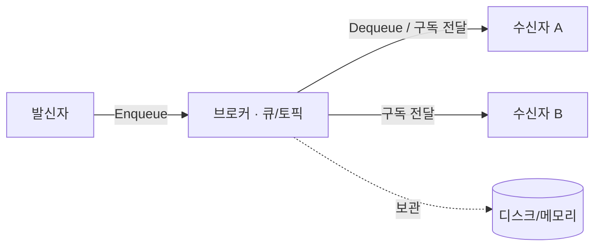

# 메시징 시스템 (Messaging System)

> 최종 업데이트: 2026-05-17 | 일반 개념 기준

## 메시징 시스템이란?

시스템·애플리케이션 컴포넌트들이 **메시지를 주고받아 통신·협력**하도록 해주는 기술이다. 데이터를 안정적으로 전달하고, 컴포넌트들이 서로의 내부 구현이나 위치를 몰라도 함께 동작할 수 있게 만든다.

> 일상 비유: 우편 시스템. 보내는 사람과 받는 사람이 직접 만나지 않고 우체국을 거쳐 편지를 주고받듯, 컴포넌트들이 직접 호출 대신 "메시지"로 소통한다.

## 배경/역사

초창기 시스템 연동은 직접 호출(동기 RPC) 방식이었으나, 호출 대상이 살아 있어야 하고 한쪽이 느리면 전체가 느려지는 한계가 있었다. 1990년대 금융·통신 등 엔터프라이즈에서 시스템 간 안정적 연동 수요가 커지며 **메시지 지향 미들웨어(MOM, Message-Oriented Middleware)** 가 등장했고, 이후 표준(JMS·AMQP)과 오픈소스(RabbitMQ·Kafka)로 발전했다.

> 제품별 상세 역사·비교는 [메시지-브로커.md](메시지-브로커.md) 참고. 이 문서는 **공통 개념과 용어**에 집중한다.

## 어디에 쓰나?

분산 시스템, **MSA(마이크로서비스)**, 서비스 지향 아키텍처(SOA)에서 주로 쓴다. 독립적으로 실행되는 컴포넌트들이 서로의 상태나 구현을 사전에 몰라도 메시지를 통해 협력할 수 있어, **느슨한 결합**과 **확장성**을 얻는다.

직접 호출 방식과 비교하면 차이가 분명하다.

| 직접 호출 (동기) | 메시징 (비동기) |
|---|---|
| 받는 쪽이 죽으면 보내는 쪽도 실패 | 받는 쪽 상태와 무관하게 일단 전달 |
| 받는 쪽이 느리면 같이 느려짐 | 보내는 쪽은 즉시 진행, 받는 쪽은 자기 속도로 처리 |
| 여러 곳에 알리려면 다 호출 | 한 번 보내면 관심 있는 쪽이 각자 수신 |
| 서로를 직접 알아야 함 (강한 결합) | 서로 몰라도 됨 (느슨한 결합) |

## 핵심 용어

| 용어 | 설명 | 비유 |
|---|---|---|
| **메시지 (Message)** | 컴포넌트 간 교환되는 데이터 단위. 텍스트 또는 이진 데이터 | 편지 한 통 |
| **발신자 (Sender / Producer)** | 메시지를 만들어 보내는 주체 | 편지를 부치는 사람 |
| **수신자 (Receiver / Consumer)** | 메시지를 받아 처리하는 주체 | 편지를 받는 사람 |
| **메시지 큐 (Message Queue)** | 메시지를 임시 보관·관리하는 중간 저장소 | 우체국 분류함 |
| **브로커 (Broker)** | 큐/토픽을 운영하며 메시지를 받아 라우팅·전달하는 서버 | 우체국 |

### 메시지 큐 (Message Queue)

발신자가 메시지를 보내면 큐에 쌓아 두고(`Enqueue`), 수신자가 준비되면 꺼내 간다(`Dequeue`). 이를 통해 **메시지 전송 시점과 처리 시점의 시간 격차**를 흡수하고, 발신자·수신자 간 **비동기 통신**이 가능해진다.

### 비동기 통신

발신자와 수신자가 같은 시점에 동시에 활성화되어 있을 필요가 없고, 보낸 메시지에 대한 응답이 즉시 오지 않아도 된다. 덕분에 한쪽 장애나 속도 차이가 다른 쪽으로 곧장 전파되지 않아 **유연성과 확장성**이 올라간다.

### 발행/구독 (Publish / Subscribe)

수신자들이 관심 있는 **주제(Topic)** 를 구독하고, 발행자가 그 주제로 메시지를 발행하면 **구독자 전원에게 전달**되는 방식이다.

> 앞 버전에 달렸던 메모 "발행자가 어떤 수신자가 어떤 메시지를 받을지 신경 쓰지 않아도 된다는 의미인가?" → **그렇다.** 발행자는 구독자가 누구인지·몇 명인지 전혀 알지 못한 채 토픽으로만 보낸다. 어떤 메시지를 받을지는 **수신자가 어떤 토픽을 구독했는지**로 결정된다. (큐 방식은 메시지 1건이 컨슈머 1명에게, 발행/구독은 구독자 전원에게 복사 전달된다.)

## 메시지 흐름

발신자는 브로커에만 메시지를 넣고 즉시 자기 일을 계속한다. 브로커는 메시지를 보관하다가 수신자가 준비되면 전달한다. 발신자와 수신자는 서로를 직접 알 필요가 없다.

## 안정성과 내구성

메시징 시스템은 메시지가 중간에 유실되지 않도록 보장해야 한다. 핵심 장치는 세 가지다.

- **영속화(Persistence)**: 메시지를 메모리뿐 아니라 디스크에 기록해 브로커가 재시작돼도 살아남게 한다.
- **확인 응답(Ack)**: 수신자가 "처리 완료"를 알려야 브로커가 메시지를 안전하게 처리·삭제한다. Ack가 없으면 재전송한다.
- **재처리/보관**: 일부 시스템은 수신자가 가져간 뒤에도 메시지를 일정 기간 보관한다.

> 앞 버전 메모 "메시지가 처리돼도 보관을 유지하는 게 어떤 시스템?" → 대표적으로 **Apache Kafka**다. Kafka는 메시지를 로그로 디스크에 보관하고, 보관 기간(retention) 내라면 컨슈머가 읽은 위치(offset)를 되돌려 **같은 메시지를 다시 처리**할 수 있다. 반면 **RabbitMQ**는 컨슈머가 ack하면 기본적으로 메시지를 삭제한다. 이 차이가 장애 복구·재처리 운영을 크게 가른다(상세: [메시지-브로커.md](메시지-브로커.md)).

## 대표 제품

| 제품 | 한 줄 특징 |
|---|---|
| **Apache Kafka** | 로그 기반, 대용량 스트리밍·재처리 표준 |
| **RabbitMQ** | AMQP 기반, 복잡한 라우팅·작업 큐 |
| **ActiveMQ** | JMS 표준 구현, 전통적 엔터프라이즈 |
| **AWS SQS / SNS** | 클라우드 매니지드 큐 / 발행·구독 |
| **Java JMS** | 특정 제품이 아닌 **자바 표준 메시징 API**(브로커 위에서 동작) |

> 제품별 모델·메시지 보관·전달 보장(at-least-once 등) 비교는 [메시지-브로커.md](메시지-브로커.md)에 정리돼 있다.

## 관련 문서

- [메시지-브로커.md](메시지-브로커.md) — 제품 비교·전달 보장·실무 함정 (이 문서의 심화편)
- [1)-Kafka-개념.md](../Kafka/1\)-Kafka-개념.md) — 로그 기반 브로커 대표 제품
- [앱-푸시-중계서버.md](앱-푸시-중계서버.md) — 메시징 시스템 활용 사례
