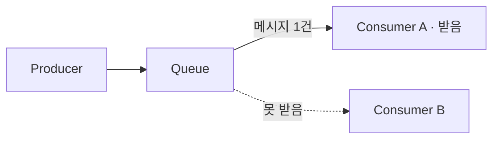
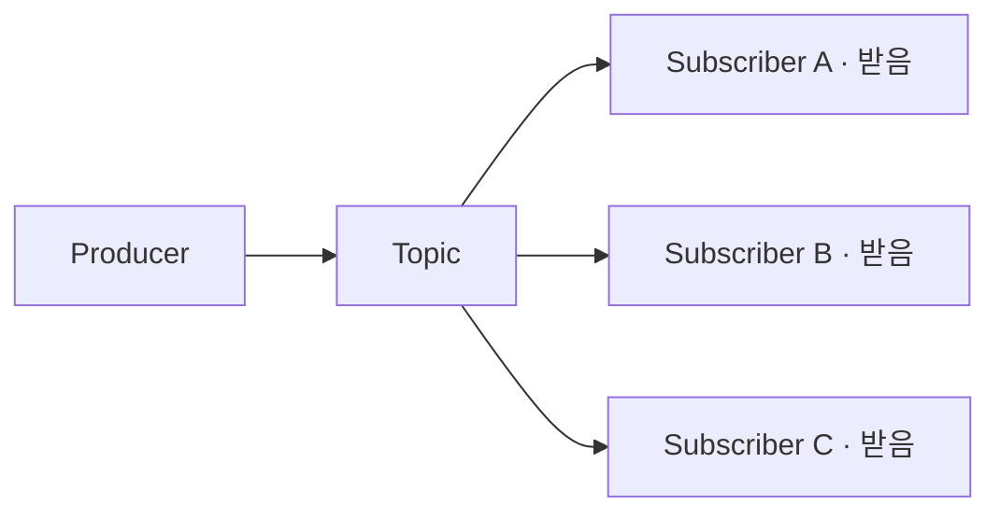

# 메시지 브로커 (Message Broker)

> 최종 업데이트: 2026-05-17 | Kafka 4.0 (KRaft 전용) / RabbitMQ 4.x / AMQP 1.0·0-9-1 기준

## 개념

메시지 브로커는 애플리케이션/서비스 간 메시지를 **중간에서 받아서 보관하고 적절한 수신자에게 전달**해주는 미들웨어다. 보내는 쪽(Producer)과 받는 쪽(Consumer)이 서로를 직접 알지 못해도 통신할 수 있게 만들어주는 "택배 회사" 역할을 한다.

> 일상 비유: 택배 회사. 보내는 사람은 받는 사람이 지금 집에 있는지 신경 쓰지 않고 택배사에 맡기면 끝. 받는 사람은 편한 시간에 수령. 보낸 사람과 받는 사람 사이의 **시간·공간·속도 차이를 흡수**해준다.

## 배경/역사

| 시기 | 사건 |
|---|---|
| 1993 | **IBM MQSeries** (현 IBM MQ) — 최초의 상용 메시지 브로커. 금융권/엔터프라이즈에서 광범위하게 사용 |
| 1998 | **JMS (Java Message Service)** — Sun이 발표한 자바 표준 API. 브로커 종류와 무관하게 동일 코드로 메시징 |
| 2003 | **AMQP** 프로토콜 등장 — 벤더 종속 없는 표준 메시징 프로토콜 |
| 2007 | **RabbitMQ** 출시 — AMQP 기반 오픈소스 브로커의 사실상 표준 |
| 2011 | **Apache Kafka** 오픈소스화 — LinkedIn의 Jay Kreps 등이 만든 분산 로그 기반 브로커. 대용량 스트리밍 시대 개막 |
| 2010~ | **클라우드 매니지드 서비스** 확산 — AWS SQS/SNS, GCP Pub/Sub, Azure Service Bus |
| 2024 | **RabbitMQ 4.0** — 네이티브 AMQP 1.0 지원, Khepri 메타데이터 저장소 도입 |
| 2025 | **Kafka 4.0** — ZooKeeper 완전 제거(KRaft 전용), 새 컨슈머 그룹 프로토콜(KIP-848) GA |

전통적으로 "큐 기반(작업 분배)" 위주였다가, Kafka 이후로 **이벤트 스트림(로그) 기반**이 데이터 파이프라인의 표준으로 자리잡았다.

## 왜 필요한가?

직접 호출(HTTP/gRPC)만으로 서비스를 연결할 때 생기는 문제와 비교하면 명확하다.

| 직접 호출 (Sync) | 메시지 브로커 (Async) |
|---|---|
| B가 죽으면 A의 요청도 실패 | A는 브로커에만 던지면 끝, B 상태 무관 |
| B가 느리면 A도 같이 느려짐 | A는 즉시 응답, B는 자기 속도로 소비 |
| C, D에도 알리려면 A가 다 호출 | 한 번 발행하면 구독자 N명이 각자 받음 |
| 트래픽 스파이크 시 B 다운 | 큐가 버퍼 역할, B는 평소 속도로 처리 |
| A↔B 강한 결합 | A↔B 느슨한 결합(서로 모름) |

## 동작 모델 2가지

### 1) Queue (Point-to-Point)
하나의 메시지를 **컨슈머 한 명만** 처리. 작업 분배에 적합.



> 비유: 콜센터 대기열. 전화 1통은 상담사 1명에게만 연결됨.

### 2) Pub/Sub (Topic)
하나의 메시지를 **구독자 전원에게 복사 전달**. 이벤트 브로드캐스트에 적합.



> 비유: 유튜브 알림. 구독자 모두에게 똑같이 알림이 감.

| 구분 | Queue | Pub/Sub |
|---|---|---|
| 메시지 수신자 | 1명 | N명 (구독자 전원) |
| 대표 용도 | 작업 큐, 비동기 처리 | 이벤트 알림, 데이터 fan-out |
| 대표 제품 | RabbitMQ(기본), SQS | Kafka, Redis Pub/Sub, SNS |

## 주요 구성 요소

| 용어 | 역할 |
|---|---|
| **Producer (Publisher)** | 메시지를 만들어 브로커로 보냄 |
| **Consumer (Subscriber)** | 브로커에서 메시지를 가져가 처리 |
| **Broker** | 메시지를 저장·라우팅하는 서버 본체 |
| **Topic / Queue** | 메시지가 쌓이는 논리적 통로 |
| **Exchange** (RabbitMQ) | 라우팅 규칙에 따라 메시지를 큐로 분배 |
| **Partition** (Kafka) | 토픽을 쪼갠 단위, 병렬 처리/확장의 핵심 |
| **Consumer Group** | 같은 토픽을 함께 나눠 소비하는 컨슈머 묶음 |
| **Offset** (Kafka) | 컨슈머가 "어디까지 읽었는지" 기록한 위치 |

## 주요 제품 비교

| 제품 | 모델 | 메시지 보관 | 특징 |
|---|---|---|---|
| **Apache Kafka** | Pub/Sub (로그형) | 디스크에 장기 보관, 재처리 가능 | 초당 수십만 건, 스트리밍·로그 파이프라인 표준 |
| **RabbitMQ** | Queue + Pub/Sub | 컨슈머가 받으면 삭제(기본) | 복잡한 라우팅(Exchange), AMQP 표준 |
| **Redis Pub/Sub / Streams** | Pub/Sub | Pub/Sub은 휘발성, Streams는 보관 | 매우 가볍고 빠름, 메모리 기반 |
| **AWS SQS** | Queue | 최대 14일 | 매니지드, 단순 큐 용도 |
| **AWS SNS** | Pub/Sub | — | SQS/이메일/람다 등으로 fan-out |
| **GCP Pub/Sub** | Pub/Sub | 7일~무제한 | 글로벌 매니지드 |
| **ActiveMQ** | Queue + Pub/Sub | 가능 | JMS 표준 구현, 전통적 엔터프라이즈 |

> 한 줄 선택 가이드: **대용량 스트리밍·이벤트 소싱이면 Kafka**, **복잡한 라우팅·작업 큐면 RabbitMQ**, **클라우드 종속 OK면 매니지드(SQS/Pub-Sub)**.

제품 선택 시 두 가지를 추가로 확인해야 한다. 첫째, **메시지 크기 제한**이 제각각이다(Kafka 기본 1MB, SQS 256KB). 큰 페이로드는 메시지에 직접 싣지 말고 S3 등에 두고 참조만 전달한다. 둘째, **재처리 가능 여부**가 운영을 크게 가른다. RabbitMQ는 컨슈머가 ack하면 메시지를 삭제하지만, Kafka는 보관 기간 내라면 오프셋을 되돌려 **재처리**할 수 있다(위 표의 "메시지 보관" 열).

## 메시지 전달 보장 (Delivery Guarantee)

분산 환경에서 "메시지가 정확히 한 번 전달됐는가"는 어려운 문제다. 3가지 보장 수준이 있다.

| 수준 | 의미 | 트레이드오프 |
|---|---|---|
| **At-most-once** | 최대 1번 (유실 가능) | 빠름, 중복 없음, 유실 가능 |
| **At-least-once** | 최소 1번 (중복 가능) | 유실 없음, 중복 처리 필요 |
| **Exactly-once** | 정확히 1번 | 가장 안전, 가장 느리고 복잡 |

대부분의 실무는 **At-least-once + 컨슈머 멱등성(idempotency)** 조합을 쓴다. 네트워크 재시도로 같은 메시지가 두 번 도착할 수 있으므로, 컨슈머는 동일 `messageId`를 두 번 처리해도 결과가 같도록 멱등하게 설계해야 한다. Kafka는 트랜잭션 API로 exactly-once를 지원하지만 비용이 크다.

순서 보장도 공짜가 아니다. Kafka는 **같은 파티션 내에서만** 순서를 보장하므로, 파티션이 여러 개면 토픽 전체의 글로벌 순서는 깨진다. 순서가 중요한 메시지는 같은 키로 같은 파티션에 보내야 한다.

또한 **DB 커밋과 메시지 발행은 별개 트랜잭션**이다. "DB는 저장됐는데 발행은 실패" 같은 불일치를 막으려면 변경과 발행 이벤트를 같은 DB 트랜잭션에 기록한 뒤 별도 프로세스가 발행하는 **Outbox 패턴**이 필요하다. 운영 측면에서는, 컨슈머가 멈추면 큐가 무한히 쌓이므로 **큐 적체(lag) 모니터링과 알람**을 반드시 갖춰야 한다.

## 짧은 코드 예시

### Spring Boot + Kafka 발행
```java
@Autowired KafkaTemplate<String, String> kafkaTemplate;

public void publishOrderCreated(Long orderId) {
    kafkaTemplate.send("order.created", String.valueOf(orderId));
}
```

### Spring Boot + Kafka 소비
```java
@KafkaListener(topics = "order.created", groupId = "inventory-service")
public void onOrderCreated(String orderId) {
    inventoryService.reserve(Long.parseLong(orderId));
}
```

### Spring Boot + RabbitMQ 발행/소비
```java
// 발행
rabbitTemplate.convertAndSend("orders.exchange", "order.created", orderId);

// 소비
@RabbitListener(queues = "inventory.queue")
public void onOrderCreated(Long orderId) { ... }
```

## 대표 사용 사례

- **비동기 후처리**: 회원가입 → 환영 메일/SMS는 큐에 던지고 응답은 즉시 반환
- **트래픽 완충**: 한순간에 들어온 10,000건을 컨슈머가 천천히 처리 (스파이크 흡수)
- **MSA 서비스 간 통신**: 주문 서비스 → 재고/결제/알림 서비스에 이벤트 fan-out
- **이벤트 소싱/CQRS**: 상태 변경을 이벤트 스트림으로 기록
- **로그 수집 파이프라인**: 앱 로그 → Kafka → Elasticsearch/S3 (Kafka가 사실상 표준)
- **데이터 동기화**: DB 변경 → CDC → Kafka → 다른 시스템에 전파

## 관련 문서

- [Messaging-System-기본.md](Messaging-System-기본.md) — 메시징 시스템 일반 개념(상위)
- [1)-Kafka-개념.md](../Kafka/1\)-Kafka-개념.md) — 로그 기반 브로커 대표 제품
- [6)-Kafka-Springboot.md](../Kafka/6\)-Kafka-Springboot.md) — Spring 연동 실습
- [앱-푸시-중계서버.md](앱-푸시-중계서버.md) — 브로커 활용 사례
- [../CS-이론/소프트웨어-아키텍처/CQRS.md](../CS-이론/소프트웨어-아키텍처/CQRS.md) — 읽기/쓰기 모델 동기화에 브로커 활용
- [../CS-이론/소프트웨어-아키텍처/Event-Sourcing.md](../CS-이론/소프트웨어-아키텍처/Event-Sourcing.md) — 이벤트 전파/구독 수단
