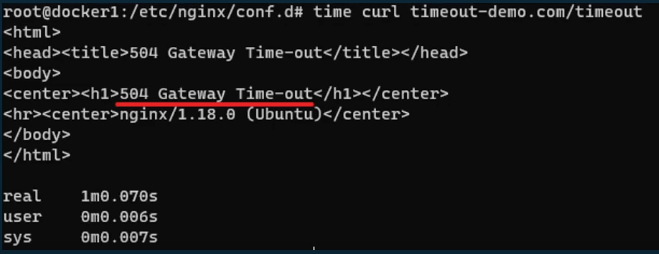
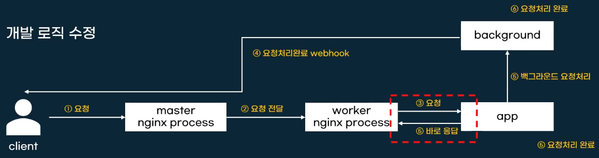

#Nginx timeout

## timeout error란?

응답을 긴 시간동안 받지 않으면 생기는 오류

worker process와 연결된 앱이 오랫동안 통신하지 않아서 세션이 종료되기 때문에 발생.

요청을 보내고 응답을 받는 대기시간(default 60초)을 넘기면 발생

## 사례 

인공지능 분석과 같은 응답이 오래 걸리는 경우.

DB등 장애로 응답 지연.

## 해결방법

1. nginx 응답대기시간을 증가시켜주기 

    app의 응답이 더 늘어나는 경우 또 늘려줘야됨.

2. 개발 로직 수정.    

