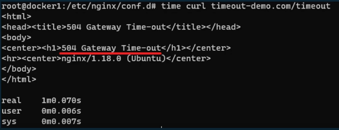
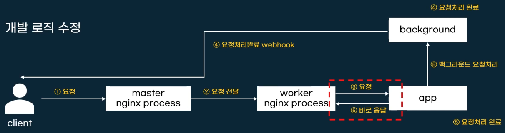

# Nginx Timeout 설정

> 최종 업데이트: 2026-04-08

## 개념

Nginx에서 timeout이란 특정 네트워크 작업이 지정된 시간 내에 완료되지 않을 때 연결을 끊는 메커니즘이다.

식당에 비유하면, 주문(요청)을 받은 뒤 주방(백엔드)에서 일정 시간 안에 음식(응답)이 나오지 않으면 "주문 취소"되는 것과 같다. Nginx는 클라이언트와 백엔드 사이에서 각 구간별로 서로 다른 타이머를 관리한다.



Worker Process와 연결된 백엔드 앱이 오랫동안 응답하지 않아 세션이 종료되기 때문에 발생한다. 요청을 보내고 응답을 받는 대기시간(기본값 60초)을 초과하면 timeout 에러가 발생한다.

## 요청 흐름과 timeout 구간

Nginx는 리버스 프록시 역할을 할 때, 요청 흐름의 각 구간마다 별도의 timeout이 적용된다.

```
Client                          Nginx                         Backend (WAS)
  │                               │                               │
  │── 요청 헤더 전송 ──→           │                               │
  │   [client_header_timeout]     │                               │
  │── 요청 본문 전송 ──→           │                               │
  │   [client_body_timeout]       │                               │
  │                               │── TCP 연결 ──→                │
  │                               │   [proxy_connect_timeout]     │
  │                               │── 요청 전달 ──→               │
  │                               │   [proxy_send_timeout]        │
  │                               │                ←── 응답 대기 ──│
  │                               │   [proxy_read_timeout]        │
  │            ←── 응답 전송 ──    │                               │
  │   [send_timeout]              │                               │
  │                               │                               │
  │←──── keepalive 유지 ────→     │                               │
  │   [keepalive_timeout]         │                               │
```


## 클라이언트 ↔ Nginx timeout 디렉티브

클라이언트와 Nginx 사이의 통신을 제어하는 timeout 설정이다. 택배에 비유하면, 고객(클라이언트)이 택배를 보내거나 받을 때 집 앞에서 기다리는 시간 제한이다.

| 디렉티브 | 기본값 | 설명 |
|----------|--------|------|
| `client_header_timeout` | 60s | 클라이언트가 요청 헤더를 보내는 데 허용되는 시간. 초과 시 408 반환 |
| `client_body_timeout` | 60s | 요청 본문(body)의 연속된 read 사이의 최대 대기 시간. 전체 전송 시간이 아님 |
| `send_timeout` | 60s | Nginx가 클라이언트에 응답을 보낼 때, 연속된 write 사이의 최대 대기 시간 |
| `keepalive_timeout` | 75s | keep-alive 연결을 유지하는 시간. 0으로 설정하면 keep-alive 비활성화 |

```nginx
http {
    client_header_timeout  30s;
    client_body_timeout    60s;
    send_timeout           30s;
    keepalive_timeout      65s;
}
```

> **주의**: `client_body_timeout`은 전체 업로드 시간이 아니라, 두 번의 연속된 read 작업 사이의 간격이다. 대용량 파일 업로드 시 데이터가 계속 전송되고 있다면 timeout이 발생하지 않는다.

## Nginx ↔ 백엔드(Proxy) timeout 디렉티브

Nginx가 리버스 프록시로 동작할 때 백엔드 서버와의 통신을 제어하는 timeout이다. 비유하면, 중개인(Nginx)이 공장(백엔드)에 주문을 넣고 납품을 기다리는 시간 제한이다.

| 디렉티브 | 기본값 | 설명 |
|----------|--------|------|
| `proxy_connect_timeout` | 60s | 백엔드 서버와 TCP 연결을 맺는 데 허용되는 시간 |
| `proxy_send_timeout` | 60s | 백엔드에 요청을 전달할 때, 연속된 write 사이의 최대 대기 시간 |
| `proxy_read_timeout` | 60s | 백엔드에서 응답을 읽을 때, 연속된 read 사이의 최대 대기 시간 |

```nginx
location /api/ {
    proxy_pass http://backend;

    proxy_connect_timeout  5s;    # TCP 연결은 보통 빠르게 완료됨
    proxy_send_timeout     30s;
    proxy_read_timeout     60s;
}
```

> **핵심**: `proxy_read_timeout`이 가장 자주 문제가 되는 디렉티브다. 백엔드의 비즈니스 로직 처리 시간이 이 값을 초과하면 504 에러가 발생한다.

## timeout과 HTTP 에러 코드의 관계

timeout이 발생하면 Nginx는 상황에 따라 다른 에러 코드를 반환한다. 진료 대기에 비유하면, 접수 자체가 안 되는 것(502)과 접수는 됐지만 진료가 너무 오래 걸리는 것(504)의 차이다.

| 에러 코드 | 의미 | 주요 원인 |
|-----------|------|-----------|
| **408 Request Timeout** | 클라이언트가 요청을 제시간에 보내지 못함 | `client_header_timeout`, `client_body_timeout` 초과 |
| **502 Bad Gateway** | 백엔드에서 유효하지 않은 응답을 받음 | 백엔드 프로세스 다운, `proxy_connect_timeout` 초과 (연결 자체 실패) |
| **504 Gateway Timeout** | 백엔드에서 제시간에 응답을 받지 못함 | `proxy_read_timeout` 초과 (연결은 됐으나 응답 지연) |

```
502 vs 504 판별 흐름:

클라이언트 → Nginx → 백엔드 연결 시도
                       │
                       ├── 연결 실패 / 비정상 응답  →  502 Bad Gateway
                       │
                       └── 연결 성공 → 응답 대기
                                        │
                                        └── proxy_read_timeout 초과  →  504 Gateway Timeout
```

## 실무 시나리오별 timeout 설정

### 일반 REST API

대부분의 API는 기본값(60s)이면 충분하다. 오히려 너무 길게 잡으면 장애 상황에서 커넥션이 쌓여 문제가 커진다.

```nginx
location /api/ {
    proxy_connect_timeout  5s;
    proxy_send_timeout     10s;
    proxy_read_timeout     30s;
}
```

### 대용량 파일 업로드

파일 업로드 경로에만 별도로 `client_body_timeout`과 `proxy_send_timeout`을 늘린다.

```nginx
location /upload/ {
    client_max_body_size   500m;
    client_body_timeout    120s;

    proxy_connect_timeout  5s;
    proxy_send_timeout     120s;
    proxy_read_timeout     120s;
}
```

### 오래 걸리는 API (AI 분석, 리포트 생성 등)

특정 경로에만 `proxy_read_timeout`을 늘려서, 다른 API에는 영향을 주지 않도록 한다.

```nginx
location /api/analysis/ {
    proxy_connect_timeout  5s;
    proxy_send_timeout     30s;
    proxy_read_timeout     300s;   # 5분
}
```

### WebSocket

WebSocket 연결은 장시간 유지되므로 `proxy_read_timeout`을 크게 설정해야 한다.

```nginx
location /ws/ {
    proxy_pass http://backend;
    proxy_http_version 1.1;
    proxy_set_header Upgrade $http_upgrade;
    proxy_set_header Connection "upgrade";

    proxy_read_timeout  3600s;    # 1시간
    proxy_send_timeout  3600s;
}
```

### SSE (Server-Sent Events)

서버가 이벤트를 계속 push하므로, 버퍼링을 끄고 read timeout을 길게 설정한다.

```nginx
location /events/ {
    proxy_pass http://backend;
    proxy_buffering off;
    proxy_cache off;

    proxy_read_timeout  86400s;   # 24시간
    proxy_send_timeout  86400s;
}
```

## timeout 설정 권장값 요약

| 시나리오 | `proxy_connect` | `proxy_send` | `proxy_read` | 비고 |
|----------|-----------------|--------------|--------------|------|
| 일반 API | 5s | 10s | 30s | 기본 권장 |
| 파일 업로드 | 5s | 120s | 120s | `client_body_timeout`도 함께 증가 |
| 장기 폴링 | 5s | 30s | 300s | long polling 패턴 |
| WebSocket | 5s | 3600s | 3600s | 연결 유지 시간만큼 |
| SSE | 5s | 86400s | 86400s | 이벤트 스트림 |

## timeout 디버깅

### error log 확인

timeout 에러가 발생하면 Nginx error log에 기록된다.

```bash
# error log 실시간 확인
tail -f /var/log/nginx/error.log

# timeout 관련 로그만 필터링
grep -i "timed out" /var/log/nginx/error.log
```

로그에 나타나는 대표적인 메시지:

| 로그 메시지 | 의미 |
|-------------|------|
| `upstream timed out (110: Connection timed out)` | `proxy_connect_timeout` 초과 |
| `upstream timed out (110: Operation timed out) while reading response header` | `proxy_read_timeout` 초과 |
| `upstream timed out (110: Operation timed out) while sending request` | `proxy_send_timeout` 초과 |
| `client timed out` | `client_body_timeout` 또는 `client_header_timeout` 초과 |

### 단계별 디버깅

```
1. error.log에서 timeout 메시지 확인
   ↓
2. 어느 구간(client ↔ nginx / nginx ↔ backend)인지 파악
   ↓
3. 해당 구간 timeout 디렉티브 확인
   ↓
4. 원인 판단:
   ├── 백엔드 로직이 실제로 느린 경우 → 로직 최적화 우선, 불가피하면 timeout 증가
   ├── 백엔드 서버 과부하 → 스케일 아웃, 리소스 확인
   └── 네트워크 이슈 → 네트워크 경로 점검
```

## 해결 방법



### 1. timeout 값 조정

가장 직접적인 방법이지만, 근본적인 해결책은 아니다. timeout을 늘리면 장애 시 커넥션이 오래 점유되어 전체 시스템에 영향을 줄 수 있다.

```nginx
# location 블록 단위로 세밀하게 설정하는 것이 핵심
location /slow-api/ {
    proxy_read_timeout 120s;
}
```

### 2. 백엔드 로직 최적화

timeout의 근본 원인이 느린 백엔드 로직이라면, timeout 값을 늘리는 것보다 로직을 개선하는 것이 올바른 해결책이다.

- 쿼리 최적화, 캐싱 도입
- 비동기 처리 (작업을 큐에 넣고 즉시 202 응답 반환)
- 응답이 오래 걸리는 작업은 polling 또는 WebSocket으로 결과 전달

### 3. 비동기 패턴 적용

오래 걸리는 작업을 동기 요청으로 처리하지 않고, 비동기 패턴으로 전환한다.

```
# 동기 방식 (timeout 위험)
Client → Nginx → Backend (5분 처리) → 응답

# 비동기 방식 (timeout 안전)
Client → Nginx → Backend → 즉시 202 + task_id 반환
Client → Nginx → Backend → GET /tasks/{task_id} (polling)
```

## 참고

- [Nginx 공식 문서 - ngx_http_core_module](http://nginx.org/en/docs/http/ngx_http_core_module.html)
- [Nginx 공식 문서 - ngx_http_proxy_module](http://nginx.org/en/docs/http/ngx_http_proxy_module.html)
