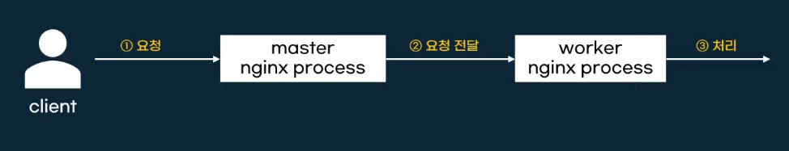
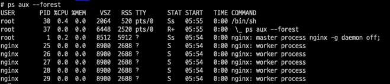
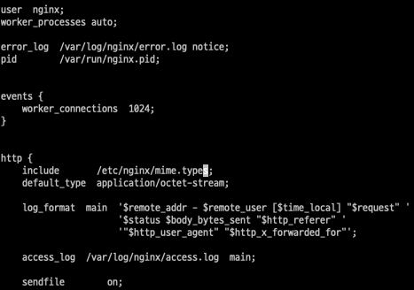
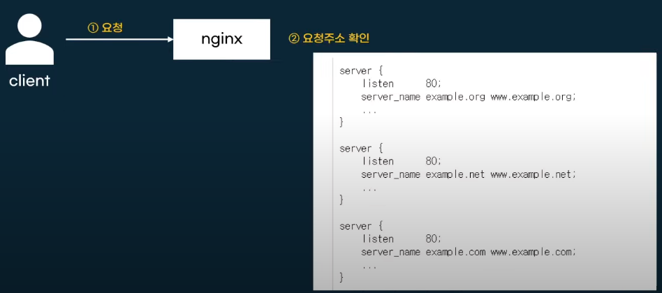

# Nginx 다양한 설정들

## 마스터 프로세스와 워커 프로세스

명령어를 통해 현재 열려있는 프로세스를 확인할 수 있음. 
~~~
ps aux --forest 
~~~

nginx.conf 파일에 접속하면

worker_processes auto; 로 설정되있는 것을 볼 수 있는데

숫자로 바꿔주면 개수를 직접 설정할 수 있다. 

## 설정파일

/etc/nginx/nginx.conf

디렉티브(directives)로 관리 

    간단 디렉티브 

        user nginx; 처럼 {}으로 안감싸져 있는 것들.

    블럭 디렉티브 

        http{} 처럼 블록으로 감싸져 있는 것들

설정의 끝은 세미콜론;

include를 사용해서 설정파일을 분리해서 관리 

    include /etc/nginx/conf.d/*.conf;

## Server block

서버 기능을 설정하는 블록

어떤 주소 port로 요청을 받을지 결정

listen : 포트번호 설정
server_name : 받을 도메인 설정

#### 연습. 

conf.d 다렉토리에 새로운 hello.conf 파일 만들어주기. default.conf 복사해서 위에 바꿔줌.

~~~
server {
	listen   82;
    listen  [::]82
	server_name helloworld.com;
        .
        .
        .
        .
        .
}
~~~

helloworld.com의 82번 포트로 연결이 들어오면 nginx를 열어준다는 뜻.
 
~~~ 
curl helloworld.com:82
~~~
를 호출하면 아무런 응답이 없음. 

왜냐면, helloworld.com은 실제 있는 도메인이기에 82포트로 들어가는 것이 불가.

우리 nginx를 호출해야 하기때문에 hosts 파일 변경 필요 

~~~
vi /etc/hosts
~~~

~~~
# nginx server_name
127.0.0.1 helloworld.com
~~~
를 추가해준다. 

## 문법 검사 

nginx -t

## http block 

