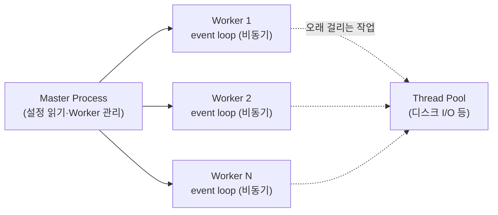
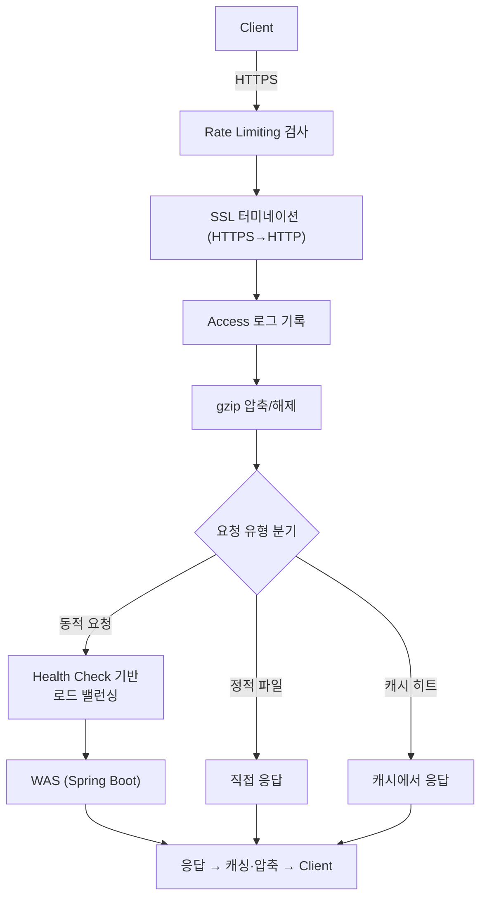

# Nginx

> 최종 업데이트: 2026-05-24 | 기준: Nginx stable 1.30.x / mainline 1.31.x (오픈소스), Nginx Plus(상용)

## 개념

**고성능 웹 서버이자 리버스 프록시 서버.** 이벤트 기반(Event-Driven) 비동기 구조로 대량의 동시 커넥션을 적은 메모리로 효율적으로 처리한다. 이름은 "engine x"를 발음한 것이다.

> **비유**: 식당의 안내 데스크와 같다. 손님(클라이언트)이 오면 직접 요리하지 않고, 적절한 주방(백엔드 서버)으로 안내하거나, 이미 준비된 음식(캐시/정적 파일)은 바로 제공한다. 안내 데스크 직원 한 명(Worker Process)이 여러 손님을 동시에 응대할 수 있는 구조다.

| 구분 | 역할 | 예시 |
|------|------|------|
| Web Server | 정적 파일 제공 (HTML, CSS, JS, 이미지) | Nginx, Apache |
| WAS | 동적 요청 처리 (비즈니스 로직) | Spring Boot (Tomcat), Node.js |

백엔드 입장에서 Nginx는 WAS 앞단에 위치해 **리버스 프록시, 로드 밸런싱, SSL 터미네이션, 정적 파일 서빙, 캐싱, 요청 제한**을 담당하는 인프라 계층이다.

> WAS와의 역할 구분은 [Web 서버와 WAS](../CS-이론/Web-서버와-WAS.md) 참고.

## 배경/역사

당시 웹 서버 표준이던 Apache는 **요청 하나에 프로세스/스레드 하나**를 붙이는 모델이라, 동시 커넥션이 1만 개를 넘기면 메모리·컨텍스트 스위칭 비용이 폭증했다. 이것이 그 유명한 **C10K 문제(동시 커넥션 1만 개 처리)**다. Nginx는 이 문제를 정면으로 풀기 위해 태어났다.

- **2002년 개발 시작, 2004년 10월 공개** — 러시아 개발자 **Igor Sysoev**가 대형 포털의 Apache 한계를 겪고 직접 만들었다. Apache의 프로세스 모델 대신 **이벤트 루프 기반 비동기 구조**를 택해, 커넥션이 늘어도 메모리가 거의 일정한 것이 핵심 혁신이었다.
- **Nginx Inc. 설립** — 상용 버전 **Nginx Plus** 출시(오픈소스 + 부가 기능).
- **2019년 — F5 Networks가 약 $6.7억에 Nginx Inc. 인수.** 현재 오픈소스 Nginx도 F5가 관리한다.
- **2024년 2월 — `freenginx` 포크 분리.** 핵심 개발자 **Maxim Dounin**이, F5의 비기술 경영진이 기존 보안 정책을 무시하고 실험적 HTTP/3 코드의 버그를 보안 릴리스로 강제 처리하려 한 것에 반발해 별도 포크를 시작했다. (앞서 2022년엔 전직 개발자들이 `Angie` 포크를 만들기도 했다.)

오픈소스 라이선스는 BSD-like 2-clause로 계속 무료다.

| 배포판 | 라이선스 | 특징 |
|--------|----------|------|
| **Nginx (오픈소스)** | BSD 2-clause, 무료 | 대부분의 기능. 본 문서 기준 |
| **Nginx Plus (상용)** | 유료 | Active 헬스 체크, 실시간 대시보드, JWT 인증, 동적 재구성 등 |
| **freenginx / Angie** | 무료 포크 | 커뮤니티 주도 포크, 본가 업데이트 미러링 |

> **버전 체계**: 두 번째 자리가 **홀수면 mainline**(개발·신기능, 현재 1.31.x), **짝수면 stable**(고위험 버그만 패치, 현재 1.30.x)이다. 최근 1.29.8/1.30 라인부터 **OpenSSL 4.0 호환**이 들어왔다.

## 아키텍처

Master 프로세스 하나가 설정을 관리하고, 실제 요청은 여러 Worker 프로세스가 처리한다. Worker는 보통 **CPU 코어 수만큼** 생성된다.



- **Master Process** — 설정 파일을 읽고 Worker를 생성·관리한다. 설정 변경(reload) 시 새 Worker를 띄우고 기존 Worker는 처리 완료 후 종료해 **무중단 설정 변경**이 가능하다.
- **Worker Process** — 실제 요청을 처리한다. OS 커널의 I/O 멀티플렉싱(Linux `epoll`, macOS/BSD `kqueue`)으로 수천 커넥션을 한 프로세스에서 다룬다. 오래 걸리는 작업(디스크 I/O 등)은 Thread Pool로 위임한다(1.7.11+).

### Apache와의 차이

| 항목 | Apache (prefork) | Nginx |
|------|-------------------|-------|
| 처리 모델 | 요청당 프로세스/스레드 생성 | 이벤트 기반 비동기 |
| 동시 커넥션 | 증가 시 메모리/CPU 급증 | 증가해도 메모리 거의 일정 |
| 설정 변경 | 재시작 필요 | reload로 무중단 변경 |
| .htaccess | 디렉토리별 설정 가능 | 미지원 (중앙 설정만) |

## 주요 역할

WAS 앞단에서 Nginx가 맡는 일들이다. 각 기능의 상세 설정은 [Nginx 설정](./Nginx-설정.md), 로드 밸런싱·로그는 전용 문서로 분리해 두었다.

| 역할 | 하는 일 | 비유 |
|------|---------|------|
| **리버스 프록시** | 요청을 백엔드로 중계하고 서버 정보를 숨김 | 외부 전화를 내부 담당자에게 연결하는 콜센터 교환원 |
| **로드 밸런싱** | 여러 WAS에 요청 분산 → [전용 문서](./Nginx-로드밸런싱.md) | 줄 짧은 매표소로 손님을 보내는 안내원 |
| **SSL/TLS 터미네이션** | 클라이언트와 HTTPS, 백엔드와 HTTP로 통신해 암복호화 부하 분리 | 정문에서만 검문하고 안에선 자유 통행 |
| **정적 파일 서빙** | HTML·CSS·이미지를 직접 응답해 WAS 부하 감소 | 미리 만들어둔 반찬을 바로 내줌 |
| **캐싱** | 백엔드 응답을 저장해 동일 요청 시 WAS를 건너뜀 | 미리 준비한 FAQ로 즉답 |
| **gzip 압축** | 텍스트 응답을 압축해 전송량 감소 | 짐을 진공팩으로 압축해 배송 |
| **Rate Limiting** | 과도한 요청을 제한해 서버 보호(DDoS·남용 방지) | 놀이기구 1인당 탑승 횟수 제한 |

대표적으로 리버스 프록시 설정은 다음과 같다. 백엔드로 넘길 때 원본 요청 정보를 헤더에 실어 보내는 게 핵심이다.

```nginx
server {
    listen 80;
    server_name example.com;

    location / {
        proxy_pass http://localhost:8080;
        proxy_set_header Host $host;
        proxy_set_header X-Real-IP $remote_addr;
        proxy_set_header X-Forwarded-For $proxy_add_x_forwarded_for;
        proxy_set_header X-Forwarded-Proto $scheme;
    }
}
```

## 전체 요청 흐름

Nginx 한 대가 요청을 받아 단계별로 처리하는 큰 그림이다.



## 주요 명령어

```bash
nginx -t                    # 설정 파일 문법 검사
nginx -s reload             # 무중단 설정 반영
nginx -s stop               # 즉시 종료
nginx -s quit               # 요청 처리 완료 후 종료
nginx -V                    # 빌드 옵션 및 모듈 확인
```

## 관련 문서

- [Nginx 설정](./Nginx-설정.md) — 설정 파일 문법·블록 구조·디렉티브 상세
- [Nginx 로드 밸런싱과 헬스 체크](./Nginx-로드밸런싱.md) — 분산 알고리즘·헬스 체크
- [Nginx 로그](./Nginx-로그.md) — Access/Error 로그
- [Nginx timeout](./Nginx-timeout.md) — 각종 타임아웃 디렉티브와 튜닝
- [Web 서버와 WAS](../CS-이론/Web-서버와-WAS.md) — 웹 서버와 WAS의 역할 분담
- [Tomcat 기본](../Tomcat/Tomcat-기본.md) — Nginx 뒤에 흔히 놓이는 WAS

---

**참고 자료**

- [nginx 공식 사이트](https://nginx.org/)
- [What's New in NGINX Open Source 1.29 — NGINX Blog](https://blog.nginx.org/blog/nginx-open-source-1-29-3-and-1-29-4)
- [Nginx — Wikipedia](https://en.wikipedia.org/wiki/Nginx)
- [Nginx web server forked as Freenginx — The Register](https://www.theregister.com/2024/02/16/freenginx_fork/)
