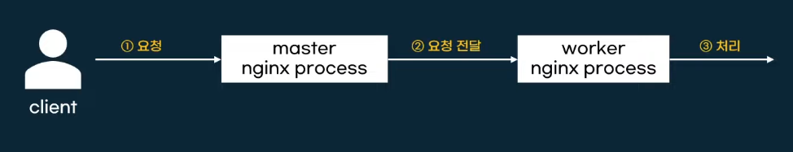
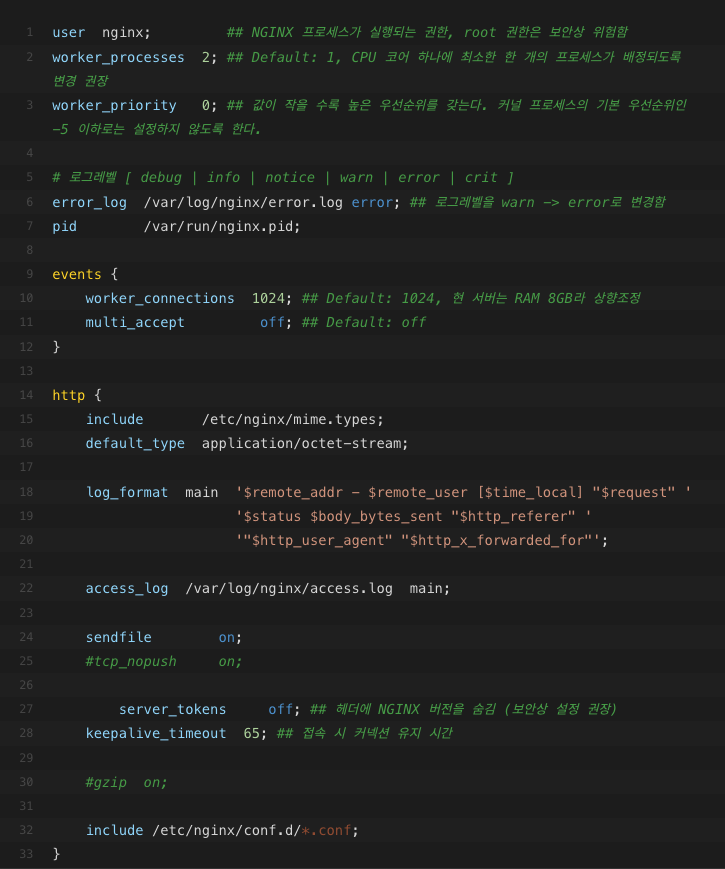
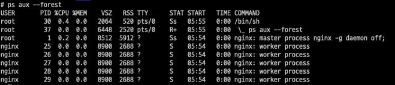
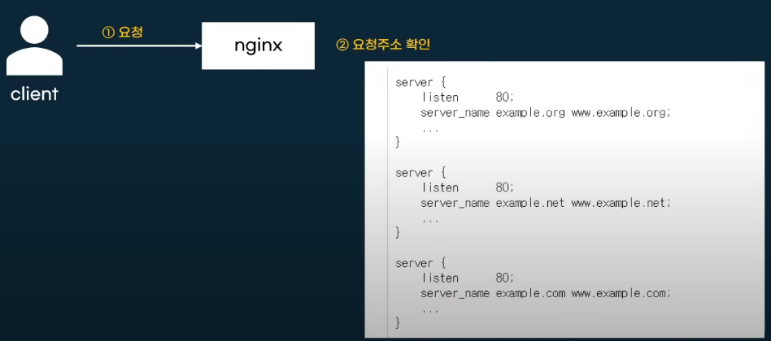
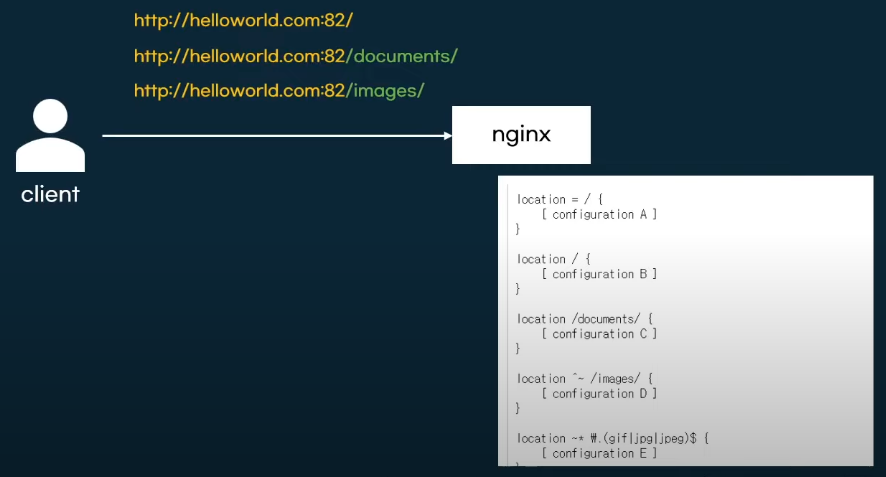
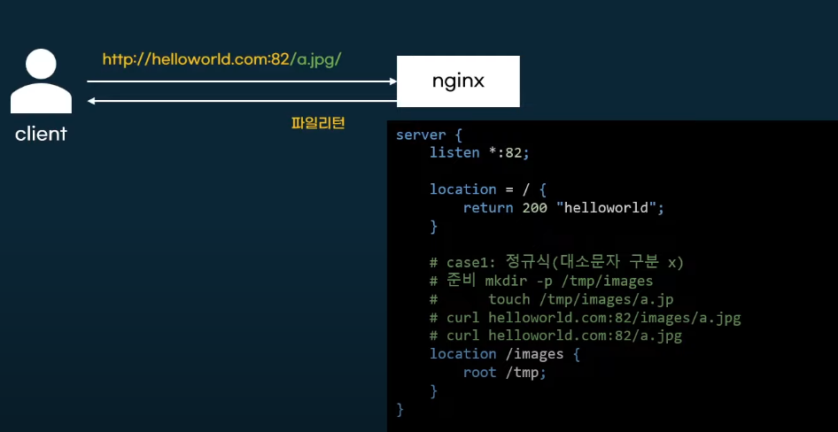
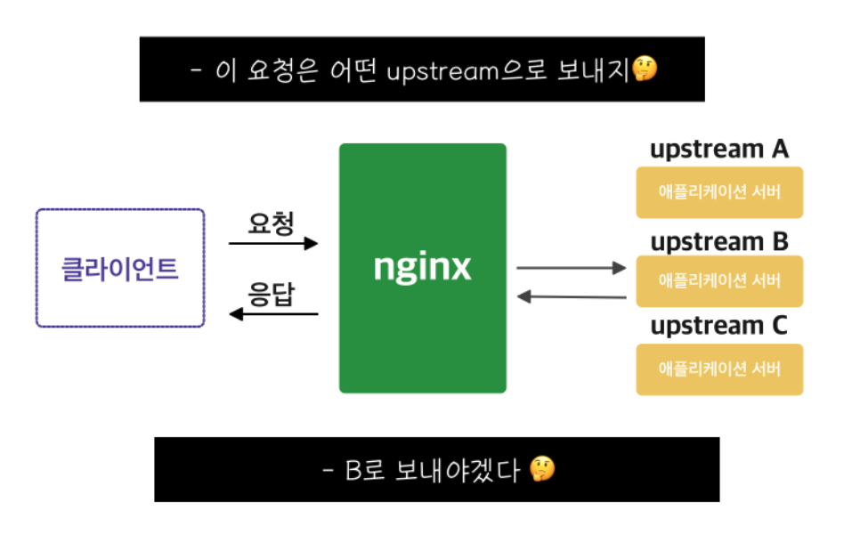

# Nginx 설정 파일 구조

> 최종 업데이트: 2026-04-08

## 개념

Nginx의 동작은 **설정 파일(Configuration File)** 하나로 결정된다. 레스토랑에 비유하면, `nginx.conf`는 레스토랑의 운영 매뉴얼이다. 직원 수(worker), 어떤 손님(요청)을 어디로 안내할지(라우팅), 메뉴판(응답) 등 모든 규칙이 이 한 곳에 정의된다.

설정의 개별 항목을 **디렉티브(Directive)**라고 부른다. 디렉티브는 두 종류로 나뉜다.

| 종류 | 형태 | 예시 |
|------|------|------|
| **간단 디렉티브** | `이름 값;` (세미콜론으로 종료) | `worker_processes auto;` |
| **블록 디렉티브** | `이름 { ... }` (중괄호로 감쌈) | `http { }`, `server { }` |

블록 디렉티브 안에 다른 디렉티브를 포함할 수 있으며, 이때 바깥 블록을 **컨텍스트(context)**라고 한다. 어떤 블록에도 속하지 않는 디렉티브는 **메인 컨텍스트**에 있다고 표현한다.

## 프로세스 구조



Nginx는 **마스터 프로세스** 1개와 **워커 프로세스** N개로 동작한다.

```
Master Process (설정 읽기, Worker 관리)
├── Worker Process 1 (실제 요청 처리)
├── Worker Process 2
└── Worker Process N
```

| 프로세스 | 역할 |
|----------|------|
| Master | 설정 파일 파싱, Worker 생성/종료, 시그널 수신 |
| Worker | 클라이언트 요청의 실제 처리 (이벤트 루프 기반) |

현재 프로세스 확인 명령어:

```bash
ps aux --forest | grep nginx
```

## 설정 파일 계층 구조



`nginx.conf`의 전체 구조를 트리로 표현하면 다음과 같다. 건물에 비유하면 `http`가 건물 전체, `server`가 각 층, `location`이 각 방이다.

```
nginx.conf
├── Core (메인 컨텍스트)
│   ├── worker_processes
│   ├── error_log
│   ├── pid
│   └── ...
├── events { }
│   └── worker_connections
└── http { }
      ├── upstream { }
      ├── server { }
      │     ├── listen
      │     ├── server_name
      │     └── location { }
      │           ├── proxy_pass
      │           ├── root / alias
      │           ├── try_files
      │           └── return
      └── include conf.d/*.conf
```

## Core 모듈 (메인 컨텍스트)



`nginx.conf` 최상위에 위치하는 디렉티브들. Nginx 프로세스 자체의 동작을 결정한다.

| 디렉티브 | 설명 | 권장값 |
|----------|------|--------|
| `worker_processes` | 생성할 워커 프로세스 수 | `auto` (CPU 코어 수만큼) |
| `error_log` | 에러 로그 파일 경로와 레벨 | `/var/log/nginx/error.log warn` |
| `pid` | 마스터 프로세스의 PID 파일 경로 | `/run/nginx.pid` |
| `user` | 워커 프로세스 실행 사용자 | `nginx` |

```nginx
user nginx;
worker_processes auto;
error_log /var/log/nginx/error.log warn;
pid /run/nginx.pid;
```

## events 블록

네트워크 이벤트 처리 방식을 설정한다. 전화 교환원이 동시에 몇 통화를 받을 수 있는지 정하는 것과 같다.

```nginx
events {
    worker_connections 1024;    # 워커 하나당 최대 동시 커넥션
    use epoll;                  # Linux 이벤트 모델 (보통 자동 선택)
}
```

**최대 동시 접속 수** = `worker_processes` x `worker_connections`

예: `worker_processes 4` + `worker_connections 1024` = 최대 4,096 동시 커넥션

## http 블록

HTTP 프로토콜 관련 설정의 **루트 블록**. 하위에 `server`, `location`, `upstream` 블록을 포함한다.

`conf.d/*.conf` 파일들은 `http` 블록 안에 include되므로, 별도 conf 파일 작성 시 `http { }`를 다시 감쌀 필요가 없다.

```nginx
http {
    include       /etc/nginx/mime.types;
    default_type  application/octet-stream;

    sendfile    on;
    keepalive_timeout 65;

    include /etc/nginx/conf.d/*.conf;   # 개별 서버 설정 로드
}
```

### conf.d 디렉터리

`/etc/nginx/conf.d/` 폴더에 `*.conf` 파일을 두면 자동으로 `http` 블록 안에 포함된다. 서비스별로 파일을 분리하여 관리하는 것이 일반적이다.

```
/etc/nginx/conf.d/
├── default.conf        # 기본 서버 설정
├── api.conf            # API 서버
└── admin.conf          # 관리자 페이지
```

## server 블록



하나의 **가상 호스트(virtual host)**를 정의한다. 같은 IP의 서버에서 여러 도메인/포트를 서빙할 수 있다. 아파트 한 건물에 여러 세대가 있는 것과 같다.

| 디렉티브 | 역할 | 예시 |
|----------|------|------|
| `listen` | 수신할 IP:포트 | `listen 80;`, `listen 443 ssl;` |
| `server_name` | 매칭할 도메인명 (Host 헤더 기준) | `server_name example.com;` |
| `root` | 정적 파일의 기본 경로 | `root /var/www/html;` |

```nginx
server {
    listen 80;
    server_name api.example.com;

    location / {
        proxy_pass http://localhost:8080;
    }
}
```

### server_name 매칭 우선순위

여러 server 블록이 있을 때, 요청의 Host 헤더와 `server_name`을 비교하여 처리할 블록을 결정한다.

| 우선순위 | 유형 | 예시 |
|----------|------|------|
| 1 | 정확한 이름 | `server_name example.com;` |
| 2 | 와일드카드 시작 | `server_name *.example.com;` |
| 3 | 와일드카드 끝 | `server_name www.example.*;` |
| 4 | 정규식 | `server_name ~^www\d+\.example\.com$;` |
| 5 | default_server | `listen 80 default_server;` |

## location 블록



요청 URI에 따라 처리 방식을 분기한다. 건물 안내 데스크에서 "어느 방으로 가세요"를 결정하는 역할이다.

### location 매칭 우선순위

| 우선순위 | 수정자 | 의미 | 예시 |
|----------|--------|------|------|
| 1 | `=` | 정확히 일치 (Exact Match) | `location = /api { }` |
| 2 | `^~` | 접두사 일치 시 정규식 검사 안 함 | `location ^~ /static/ { }` |
| 3 | `~` | 정규식 (대소문자 구분) | `location ~ \.php$ { }` |
| 4 | `~*` | 정규식 (대소문자 무시) | `location ~* \.(jpg\|png)$ { }` |
| 5 | (없음) | 접두사 매칭 (Prefix Match) | `location /api/ { }` |

```
요청: /api/users
  1. = /api/users        → 정확히 일치하면 즉시 선택
  2. ^~ /api/            → 접두사 일치하면 정규식 스킵, 즉시 선택
  3. ~ ^/api/.*          → 정규식 매칭 시도
  4. ~* ^/api/.*         → 대소문자 무시 정규식 매칭 시도
  5. /api/               → 가장 긴 접두사 매칭 선택
```

### location 내 주요 디렉티브

| 디렉티브 | 역할 | 예시 |
|----------|------|------|
| `proxy_pass` | 요청을 백엔드 서버로 전달 | `proxy_pass http://backend;` |
| `root` | 정적 파일 루트 경로 (URI가 붙음) | `root /var/www;` → `/var/www/images/a.jpg` |
| `alias` | 정적 파일 경로 (URI 대체) | `alias /data/images/;` |
| `try_files` | 파일 존재 여부에 따라 순차 시도 | `try_files $uri $uri/ =404;` |
| `return` | 즉시 상태 코드/문자열 반환 | `return 200 "OK";` |
| `rewrite` | URI 변환 | `rewrite ^/old /new permanent;` |

### 예시: Exact Match

```nginx
server {
    listen 80;
    server_name example.com;

    location = / {
        return 200 "home";
    }

    location = /health {
        return 200 "ok";
    }

    location /api/ {
        proxy_pass http://localhost:8080;
    }
}
```

`=`를 사용하면 `/health`는 정확히 매칭되지만, `/health/check`는 매칭되지 않는다.

## 파일 서빙 (root, alias, try_files)



정적 파일을 반환할 때 `root`와 `try_files`를 조합한다.

| 디렉티브 | 동작 |
|----------|------|
| `root /tmp;` + URI `/images/a.jpg` | `/tmp/images/a.jpg` 반환 (root + URI) |
| `alias /tmp/;` + URI `/images/a.jpg` | `/tmp/a.jpg` 반환 (alias가 location 경로를 대체) |

```nginx
server {
    listen 80;

    location /images/ {
        root /tmp;
        try_files $uri =404;    # 파일 없으면 404 반환
    }
}
```

## upstream 블록



백엔드(origin) 서버 그룹을 정의한다. 여러 WAS 인스턴스에 요청을 분산(로드 밸런싱)할 때 사용한다.

```nginx
upstream backend_servers {
    least_conn;
    server 10.0.0.1:8080;
    server 10.0.0.2:8080;
    server 10.0.0.3:8080 backup;    # 다른 서버 장애 시에만 사용
}

server {
    listen 80;

    location / {
        proxy_pass http://backend_servers;
    }
}
```

로드 밸런싱 알고리즘 상세와 헬스 체크는 [Nginx 로드 밸런싱과 헬스 체크](Nginx-로드밸런싱.md) 참고.

## 주요 내장 변수

Nginx는 요청 정보를 변수로 제공한다. `proxy_set_header` 등에서 활용한다.

| 변수 | 설명 |
|------|------|
| `$host` | 요청의 Host 헤더값 |
| `$remote_addr` | 클라이언트 IP |
| `$uri` | 현재 요청 URI (정규화된 경로) |
| `$request_uri` | 원본 요청 URI (쿼리 스트링 포함) |
| `$args` | 쿼리 스트링 파라미터 |
| `$scheme` | 프로토콜 (`http` 또는 `https`) |
| `$server_name` | 매칭된 server_name |
| `$proxy_add_x_forwarded_for` | X-Forwarded-For 헤더에 클라이언트 IP 추가 |

```nginx
proxy_set_header Host $host;
proxy_set_header X-Real-IP $remote_addr;
proxy_set_header X-Forwarded-For $proxy_add_x_forwarded_for;
proxy_set_header X-Forwarded-Proto $scheme;
```

## 설정 검증과 반영

설정을 변경한 뒤에는 반드시 **문법 검사 후 reload** 하는 흐름을 따른다. 식당의 레시피를 바꿨으면, 먼저 검수한 뒤 주방에 공지하는 것과 같다.

```
설정 파일 수정 → nginx -t (문법 검사) → nginx -s reload (무중단 반영)
```

| 명령어 | 동작 |
|--------|------|
| `nginx -t` | 설정 파일 문법 검사 (실제 반영 안 함) |
| `nginx -s reload` | 새 Worker 생성, 기존 Worker는 요청 완료 후 종료 (무중단) |
| `nginx -s stop` | 즉시 종료 |
| `nginx -s quit` | 현재 요청 처리 완료 후 종료 (Graceful) |
| `nginx -T` | 전체 설정 내용 출력 (디버깅용) |

### reload 동작 흐름

```
nginx -s reload
    ↓
Master Process: 설정 파일 다시 읽기
    ↓
새 Worker Process 생성 (새 설정 적용)
    ↓
기존 Worker Process: 현재 요청 완료 후 종료
    ↓
무중단 설정 반영 완료
```

## Timeout 설정

timeout 관련 디렉티브(`proxy_read_timeout`, `proxy_connect_timeout` 등)는 별도 문서에서 상세히 다룬다.

-> [Nginx-timeout.md](Nginx-timeout.md)

## 쿠버네티스 Ingress와의 관계

쿠버네티스에서는 **Ingress** 리소스가 Nginx 설정 파일의 역할을 대신한다. Ingress Controller(주로 nginx-ingress-controller)가 Ingress 리소스를 읽어 자동으로 `nginx.conf`를 생성한다.

| Nginx 설정 | K8s Ingress 대응 |
|-------------|-------------------|
| `server_name` | `spec.rules[].host` |
| `location` | `spec.rules[].http.paths[].path` |
| `= (exact match)` | `pathType: Exact` |
| 접두사 매칭 | `pathType: Prefix` |
| `proxy_pass` (upstream) | `backend.service.name` + `port` |

```yaml
# Ingress 예시 (Nginx location과 동일한 역할)
apiVersion: networking.k8s.io/v1
kind: Ingress
metadata:
  name: api-ingress
spec:
  rules:
  - host: api.example.com
    http:
      paths:
      - path: /
        pathType: Prefix
        backend:
          service:
            name: api-service
            port:
              number: 8080
```

## 참고

- https://nginx.org/en/docs/
- https://www.youtube.com/watch?v=hA0cxENGBQQ
- https://juneyr.dev/nginx-basics
- https://architectophile.tistory.com/12
