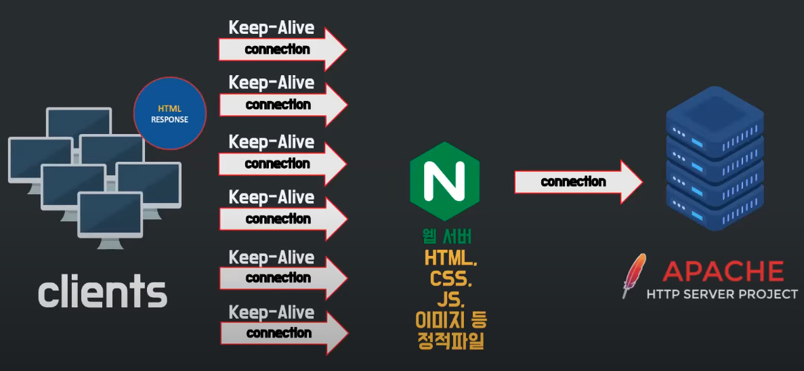
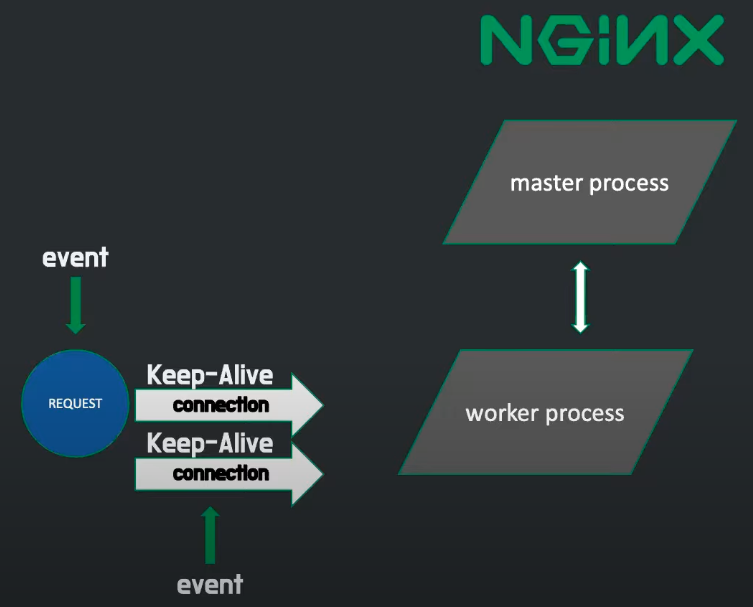
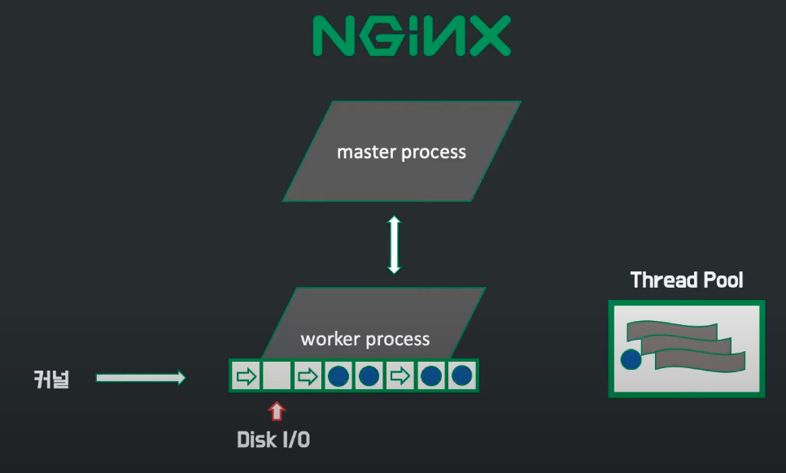
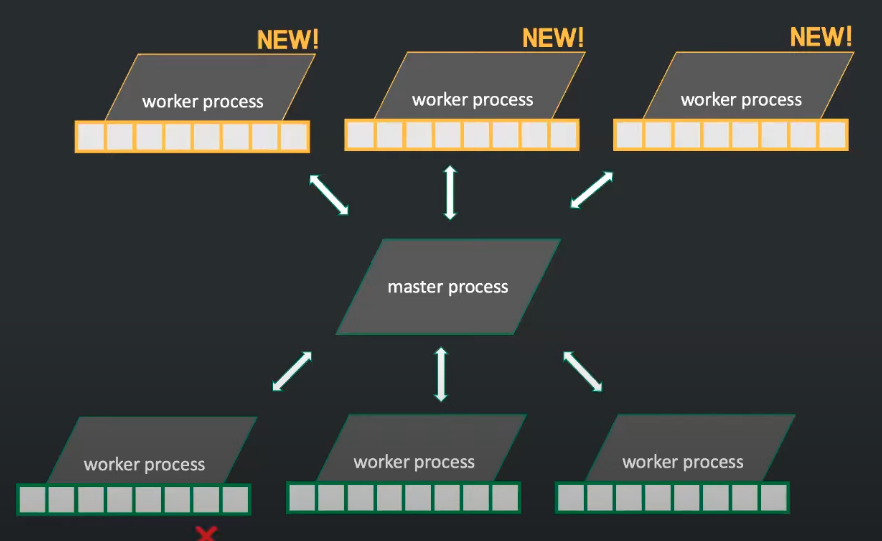

# Nginx

## Nginx란? 

#### 한마디로 웹서버
        
    Web Server : Nginx. 정적페이지, 완제품

    WAS : Spring Boot(Tomcat) : 동적페이지, 주문제작

## 역사

**1995** - NCSA를 보다 개량한 APACHE 서버 만들어짐.

#### apache 특징

    요청이 들어올 때마다 process 생성.

    prefork방식을 통해 만드는데 오래걸리는 process를 미리 만들어둠. 

    새로운 요청이 오면 만들어둔 process 배치.

    process없으면 추가로 생성.

#### apache 장점.

    개발하기 쉬워서 다양한 모듈이 만들어서 서버에 빠르게 기능을 추가함.

    요청을 받고 응답하는 과정을 하나의 서버에서 해결하기 좋았음. 

**1999** 

서버가 처리할 요청이 너무 많아짐. 

C10K Connection 10000 problem 

    서버에 동시에 연결된 connection이 많아졌을 때 더이상 신규 connection을 만들지 못하게 됨.

    하드웨어는 문제가 없었음. 

    Apache의 구조가 문제였다. 

        connection이 많아질 수 록 process를 할당하기 때문에 메모리 부족현상

        리소스의 양이 늘어남. 

        CPU 부하가 증가함.

**2004**

새로운 구조, apche server를 보완한 NGINX 등장.

초창기에는 apache와 같이 쓰이기 위해 등장함.

    nginx가 대신 동시 커넥션을 유지.

    자체로 웹서버이기 때문에 정적파일 요청을 대신 처리. 

    동적 파일 요청을 받았을 때, apache와 커넥션 생성

**2008**

Nginx의 점유율이 상승하기 시작함. 

스마트폰의 보급. 동시 connection이 급격히 늘어나게 됨.

Apache도 MPM을 도입하기 시작함. 

**2021**

웹 서버 역할

로드 밸런서 역할

웹 서버 가속기 역할

    SSL 터미네이션 역할

        클라이언트와는 https 통신, 서버와는 http 통신. 

        서버가 복호화 과정을 담당하지 않게 됨. 부하를 줄여줌. 

    캐싱 역할 

        http 프로토콜을 활용해서 전달하는 컨텐츠를 캐싱할 수 있음. 

        nginx를 클라쪽에 가깝게 배치. 서버로 부터 받은 응답을 스스로 보유 

    HSTS

    CORS 처리 

    TCP/UDP 커넥션 부하 분산

    HTTP/2

## Nginx 구조 

master process가 실제 일을 하는 worker process를 생성함. 

요청이 들어오면 worker process와 connection을 형성하고 keep-alive 시간만큼 유지됨.

event

    새로운 connection을 형성, 

    다른 connection으로 부터 요청 처리, 

    connection 제거 

    와 같은 행동들을 nginx에서 부르는 말.
 

이 event들을 OS 커널이 queue 형식으로 worker process에 전달 (멀티플렉싱, epoll)

비동기방식으로 차례대로 대기. 

이를 통해, worker process가 쉬지 않고 일하게 됨. apache에 비해 매우 효율적(apache는 요청이 없으면 process가 쉬게됨.)

요청 중 시간이 오래 걸리는 작업은 Thread Pool로 보냄. 

worker process는 보통 cpu 코어 개수만큼 생성함. 코어가 담당하는 process를 바꾸는 횟수를 줄일 수 있어서 cpu 부하를 줄인다. 

이것이 이벤트 기반 구조이다. 

## Nginx 구조 장점

동시 커넥션 양 최소 10배 증가. 

동일한 커넥션일 때 속도 2배 증가

동적 설정 변경 가능

    설정 파일을 변경하면 설정에 맞는 새로운 worker process를 생성함. 

    요청을 모두 처리한 기존의 worker process는 사라지게 됨.

    뒷단에 서버가 추가돨때 nginx의 로드밸런서 역할을 담당할 때 자주 쓰이게 됨. 

## Nginx 구조 단점 

기능 추가를 하다가 worker process를 종료시켜버리면, 해당 connection들을 더이상 처리할 수 없어짐.  

## 왜 쓰는가?

    1. WAS의 부담을 줄여주기 위해
   
        할일이 많은 WAS를 대신해서 정적파일, 이미지를 내려주는 일을 NGINX가 대신한다
   
    2. 무중단 배포를 위해
   
        가장 저렴하다

        기존에 쓰던 EC2에 그대로 적용하면 되기 때문에 배포를 위해 AWS EC2 인스턴스가 하나더 필요하지 않다.
   
    3. 빠르다

        동시 요청 당 메모리 수가 거의 일정함. 

        초당 요청 처리수도 압도적으로 큼.
   
        아파치, openresty에 비해 빠르기 때문에 전세계 점유율 1위
   
    4. 리버스 프록시 역할
   
        리버스 프록시 : 인터넷과 백엔드 사이에 있는 서버

        클라이언트에게 서버의 정보를 감춘다

        로드 밸런싱 역할을 한다
            요청들을 모두 받아서 어느 WAS로 가야하는지 길을 알려주고 밸런스있게 조율해준다

        캐싱을 해준다
            서버단의 캐시 서버
            동일한 요청이 발생했을 때 WAS로 가지않고 cache에 저장해둔 값을 가져다 씀.

        보안 역할
            WAS의 응답데이터에 많은 정보가 담겨있다.
            NGINX가 중요 데이터들을 중간에 숨겨준다.
   
    5. SSL 지원
   
        HTTPS의 보안 인증서를 지원해준다

    6. 압축 

        gzip 사용

        클라의 요청이 텍스트 일 경우 압축을 시켜줌
   
    7. 비동기 처리
   
        이벤트 루프 방식을 사용한다(event driven)

        요청을 한줄로만 받음

        많은 트래픽을 동시에 처리할 수 있다

## 참고 

https://www.youtube.com/watch?v=6FAwAXXj5N0