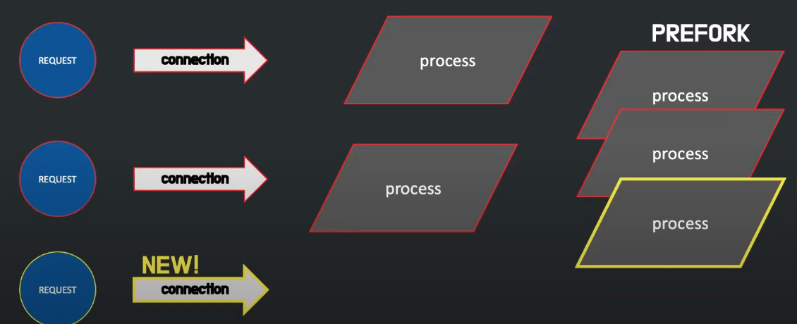

# Nginx

## Nginx란? 

#### 한마디로 웹서버
        
    Web Server : Nginx. 정적페이지, 완제품

    WAS : Spring Boot(Tomcat) : 동적페이지, 주문제작

## 역사

1995 - NCSA를 보다 개량한 APACHE 서버 만들어짐.

#### apache 특징

    요청이 들어올 때마다 process 생성.

    prefork방식을 통해 만드는데 오래걸리는 process를 미리 만들어둠. 

    새로운 요청이 오면 만들어둔 process 배치.

    process없으면 추가로 생성.

## 왜 쓰는가?

    1. WAS의 부담을 줄여주기 위해
   
        할일이 많은 WAS를 대신해서 정적파일, 이미지를 내려주는 일을 NGINX가 대신한다
   
    2. 무중단 배포를 위해
   
        가장 저렴하다

        기존에 쓰던 EC2에 그대로 적용하면 되기 때문에 배포를 위해 AWS EC2 인스턴스가 하나더 필요하지 않다.
   
    3. 빠르다
   
        아파치, openresty에 비해 빠르기 때문에 전세계 점유율 1위
   
    4. 리버스  프록시를 사용한다
   
        리버스 프록시 : 인터넷과 백엔드 사이에 있는 서버

        클라이언트에게 서버의 정보를 감춘다

        로드 밸런싱 역할을 한다
            요청들을 모두 받아서 어느 WAS로 가야하는지 길을 알려주고 밸런스있게 조율해준다

        캐싱을 해준다
            서버단의 캐시 서버
            동일한 요청이 발생했을 때 WAS로 가지않고 cache에 저장해둔 값을 가져다 씀.

        보안 역할
            WAS의 응답데이터에 많은 정보가 담겨있다.
            NGINX가 중요 데이터들을 중간에 숨겨준다.
   
    5. SSL 지원
   
        HTTPS의 보안 인증서를 지원해준다
   
    6. 비동기 처리
   
        이벤트 루프 방식을 사용한다(event driven)

        요청을 한줄로만 받음

        많은 트래픽을 동시에 처리할 수 있다