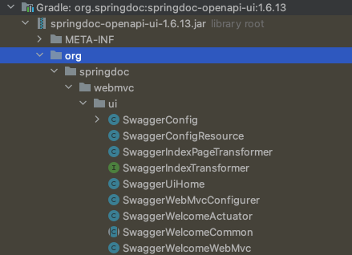

# Springboot 에서 Swagger 사용하기

## Swagger 라이브러리 

현재 스프링부트에서 Swagger 사용을 도와주는 라이브러리로는 

1. Springfox Swagger 
https://mvnrepository.com/artifact/io.springfox/springfox-swagger2

현재 2020년에 마지막으로 업데이트 되었다. 

2. SpringDoc OpenAPI UI (Spring Rest Docs가 아니다.)
https://mvnrepository.com/artifact/org.springdoc/springdoc-openapi-ui

2022년 꾸준히 업데이트 되는중이다. 

기존에는 springfox를 무지성으로 사용했었는데 꾸준히 업데이트되는 SpringDoc을 사용해보도록 하겠다.

공식 홈페이지 https://springdoc.org/

## Gradle 설정방법

~~~java
// https://mvnrepository.com/artifact/org.springdoc/springdoc-openapi-ui
implementation group: 'org.springdoc', name: 'springdoc-openapi-ui', version: '1.6.13'

~~~

스프링부트3 에서 변경됨.
https://springdoc.org/v2/#getting-started

1.6.13버전은 아래의 기능들을 지원한다.
OpenAPI 3
Spring-boot (v1, v2 and v3)
JSR-303, specifically for @NotNull, @Min, @Max, and @Size.
Swagger-ui
OAuth 2
GraalVM native images

의존성을 추가하고 나면 

swagger관련 클래스들이 자동 추가되어있다.

##Swagger 실제로 적용해보기

## 참고 

https://springdoc.org/#demos

https://oingdaddy.tistory.com/271