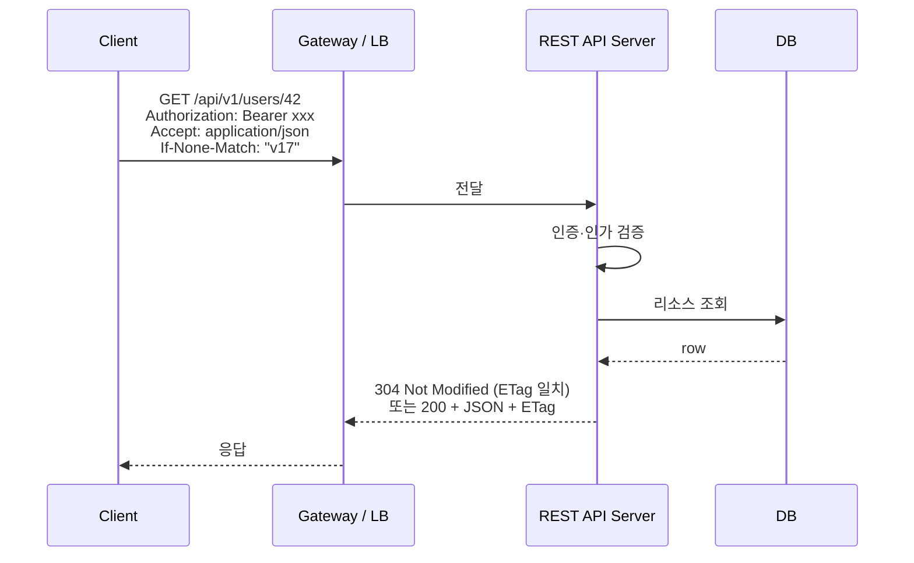

# REST / RESTful API

> 최종 업데이트: 2026-06-06 | 기준: Roy Fielding 논문(2000), RFC 9110(HTTP Semantics), RFC 7807

## 개념

**REST**(Representational State Transfer)는 네트워크 소프트웨어의 **아키텍처 스타일**이다. **RESTful API**는 그 제약조건을 실무적으로 따르는 HTTP API를 가리킨다.

> 비유하자면 **건축 양식**. 고딕 양식이 뾰족한 아치·스테인드글라스 등의 **제약조건 집합**이듯, REST도 6가지 제약을 정의해 웹 시스템이 따라야 할 구조를 제시한다. "정통 고딕 vs 고딕 스타일"의 관계가 그대로 "REST vs RESTful API"에 적용된다.

학술적 REST(6가지 제약 모두 만족)를 100% 지키는 API는 실무에 거의 없고, 대부분은 일부만 채택한 **REST-like / RESTful**이다. 그래서 산업계 통용어는 "REST"보단 "**RESTful**"이며, 사실상 같은 의미로 혼용된다.

성숙도 평가는 [Richardson-Maturity-Model.md](Richardson-Maturity-Model.md) 참고.

## 배경/역사

- **2000년**: **Roy T. Fielding**이 박사 논문 *Architectural Styles and the Design of Network-based Software Architectures*에서 REST 정의. HTTP 1.0/1.1 스펙 설계에 직접 참여하면서 웹 인프라(HTTP·URI·HTML)를 최대한 활용하는 아키텍처를 정리
- **2000년대 중반**: SOAP/XML-RPC의 무거움에 대한 반작용으로 단순한 HTTP+JSON API가 산업계 표준으로 확산
- **2008년**: **Leonard Richardson**이 RMM(Richardson Maturity Model) 발표 → REST 성숙도 단계화
- **2010년경**: Twitter, GitHub, Stripe 등 공개 API가 RESTful 스타일을 대중화
- **2016년 RFC 7807**: Problem Details for HTTP APIs — REST 에러 응답 표준 포맷
- **2022년 RFC 9110**: HTTP Semantics — HTTP 메서드·상태코드 의미를 한 문서로 정리한 현행 표준

> Roy Fielding 본인은 "HATEOAS 없으면 REST가 아니다"는 입장을 여러 번 표명. 하지만 산업계는 RMM Level 2 수준에서 **"이 정도면 RESTful"** 이라고 부르며 굳어졌다.

## REST 6가지 제약조건

REST는 구체적인 프로토콜이 아니라 아래 6가지 **제약조건(Constraints)** 의 집합이다.

| # | 제약조건 | 핵심 설명 | 필수 여부 | 실무 준수도 |
|---|---|---|---|---|
| 1 | **Client-Server** | 클라/서버 관심사 분리. UI와 데이터 저장을 독립 진화 | 필수 | ✅ 거의 100% |
| 2 | **Stateless** | 각 요청은 필요한 모든 정보 포함. 서버는 클라 상태 저장 X | 필수 | ✅ 대체로 | ※ 세션 쿠키는 부분 위반 |
| 3 | **Cacheable** | 응답에 캐시 가능 여부 명시 | 필수 | ⚠️ 부분적 |
| 4 | **Uniform Interface** | 리소스 조작 방식 통일 — 가장 핵심 | 필수 | ⚠️ 부분적 (HATEOAS는 거의 X) |
| 5 | **Layered System** | 클라는 중간 계층(프록시·LB) 존재를 알 수 없음 | 필수 | ✅ 자연 충족 |
| 6 | **Code on Demand** | 서버가 클라에 실행 가능한 코드 전송 가능 | **선택** | ❌ 거의 미사용 |

### Stateless 예시

```
-- Stateful (REST 위반) --
Client: "장바구니에 사과 추가"
Server: (세션에 사과 저장)
Client: "결제해줘"             ← 서버가 이전 상태를 기억해야 함

-- Stateless (REST 준수) --
Client: "장바구니=[사과,바나나]로 결제"  ← 요청 하나에 모든 정보 포함
```

### Cacheable 예시

```http
GET /products/42 HTTP/1.1

HTTP/1.1 200 OK
Cache-Control: max-age=3600
ETag: "v1-product42"
```

## Uniform Interface (핵심 제약)

REST를 다른 아키텍처 스타일과 구분 짓는 **가장 중요한 제약**. 4가지 하위 제약으로 구성.

> 비유: 전 세계 어디서든 USB-C 포트에 케이블 꽂으면 동작하듯, 리소스 조작 방식을 통일하면 클라-서버 결합도가 낮아진다.

| 하위 제약 | 설명 | 예시 |
|---|---|---|
| **Resource Identification** | 각 리소스는 URI로 고유 식별 | `GET /users/42` |
| **Representation을 통한 Manipulation** | JSON·XML 등 표현을 주고받아 리소스 조작 | `PUT /users/42` + JSON 본문 |
| **Self-descriptive Messages** | 메시지 자체에 처리 방법이 담겨야 함 | `Content-Type: application/json` |
| **HATEOAS** | 응답에 다음 가능한 행동(링크) 포함 | 아래 참조 |

### HATEOAS

**Hypermedia As The Engine Of Application State.** 응답에 관련 리소스 링크를 포함해, 클라가 API 구조를 사전에 알 필요 없이 링크 따라가며 상태 전이.

```json
{
  "id": 42,
  "name": "Alice",
  "links": [
    { "rel": "self",   "href": "/users/42" },
    { "rel": "orders", "href": "/users/42/orders" },
    { "rel": "delete", "href": "/users/42", "method": "DELETE" }
  ]
}
```

> HATEOAS는 RMM **Level 3**. 상세는 [Richardson-Maturity-Model.md](Richardson-Maturity-Model.md). 실무에선 거의 구현하지 않으며, 그 결과 대부분 API는 RMM Level 2에 머문다.

## URI 설계 규칙

리소스를 **명사로**, **계층적으로**, **일관되게** 표현.

| 규칙 | Good | Bad |
|---|---|---|
| 명사 사용 | `/users` | `/getUsers`, `/createUser` |
| 복수형 통일 | `/products/42` | `/product/42`, 단·복수 혼용 |
| 계층 구조 | `/users/42/orders` | `/orders?userId=42` (관계 표현 시) |
| 소문자 + 하이픈 | `/order-items` | `/orderItems`, `/order_items` |
| 확장자 미포함 | `/users/42` | `/users/42.json` |
| 트레일링 슬래시 X | `/users` | `/users/` |
| 컬렉션-항목 패턴 | `/users` / `/users/42` | `/userList`, `/userDetail` |

### 동사가 정말 필요할 때

순수 CRUD로 안 되는 액션은 **하위 리소스** 또는 명백한 동사 endpoint로 표현.

```
POST /orders/42/cancel
POST /users/42/password/reset
POST /payments/42/refund
```

> 모든 걸 CRUD에 끼워 맞추려다 도메인이 뒤틀리는 게 더 나쁘다. RPC적 동사 endpoint를 일부 두는 건 실무 RESTful 관행.

## HTTP 메서드

| 메서드 | 용도 | 멱등 | 안전 | 본문 | 성공 응답 |
|---|---|---|---|---|---|
| `GET` | 조회 | ✅ | ✅ | ❌ | 200 |
| `POST` | 생성 / 비CRUD 액션 | ❌ | ❌ | ✅ | 201 (생성) / 200·202 |
| `PUT` | **전체 교체** | ✅ | ❌ | ✅ | 200 / 204 |
| `PATCH` | **부분 수정** | △ | ❌ | ✅ | 200 / 204 |
| `DELETE` | 삭제 | ✅ | ❌ | ❌ | 204 |
| `HEAD` | 헤더만 조회 | ✅ | ✅ | ❌ | 200 |
| `OPTIONS` | 메서드 탐색·CORS preflight | ✅ | ✅ | ❌ | 200·204 |

### PUT vs PATCH

```http
PUT /users/42
{ "name": "길동", "email": "gd@x.com", "role": "user" }
```
→ 리소스 **전체 교체**. 빠진 필드는 기본값/null로 대체된다고 봐야 함.

```http
PATCH /users/42
{ "email": "new@x.com" }
```
→ 보낸 필드만 변경. **JSON Merge Patch (RFC 7396)** 또는 **JSON Patch (RFC 6902)** 둘 중 하나의 방언이 표준.

### 멱등성(Idempotency)

같은 요청을 여러 번 보내도 **결과가 동일**한 성질. 네트워크 재시도·중복 호출에 안전한지 결정.

- `GET`, `PUT`, `DELETE`, `HEAD`, `OPTIONS` → 멱등
- `POST`, `PATCH` → 비멱등 (기본적으로)
- 결제·주문 등 비멱등 POST는 **`Idempotency-Key` 헤더**(Stripe 관행)로 클라가 키를 줘서 서버가 중복을 잡는다

```http
POST /payments
Idempotency-Key: 9b4f1c-...-aa
```

서버는 키 + 요청 해시를 일정 기간(보통 24h) 저장, 같은 키가 다시 오면 **저장된 응답을 그대로** 돌려줌.

## 상태 코드

REST답게 쓰려면 **상태코드의 의미를 정확히** 매칭. `200 OK + { success: false }`로 모든 걸 뭉뚱그리는 건 안티패턴.

| 범주 | 코드 | 쓰임 |
|---|---|---|
| 2xx 성공 | `200 OK` | 일반 성공 (조회·수정) |
|  | `201 Created` | 리소스 생성. **`Location` 헤더에 새 자원 URI** |
|  | `202 Accepted` | 비동기 처리 접수 (큐에 넣음) |
|  | `204 No Content` | 성공, 응답 본문 없음 (DELETE 후) |
| 3xx 리다이렉트 | `301`/`308` | 영구 이동 |
|  | `304 Not Modified` | 조건부 GET 캐시 유효 |
| 4xx 클라 오류 | `400 Bad Request` | 형식·유효성 오류 |
|  | `401 Unauthorized` | **인증 안 됨** (토큰 없음/만료) |
|  | `403 Forbidden` | 인증은 됐지만 권한 없음 |
|  | `404 Not Found` | 리소스 없음 |
|  | `405 Method Not Allowed` | URI는 맞는데 메서드 미지원 |
|  | `409 Conflict` | 충돌 (낙관적 락 실패, 중복 생성) |
|  | `410 Gone` | 영구적으로 사라짐 |
|  | `415 Unsupported Media Type` | Content-Type 미지원 |
|  | `422 Unprocessable Entity` | 형식 OK인데 의미 오류 (도메인 검증 실패) |
|  | `429 Too Many Requests` | Rate limit |
| 5xx 서버 오류 | `500 Internal Server Error` | 서버 버그 |
|  | `502 Bad Gateway` | 업스트림 응답 이상 |
|  | `503 Service Unavailable` | 일시 불가 (점검·과부하) |
|  | `504 Gateway Timeout` | 업스트림 타임아웃 |

> **401 vs 403** 헷갈림 주의: 토큰이 없거나 만료면 401, 로그인은 됐는데 권한이 부족하면 403.

## 에러 응답 표준 (RFC 7807)

에러 본문도 **일관된 포맷**이 있어야 클라가 처리하기 쉽다. **Problem Details for HTTP APIs (RFC 7807)** 가 표준 권고.

```http
HTTP/1.1 422 Unprocessable Entity
Content-Type: application/problem+json

{
  "type": "https://example.com/errors/invalid-amount",
  "title": "Invalid amount",
  "status": 422,
  "detail": "amount must be greater than 0",
  "instance": "/orders/42",
  "errors": [
    { "field": "amount", "message": "must be > 0" }
  ]
}
```

- `type`: 에러 유형 URI (문서 링크)
- `title`: 사람용 짧은 요약
- `status`: HTTP 상태와 동일
- `detail`: 사람용 설명
- `instance`: 이 에러가 발생한 자원
- 도메인 필드는 자유 확장

> Spring Boot 3는 `ProblemDetail` 클래스로 RFC 7807 기본 지원.

## 컬렉션 다루기

### 페이지네이션

| 방식 | URL 예시 | 장점 | 단점 |
|---|---|---|---|
| **Offset** | `?page=3&size=20` | 직관적, 임의 페이지 이동 | 큰 offset 느림, 쓰기 중 데이터 흔들림 |
| **Cursor** | `?cursor=eyJpZCI6MTIzfQ&limit=20` | 성능 일정, 변동 데이터에 안전 | 임의 페이지 이동 불가 |
| **Keyset** | `?after_id=123&limit=20` | 빠름 | 정렬 키 의존 |

응답에 페이지 메타 포함:

```json
{
  "data": [...],
  "page": { "size": 20, "total": 1342, "next_cursor": "eyJpZCI6MTQzfQ" }
}
```

또는 **`Link` 헤더** (RFC 8288):
```http
Link: </users?cursor=eyJpZCI6MTQzfQ>; rel="next"
```

### 필터링·정렬·필드 선택

```
GET /users?status=active&role=admin          # 필터
GET /users?sort=-created_at,name             # 정렬 (-는 desc)
GET /users?fields=id,name,email              # 필드 선택 (sparse fieldset)
GET /users?q=길동                             # 자유 검색
```

### 부분 응답 / 임베딩

```
GET /orders/42?include=items,customer
```

너무 깊은 임베딩이 필요해지면 GraphQL 도입을 고민할 신호.

## 버전 관리

| 방식 | 예시 | 장점 | 단점 |
|---|---|---|---|
| **URI 경로** (실무 표준) | `/api/v1/users` | 직관적, 브라우저 테스트 쉬움 | URI 오염 |
| **Accept 헤더** | `Accept: application/vnd.myapp.v1+json` | URI 깔끔, "올바른 REST" | 디버깅·캐싱 까다로움 |
| **커스텀 헤더** | `X-API-Version: 1` | 분리 | 비표준 |
| **쿼리** | `?version=1` | 간단 | 캐시 키 복잡, 비권장 |

> 산업계 다수가 **URI 경로 버저닝**(`/v1/`). Roy Fielding은 헤더 방식을 선호하지만 실무 친화성에서 URI가 이김.

### 변경 정책

- 하위 호환 변경(필드 추가 등) → **버전 안 올림**
- 파괴적 변경(필드 제거, 시맨틱 변경) → **새 버전**
- 구버전은 **deprecation 헤더**로 알림

```http
Sunset: Sat, 01 Jan 2027 00:00:00 GMT
Deprecation: true
Link: <https://docs.example.com/v2-migration>; rel="deprecation"
```

## 인증 / 인가

| 방식 | 헤더 | 쓰임 |
|---|---|---|
| **Bearer Token (JWT 등)** | `Authorization: Bearer eyJ...` | API 표준 |
| **API Key** | `Authorization: ApiKey xxx` or `X-API-Key` | 서버 간 / 외부 파트너 |
| **Basic** | `Authorization: Basic base64(id:pw)` | 내부·점검용 |
| **OAuth 2.0 / OIDC** | Bearer 토큰의 발급 표준 | 3rd party 로그인 |

쿠키 기반 세션도 가능하지만 **순수 REST 관점에선 Stateless 위반**. 실무 RESTful API는 보통 **Bearer 토큰**이 표준.

## 동시성 제어 (ETag)

```http
GET /users/42
→ 200 OK
  ETag: "v17"

PUT /users/42
  If-Match: "v17"
→ 412 Precondition Failed   (다른 사람이 먼저 수정한 경우)
```

리소스 버전이 달라지면 거부. RESTful한 낙관적 동시성 제어 방법.

## 콘텐츠 협상

같은 자원도 클라가 원하는 표현으로 줄 수 있는 게 REST 정신.

```http
GET /users/42
Accept: application/json
Accept-Language: ko
Accept-Encoding: gzip
```

서버는 응답 형태를 골라 `Content-Type`, `Content-Language`, `Content-Encoding`으로 알린다.

> 대부분 RESTful API는 JSON 한 가지만 지원하지만, 공개 API는 JSON + XML, 또는 JSON + Protobuf를 함께 제공하기도 함.

## 동작 흐름



Uniform Interface 매핑:
- `GET /users/42` → Resource Identification
- `Accept: application/json` → Representation
- 메서드·Content-Type·상태코드 → Self-descriptive Messages
- (응답의 `links` 배열) → HATEOAS

## Spring Boot 예시

```java
@RestController
@RequestMapping("/api/v1/users")
@RequiredArgsConstructor
public class UserController {

    private final UserService userService;

    @GetMapping("/{id}")
    public ResponseEntity<UserResponse> get(@PathVariable Long id) {
        return ResponseEntity.ok(userService.find(id));
    }

    @PostMapping
    public ResponseEntity<UserResponse> create(@RequestBody @Valid UserCreateRequest req) {
        UserResponse created = userService.create(req);
        return ResponseEntity
            .created(URI.create("/api/v1/users/" + created.id()))
            .body(created);
    }

    @PatchMapping("/{id}")
    public UserResponse patch(@PathVariable Long id, @RequestBody UserPatchRequest req) {
        return userService.patch(id, req);
    }

    @DeleteMapping("/{id}")
    @ResponseStatus(HttpStatus.NO_CONTENT)
    public void delete(@PathVariable Long id) {
        userService.delete(id);
    }

    @ExceptionHandler(NotFoundException.class)
    public ProblemDetail handle(NotFoundException e) {
        ProblemDetail pd = ProblemDetail.forStatusAndDetail(HttpStatus.NOT_FOUND, e.getMessage());
        pd.setType(URI.create("https://example.com/errors/not-found"));
        return pd;
    }
}
```

## RESTful 안티패턴

| 안티패턴 | 문제 | 개선 |
|---|---|---|
| 모두 `200 OK` + `{success: false}` | 클라 분기 어려움, 캐시·모니터링 오작동 | 적절한 4xx/5xx |
| URI에 동사 (`/getUser`, `/createOrder`) | RPC 스타일, 일관성 ↓ | 명사 + HTTP 메서드 |
| `GET`으로 상태 변경 | 캐시·재시도가 의도치 않게 변경 발생 | `POST`/`PUT`/`PATCH` |
| 페이지네이션 없이 `/users` 전체 반환 | 데이터 늘면 폭주 | 페이지/커서 |
| 에러 메시지 자유 형식 | 클라 처리 제각각 | RFC 7807 |
| 매번 새 버전 (`/v2`, `/v3`) 양산 | 호환성 지옥 | 하위호환 변경은 무버전, 파괴적 변경만 |
| 인증을 쿼리스트링에 (`?token=xxx`) | 로그·Referer 누출 | `Authorization` 헤더 |

## 관련 기술 및 생태계

| 구분 | 이름 | 설명 |
|---|---|---|
| 프레임워크 | **Spring MVC / WebFlux** | Java/Kotlin 진영 대표 REST 프레임워크 |
|  | **Express.js** | Node.js 진영 경량 웹 프레임워크 |
|  | **Django REST Framework** | Python 진영 REST API 프레임워크 |
|  | **FastAPI** | Python, OpenAPI 자동 생성 |
| 문서화 | **OpenAPI (Swagger)** | REST API 스펙 표준 |
|  | **Spring REST Docs** | 테스트 기반 API 문서 생성 |
| HATEOAS | **Spring HATEOAS** | Spring 생태계 HATEOAS 지원 |
| 대안 기술 | **GraphQL** (Facebook, 2015) | 클라가 필요한 데이터 구조 직접 정의 |
|  | **gRPC** (Google) | Protobuf 기반 고성능 RPC |

## 관련 문서

- [Richardson-Maturity-Model.md](Richardson-Maturity-Model.md) — REST 성숙도 단계
- [../GraphQL/GraphQL.md](../GraphQL/GraphQL.md) — 대안 API 스타일
- [../CS-이론/네트워크/통신-프로토콜/HTTP/](../CS-이론/네트워크/통신-프로토콜/HTTP/)
- [../OPENAPI-3.0/](../OPENAPI-3.0/) — REST API 명세화

## 참고

- [로이 필딩 논문](https://www.ics.uci.edu/~fielding/pubs/dissertation/top.htm)
- https://en.wikipedia.org/wiki/Representational_state_transfer
- https://en.wikipedia.org/wiki/HATEOAS
- https://tv.naver.com/v/2292653
