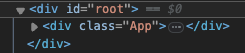
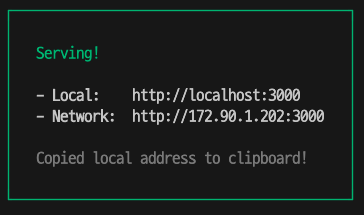
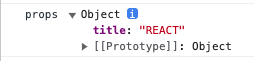

# React
[공식문서](https://ko.legacy.reactjs.org/)

## 핵심역할
사용자 정의태그를 만들어서 부품으로 사용한다.

## 로컬 세팅
새로운 React 앱 만들기 > 추천 툴체인(필요한 모든 환경을 제공하는 편리한 도구들) > Create React App
[Create React App](https://create-react-app.dev/)

1. node.js 설치

2. 해당 폴더에서 명령 실행
~~~sh
npx create-react-app .
~~~

3. 리액트 구동
~~~sh
npm start
~~~

## 리액트 구조
### src
`index.js `
입구 파일.
여러가지 전역적인 설정이 들어간다.

npm start로 리액트 앱을 구동시키면, index.js를 찾고 적혀있는대로 동작

`<App />`
이 코드가 UI 코드인데, 실제 내용은 어디있냐면
위에서 `import App from './App';`에서 가져오고 있음. 참고로 .js 확장자명은 생략된 것이다.

`App.js`의 function App()의 return값인 HTML 코드가 실제 화면의 소스와 일치한다.

그리고 `App.js`는 `import './App.css';`를 통해 css를 import 한다.

저 root의 출처는 아래이다.
~~~js
const root = ReactDOM.createRoot(document.getElementById('root'));
root.render(
  <React.StrictMode>
    <App />
  </React.StrictMode>
);
~~~
import한 `<App/>`을 id값이 **root**인 태그로 렌더링되라는 코드가 있다.

`public/index.html`을 보면 아래 코드가 있다.
~~~html

~~~

## 배포
~~~sh
npm run build
~~~
배포본을 만드는 명령어

build 폴더가 생긴다. index.html 폴더를 보면 공백 조차 없다. 배포할 때는 최대한 용량을 줄이기 위해서.

~~~sh
npx serve -s build
~~~
serve(web server)라는 앱을 쓰도록 권장함. node.js로 만들어졌다.
-s 옵션 : 사용자가 어떤 경로로 들어오든지, index.html을 서비스 해줌
build 폴더 지정 : build 폴더 안에 있는 index.html을 서비스

## Component(사용자 정의 태그) 만들기
~~~js
function Test(){ //대문자로 시작하기
  return HTML 코드
}
~~~

사용할 때는 
~~~js
<Test></Test>
또는
<Test/>
~~~

여러 태그들을 부품으로 만들 수 있게 되었다.

## PROP(속성)을 가진 Component
~~~js
function Header(props){
  console.log('props', props, props.title);
  return <header>
    <h1><a href="/">{props.title}</a></h1>
  </header>
}

<Header title="REACT"></Header>
~~~
Component 함수에 parameter를 준다. 이름은 마음대로 할 수 있지만 보통 props를 쓴다.

console을 찍어보면 객체가 들어온다.

값을 가져오기 위해 {} 표현식을 쓴다.

`key` PROP
리액트가 자동으로 생성한 태그를 추적할 근거.
약속된 PROP. Unique한 값을 줘야 한다.

## 이벤트 기능
PROP의 값으로 함수를 전달한다.