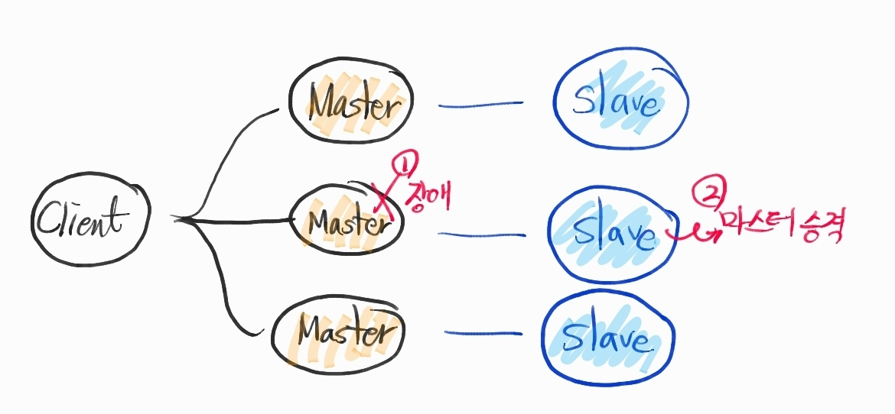

# Redis Cluster

## Redis Replication 개념

    Read 분산과 데이터 이중화를 위한 Master/Slave 구조

    Master 노드 : 쓰기/읽기 전부 수행.

    Slave 노드 : 읽기만 수행. 

    Replication : Slave가 Master의 데이터를 전부 가지고 있어야 해서 데이터를 전부 복제해서 옮기는 작업.

## Replication 작업 흐름

   1. Slave Configuration 쪽에 "replicaof <master IP> <master PORT>" 설정 혹은 REPLICAOF 명령어를 통해 마스터에 데이터 Sync 요청. 
   2. Master는 백그라운드에서 RDB파일(현재 메모리 상태를 담은 파일) 생성을 위한 프로세스 진행.
   3. Master는 fork를 통해 메모리 복사. fork한 프로세스에서 현재 메모리 정보를 디스크에 덤프뜨는 작업을 진행.
   4. 동시에 Master는 이후부터 들어오는  쓰기 명령들을 Buffer에 저장.
   5. 덤프작업이 완료되면 Master는 Slave에 해당 RDB파일을 전달해줌.
   6. Slave는 디스크에 저장한 후에 메모리로 로드.
   7. 4번에 모아두었던 쓰기 명령들을 Slave로 보내줌.


    주의할 점 

    1. Master가 fork를 진행할 때, 자신이 쓰고 있는 메모리만큼 추가로 필요해짐. OOM이 발생하지 않도록 주의 필요. 
    2. Masterrㅏ 죽는 경우 Slave는 주인을 잃어버리고 Sync 에러 발생. 쓰기가 불가능하고 읽기만 가능한 상태. 이떄는, Slave를 Master로 승격시켜야 함. 
    3. 위와 같은 failover를 대응하기 위한 것이 Redis Cluster


## Redis Cluster

    

    Cluster란, 각기 다른 서버를 하나로 묶어 하나의 시스템처럼 동작하게 함으로써 클라이언트에게 고갸용성을 제공하는 것.

    여러대의 서버에 데이터가 분산되어 저장되므로 트래픽이 분산되는 효과를 얻을 수 있음.

    서버거 꺼지더라도 백업 서버 덕분에 데이터의 유실없이 서비스를 계속 이어나갈 수 있음.

```
failover를 위한 대표적인 구성방식

여러 노드가 Hash 기반의 Slot을 나눠가지면서 클러스터를 구성하여 사용하는 방식.

전체 slot은 16384이고, hash 알고리즘은 CRC16.

Key를 CRC16으로 해시한 후에 16384로 나누면 해당 key가 저장될 slot이 결정됨.
```

```
Cluster를 구성하는 각 노드들은 master 노드들. 

자신만의 특정 slot range를 가짐.

데이터를 이중화하기 위해 Replication에서 설명한 Slave 노드를 가질 수 있음. 

하나의 클러스터 > 여러개의 master > 여러개의 slave로 구성. 
```

## 참고 

https://brunch.co.kr/@jehovah/20

https://daddyprogrammer.org/post/1601/redis-cluster/

https://medium.com/garimoo/redis-documentation-2-%EB%A0%88%EB%94%94%EC%8A%A4-%ED%81%B4%EB%9F%AC%EC%8A%A4%ED%84%B0-%ED%8A%9C%ED%86%A0%EB%A6%AC%EC%96%BC-911ba145e63