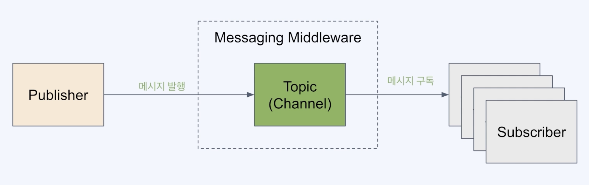
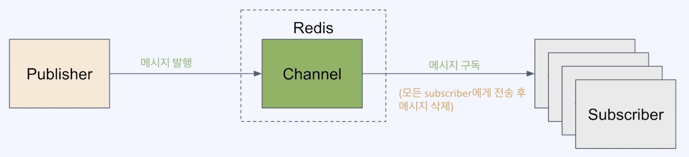

#  Redis Pub/Sub

## Pub/Sub 패턴



- 메시징 모델 중의 하나
- 발행(Publish)과 구독(Subscribe) 역할로 개념화 한 형태
- pub과 sub은 서로에 대한 정보 없이 특정 주제(토픽/채널)를 매개로 송수신
- kafka, rabbitmq, activemq 등등이 있음

### middleware 장점

- 비동기 처리 가능
- 송신자와 수신자의 낮은 결합도.
  - 서로의 영향도가 작아짐
- 한 쪽에서 장애가 생겨도 다른 pub/sub에 영향이 최소화됨

## Redis의 pub/sub



- 메시지가 큐에 저장되지 않음.
  - 현재 온라인으로 떠있는 sub에게만 메시지가 전달됨
- kafka의 컨슈머 그룹 같은 분산처리 개념이 없음
  - 모든 sub에게 메시지를 전송하게 되어있음
- 메시지 발행 시 push 방식으로 sub에게 전송
  - sub이 늘어날수록 성능저하가 날 수 있다.

## 언제 쓰는가?
- 실시간으로 빠르게 전송하는 메시
- 유실되어도 무관한 메시지
- 최대 1회 전송(at-most-once) 패턴이 적합한 경우
  - 메시지 전달 모델 중 하나.
  - 중복 처리는 안함
- sub들이 유동적으로 구독을 변경하는 경우

## 채팅방 구현

Clinet
- 채팅방 입장 : 채널 pub
- 메시지 전송 : 채널에 publish
- 메시지 수신 : 채널 구독에 따른 listner 구현


### RedisMessageListenerContainer

- 역할
  - 메시지 리스너 등록
    - 하나 이상의 MessageListener 인스턴스를 등록 가능.
    - 각 MessageListener는 수신하는 하나 이상의 채널 또는 패턴과 연결된다.
  - 연결 관리
    - Redis 서버에 대한 연결을 관리
    - 애플리케이션이 채널 구독 및 메시지 수신을 위한 지속적인 연결을 유지하도록 보장
    - 이때 RedisConnectionFactory가 필요함.
  - 메시지 발송
    - 메시지가 Redis 채널에 게시되면 RedisMessageListenerContainer가 메시지를 수신하고 해당 채널을 구독하는 적절한 MessageListener 인스턴스로 전달
  - 동시 메시지 처리
    - 여러 메시지를 병렬로 처리 가능
  - 패턴 매칭
    - 직접 채널 구독 외에도 패턴 기반 구독 처리 가능


### Redis cli 명령어
```sh
publish {채널명} {메시지}
```