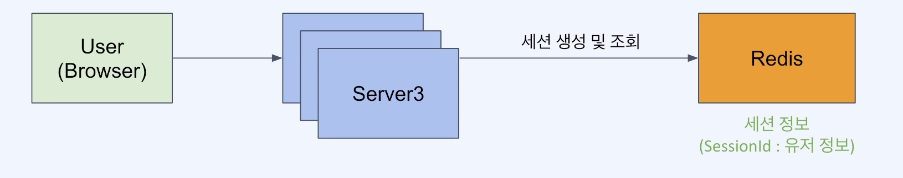

# 분산환경에서의 세션처리

## 구조

- 세션 데이터는 영속이 불필요
  - 세션은 유저가 로그인한 동안에만 유지되면 됨.
  - RDB 수준의 영속성은 불필요
  - 심지어 세션이 날라가도 그저 유저가 로그인만 다시해주면 됨.
  - 심각한 장애라고 볼 수 없음.
- 세션 데이터는 변경이 빈번하고 빠른 엑세스 속도가 필요

## 서버의 역할
- 세션 생성
  - 처음 요청이 들어왔을 때 세션생성
  - 응답에 set-cookie로 넘겨준다.
- 세션 조회
  - 요청이 들어왔을 때 cookie를 보고 session 조회
- 세션 삭제
  - 타임아웃이나 로그아웃시 세션 삭제 

## HttpSession

[HttpSession 개념](../Java/세션/자바에서의%20Session.md)