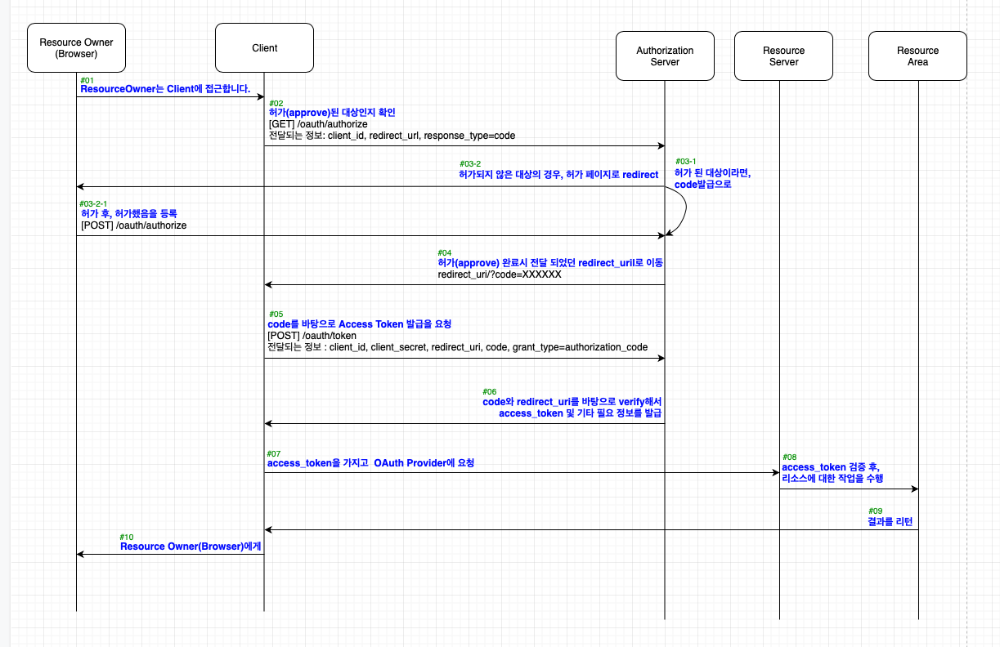
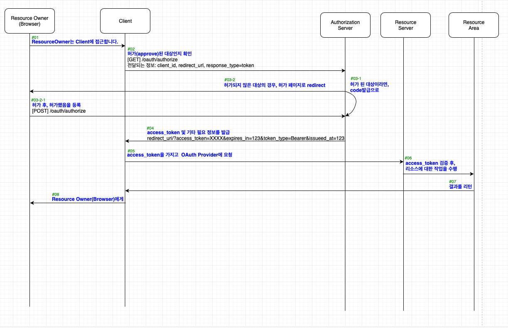
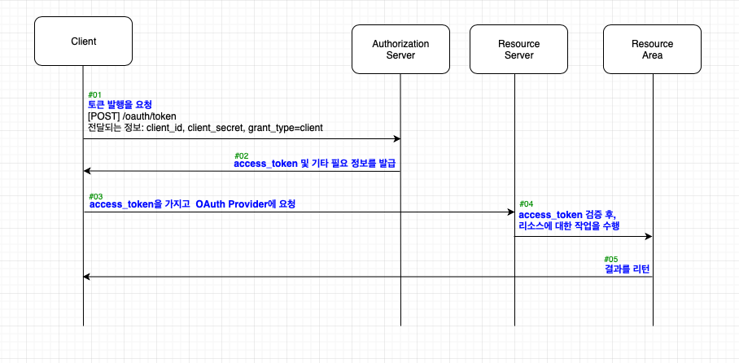
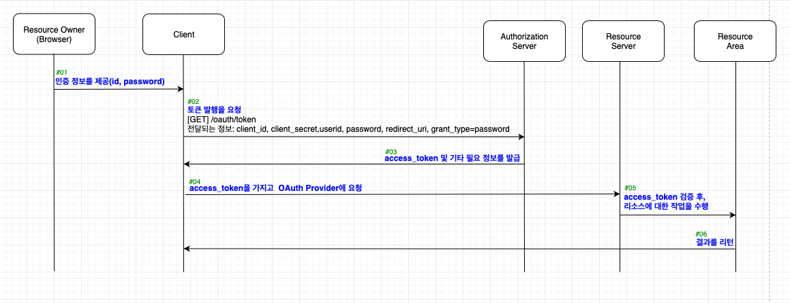
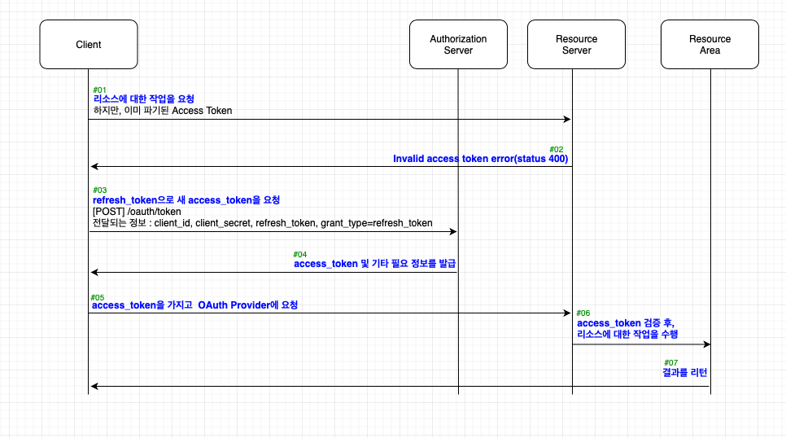
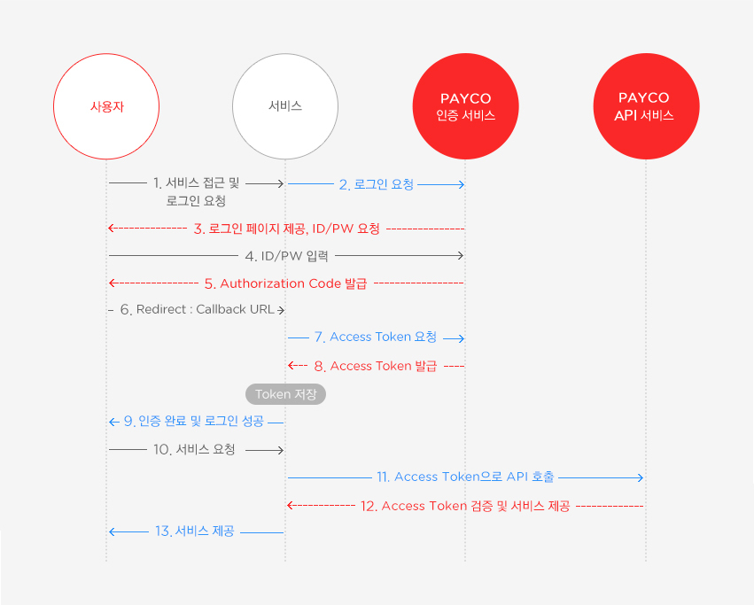
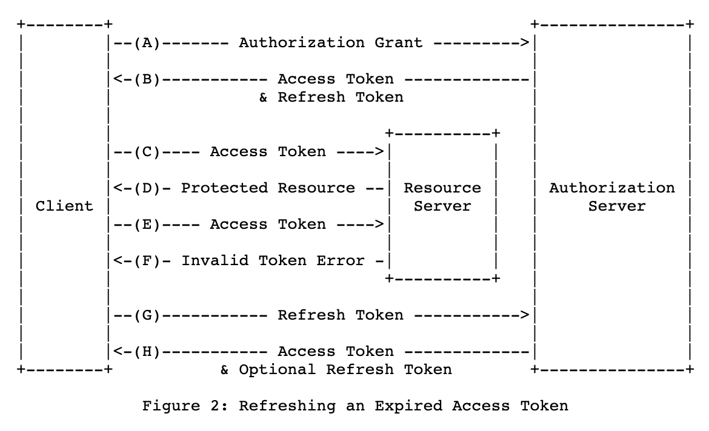

# OAuth 2.0

[공식문서](https://oauth.net/2/)

## 개념 
`OAuth 2.0` is the industry-standard protocol for **authorization**.

`Authorization`(인가)을 목표로 설계

## 배경

나의 서비스에서 다른 서비스(google, facebook)을 이용할 수 있는 방법은 다른 서비스의 아이디와 비밀번호를 입력받아 사용하는 것이다. 

하지만, 이 방법은 사용자, 나의 서비스, 다른 서비스 모두에게 위험을 가지고있는 방식이다. 

## 특징 

실제 비밀번호 대신 AccessToken이라는 비밀키를 주고 받음. 

OAuth2는 다른 서비스로부터 이런 AccessToken을 받아내는 기술이다. 

이 AccessToken을 가지고 해당 서비스의 일부 기능을 이용할 수 있게됨.

## OAuth 필수 4요소

1. Resource Owner : 일반 사용자

2. Client : 나의 서비스. Resource Owner가 실질적으로 사용하려하는 서비스

3. Authorization Server : 인가의 주체자. 구글, 네이버. 페이스북, 카카오 ....
 4. 인증을 받은 이후에, OAuth로 인가를 받으면 Access Token이 발급됨.

4. Resource Server
 5.  Access Token을 얻은 Application의 인증받은 요청에 대해서 핸들링을 하는 곳.

 6.  Authorization Server로 부터 발급받은 토큰을 확인하거나, 인가받았는지 여부를 확인하는 문지기 역할

 7.  Authorization Server - 매표소. Resource Server - 검표하는 곳.

 8.  3가지 역할
     1.  Aceess Token의 확인
     2.  Scope의 확인 - 해당 Cient의 권한 범위
     3.  에러코드 및 비인가 접근에 대한 처리

 9.  실제로 하는 역할은 필터에 가까운 모습. 

## Client가 Authorization Server에 전달해야 하는 것들

 1. Client id, client secret : Client 고유의 id, password

 2. Redirect URL : id, secret 확인 후 다시 제어권을 돌려받을 수 있는 리다이렉트할 주소.

 3. response_type :  Client가 토큰발행 요청을 했을 때의 Authorization Server의 응답유형에 대한 정의. return 타입을 결정한다고 보면 됨
    1. Authorization Code, Implicit Grant type에서만 사용됨.

 4. grant type : 실질적으로, 이 정보를 통해 Authorization Server는 Client가 어떤 유형으로 토큰 발행을 요청한 것인지 판별
 
 5. scope : Client가 접근가능하도록 승인된 내 리소소의 범위. 이름, 이메일, 성별, 나이 등등등

 6. state : csrf 공격을 막기위한 정보값. Client와 Authorization Server 사이에 특정 값을 주고받음. 
## OAuth Grant Type

 허가를 받는 유형. 

 OAuth 2.0에는 Client가 OAuth Provider로 부터 토큰을 받아가는 5가지 방식

 Grant Type에 따라 파라미터의 종류를 다르게 하거나 값을 달리해서 보냄.

#### Authorization Code Grant type

 reponse_type : code
 
 code값을 먼저 요청해서 받은 후, 이 code값으로 토큰을 발급받음. 

#### Implicit

response_type : token

code발급과정없이 바로 token을 발급해줌. 

url에 파라미터로 토큰이 그대로 노출되게 됨. 

그래서 자바스크립트와 같은 스크립트 언어로 동작하는 클라이언트들을 지원하기 위한 승인 유형. 

웹 브라우저의 신뢰도가 높고, 신뢰할 수 없는 사용자나 앱에 노출될 염려가 적을 때 주로 사용됨. 

#### Client Credentials

    Client 자체가 토큰 발행을 요청할 수 있는 주체. 

    owner의 승인과정이 제외됨. owner와 client를 하나로 봄.

    신뢰성이 아주 높은 app에서만 사용됨.

#### Resource Owner Password Credentials

토큰발행시 Resource Owner의 id, password를 추가로 요청함.

사용자의 아이디, 비밀번호가 모두 노출. 심지어 Get방식 요청.

#### Refresh 

만료된 Access Token을 전달하면, 에러 응답을 받음. 

Client는 미리 가지고 있던 Refresh Token을 전달해서 새로운 Access Tokend을 발급받음. 

이때, Refresh Token은 최초로 Access Token을 발급받을 떄 같이 받음. 

즉, Authorization Code, Client Credentials type만 Refresh Token을 발급받을 수 있음.

## OAuth2 흐름

1. Client는 이미 등록을 통해 id, secret, redirect url을 가지고 있는 상태
    
2. 사용자가 로그인을 하면 Auth server에서 redirect url 뒤에 Authorization Code를 붙여서 발급
   1. redirect_url?code={code}
    
3. Client는 위 4가지 정보를 Auth server로 전송. 
    
4. 4가지 정보가 모두 일치하면 Access Token 발급.
   1. 이 떄, 역할을 다한 Authorization Code는 삭제됨. 
    
5. 발급받은 Access Token을 활용해 Resource Server의 기능을 이용할 수 있음. 
 

6. Refresh Token을 사용하는 경우.
   1. Access Token에는 유효기간이 있음. 
   2. Access Token 재발급을 위해 Refresh Token 사용.
   3. Access Token은 주로 세션에 저장하고
   4. Refresh Token은 주로 DB에 저장한다. 

## 출저

https://velog.io/@sonypark/OAuth2-%EC%9D%B8%EC%A6%9D

https://otrodevym.tistory.com/entry/spring-boot-%EC%84%A4%EC%A0%95%ED%95%98%EA%B8%B0-9-oauth2-%EC%84%A4%EC%A0%95-%EB%B0%8F-%ED%85%8C%EC%8A%A4%ED%8A%B8-%EC%86%8C%EC%8A%A4

https://blinders.tistory.com/63?category=825013