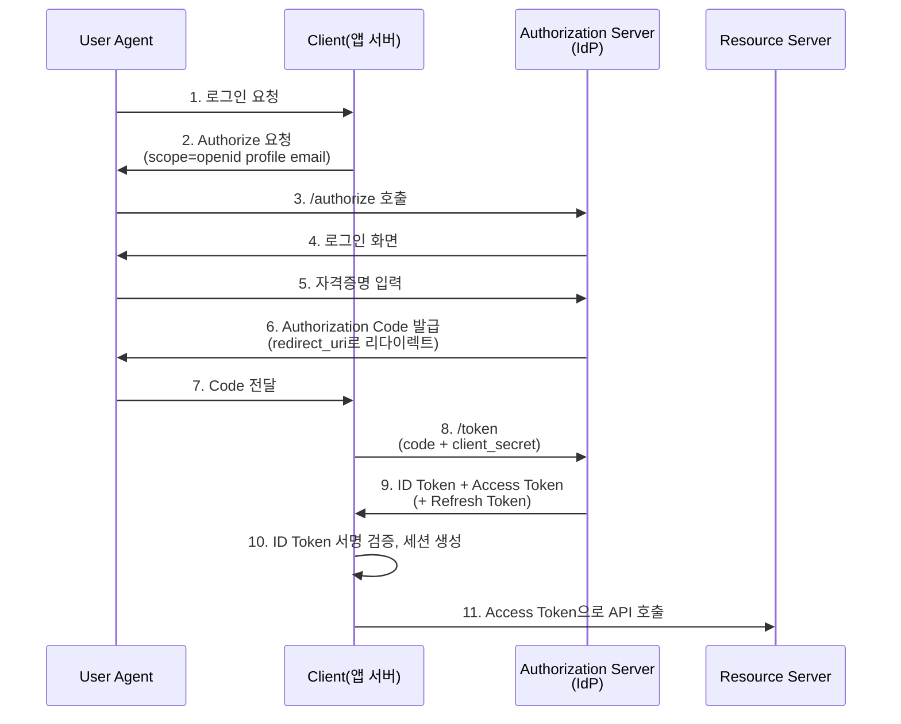

# OpenID Connect (OIDC)

> 최종 업데이트: 2026-05-15 | 기준 정보: OpenID Connect Core 1.0 + Errata Set 2 (2024-12), Spring Security 6.4

## 개념

OpenID Connect는 **OAuth 2.0 위에 얹은 신원 인증(Authentication) 레이어** 프로토콜이다. OAuth 2.0이 "이 앱이 너 대신 리소스에 접근해도 되는가(인가, Authorization)"에 답한다면, OIDC는 "이 사용자가 정말 누구인가(인증, Authentication)"에 답한다.

비유하자면 OAuth 2.0은 호텔에서 발급받은 **객실 키카드**(권한)이고, OIDC는 그 사람의 **신분증**(누구인지 증명)이다. OIDC는 OAuth 2.0의 토큰 발급 흐름을 그대로 재사용하면서, 추가로 `ID Token`이라는 JWT 형식의 신원증명서를 함께 발급해준다.

| 항목 | 내용 |
|---|---|
| 표준화 주체 | OpenID Foundation (OIDF) |
| 표준 발표 | 2014-02-26 (OIDC Core 1.0) |
| 최신 갱신 | Errata Set 2 (2024-12) |
| 기반 프로토콜 | OAuth 2.0 (RFC 6749) |

## 배경 / 역사

| 연도 | 이벤트 |
|---|---|
| 2005 | OpenID 1.0 (구버전, XML 기반, 현재 폐기) |
| 2007 | OpenID 2.0 (Yahoo, Google 채택했으나 복잡함과 보안 이슈) |
| 2012 | OAuth 2.0 RFC 6749 발표 — 인가 표준화 |
| 2014-02 | **OpenID Connect 1.0** 정식 발표 (OAuth 2.0 위에 재설계) |
| 2018 | FAPI (Financial-grade API) 1.0 — 금융권용 강화 프로파일 |
| 2022 | FAPI 2.0 — Open Banking 표준 채택 |
| 2024-04 | OIDC4VCI Implementer's Draft — Verifiable Credential 발급 |
| 2024-12 | OIDC Core 1.0 Errata Set 2 (보안 권고 갱신, Implicit Flow 비권장 명문화) |

**왜 OIDC가 등장했나?**: OAuth 2.0은 본래 인가(권한 위임)만을 다뤘지만, 많은 서비스가 "구글 로그인" 같은 SSO 목적으로 OAuth를 변칙적으로 사용했다. 각 서비스마다 UserInfo 응답 포맷이 달라 호환성이 깨졌고, 이를 표준화하기 위해 OIDC가 만들어졌다.

## OAuth 2.0과의 차이

| 구분 | OAuth 2.0 | OpenID Connect |
|---|---|---|
| **목적** | Authorization (인가) | Authentication (인증) + 인가 |
| **답하는 질문** | "이 토큰으로 뭘 할 수 있는가?" | "이 사용자는 누구인가?" |
| **발급 토큰** | Access Token (+ 선택적 Refresh Token) | Access Token + **ID Token** |
| **ID Token 포맷** | 없음 | **JWT 강제** (서명 검증 가능) |
| **사용자 정보 획득** | 표준화 X (Provider별 API 호출) | `/userinfo` 표준 엔드포인트 |
| **Discovery** | 없음 | `/.well-known/openid-configuration` 표준 |
| **필수 Scope** | 없음 | `openid` (이게 있어야 OIDC로 동작) |

핵심 차이는 **ID Token**의 존재. OAuth만 쓸 때는 Access Token으로 별도 API 호출해서 사용자 정보를 가져와야 했지만, OIDC는 ID Token 안에 사용자 식별 정보(`sub`, `email`, `name` 등)가 JWT로 들어있어 추가 호출 없이도 신원 확인이 가능하다.

## ID Token

OIDC의 가장 핵심적인 산출물. JWT(JSON Web Token) 형식으로, 헤더·페이로드·서명 3부분으로 구성된다.

### 표준 클레임 (Claims)

| 클레임 | 의미 | 필수? |
|---|---|---|
| `iss` | Issuer — 토큰 발급자 (예: `https://accounts.google.com`) | O |
| `sub` | Subject — 사용자 고유 ID (Provider 내부에서 unique) | O |
| `aud` | Audience — 이 토큰을 받기로 한 Client ID | O |
| `exp` | Expiration time — 만료 시각 (Unix epoch) | O |
| `iat` | Issued at — 발급 시각 | O |
| `auth_time` | 사용자가 실제 인증한 시각 | △ |
| `nonce` | 재생 공격(replay attack) 방지용 임의값 | △ |
| `acr` | Authentication Context Class Reference (인증 강도) | X |
| `amr` | Authentication Methods References (OTP, 비밀번호, 생체 등) | X |
| `azp` | Authorized Party — multi-audience일 때 실제 권한 부여 대상 | X |

### 스코프별 추가 클레임

| Scope | 추가되는 클레임 |
|---|---|
| `profile` | `name`, `given_name`, `family_name`, `picture`, `locale`, `updated_at` |
| `email` | `email`, `email_verified` |
| `address` | `address` (formatted, street_address, locality 등) |
| `phone` | `phone_number`, `phone_number_verified` |

### ID Token 예시

```json
{
  "iss": "https://accounts.google.com",
  "sub": "108234923894723894273",
  "aud": "myapp-client-id.apps.googleusercontent.com",
  "exp": 1747315200,
  "iat": 1747311600,
  "auth_time": 1747311590,
  "nonce": "abc123xyz",
  "email": "user@example.com",
  "email_verified": true,
  "name": "홍길동",
  "picture": "https://lh3.googleusercontent.com/..."
}
```

> ⚠️ ID Token은 **반드시 서명을 검증**해야 한다. Provider의 JWKS 엔드포인트에서 공개키를 받아 `RS256` 등으로 검증. 검증 없이 JSON만 디코딩해서 신뢰하면 위조 토큰으로 우회 가능.

## ID Token vs Access Token

같은 OIDC 흐름에서 둘 다 받지만 용도가 명확히 다르다.

| 구분 | ID Token | Access Token |
|---|---|---|
| **대상** | Client(앱) — 사용자가 누구인지 알려줌 | Resource Server — API 접근 권한 증명 |
| **포맷** | JWT 강제 | JWT 권장 (구현체에 따라 opaque도 있음) |
| **검증 주체** | Client가 검증 | Resource Server가 검증 |
| **수명** | 짧음 (대개 5~15분) | 다양 (1시간 ~ 24시간) |
| **포함 정보** | 사용자 신원 클레임 | 권한(scope), subject 정도 |
| **잘못된 사용** | Access Token처럼 API 호출에 사용 X | ID Token 대신 신원 확인용으로 사용 X |

## 주요 Flow

OIDC는 OAuth 2.0의 Grant Type을 재사용한다. 단, Implicit Flow는 보안상 비권장(2024-12 Errata로 명문화).

### Authorization Code Flow (표준, 권장)

서버 사이드 웹앱에 가장 적합. Authorization Code를 받은 뒤 서버에서 토큰으로 교환하므로 토큰이 브라우저 URL에 노출되지 않는다.



### Authorization Code Flow + PKCE (공개 클라이언트 표준)

SPA, 모바일 앱처럼 `client_secret`을 안전하게 보관할 수 없는 환경에서 필수. Code를 가로채도 `code_verifier`가 없으면 토큰 교환 불가.

| 단계 | 클라이언트 동작 |
|---|---|
| 인증 요청 전 | `code_verifier` 랜덤 생성 → SHA-256 해시한 `code_challenge` 동봉 |
| 토큰 교환 시 | 원본 `code_verifier`를 함께 전송 → 서버가 해시 비교 |

> **2026년 현재 SPA·모바일은 PKCE가 사실상 의무**. OAuth 2.1 초안에서도 PKCE를 모든 클라이언트 타입에 강제.

### Hybrid Flow

Authorization Code와 ID Token을 동시에 받는 방식. 초기 응답에서 ID Token으로 사용자를 빠르게 식별하면서, Code로는 안전하게 Access Token을 교환. 금융권 FAPI 프로파일이나 일부 SSO 환경에서 사용.

| `response_type` | 받는 것 |
|---|---|
| `code` | Code만 (Authorization Code Flow) |
| `code id_token` | Code + ID Token (Hybrid) |
| `code id_token token` | Code + ID Token + Access Token (Hybrid) |

### Implicit Flow (비권장, 2024년 Errata로 폐기 권고)

토큰이 URL fragment(`#`)로 직접 반환되어 브라우저 히스토리·서버 로그에 노출되는 보안 취약점. 대체로 Authorization Code + PKCE를 사용.

## Discovery — `/.well-known/openid-configuration`

OIDC의 결정적 장점. Provider의 모든 엔드포인트와 지원 기능을 단일 URL로 조회 가능.

```bash
curl https://accounts.google.com/.well-known/openid-configuration
```

```json
{
  "issuer": "https://accounts.google.com",
  "authorization_endpoint": "https://accounts.google.com/o/oauth2/v2/auth",
  "token_endpoint": "https://oauth2.googleapis.com/token",
  "userinfo_endpoint": "https://openidconnect.googleapis.com/v1/userinfo",
  "jwks_uri": "https://www.googleapis.com/oauth2/v3/certs",
  "response_types_supported": ["code", "id_token", "token id_token", ...],
  "scopes_supported": ["openid", "email", "profile"],
  "id_token_signing_alg_values_supported": ["RS256"]
}
```

| 엔드포인트 | 역할 |
|---|---|
| `authorization_endpoint` | 사용자 로그인 동의 화면 |
| `token_endpoint` | Code → Token 교환 |
| `userinfo_endpoint` | Access Token으로 추가 사용자 정보 조회 |
| `jwks_uri` | ID Token 서명 검증용 공개키 (JWK Set) |
| `end_session_endpoint` | RP-Initiated Logout (OIDC Session Mgmt) |
| `revocation_endpoint` | 토큰 폐기 (RFC 7009) |
| `introspection_endpoint` | 토큰 유효성 검사 (RFC 7662) |

> Discovery 덕분에 새 Provider를 추가할 때 코드 수정 없이 `issuer-uri`만 바꿔도 동작한다. Spring Security의 `spring.security.oauth2.client.provider.{provider}.issuer-uri`가 바로 이걸 이용.

## 주요 IdP (Identity Provider)

| Provider | 특징 |
|---|---|
| **Google** | 가장 보편적, `accounts.google.com` |
| **Microsoft Entra ID** (구 Azure AD) | 엔터프라이즈 SSO, Multi-tenant 지원 |
| **Apple ID** | iOS 앱 필수, `sub`이 앱별로 다름(`private email relay`) |
| **Okta** / **Auth0** | SaaS IdP, 무료 티어 풍부 |
| **Keycloak** | 오픈소스 IdP, 자체 호스팅 표준 |
| **Authelia** / **Authentik** | 경량 셀프호스팅 OIDC Provider |
| **AWS Cognito** | AWS 통합 OIDC, User Pool |
| **카카오 / 네이버** | 국내 OIDC 일부 지원 (네이버는 OAuth 2.0만, 카카오는 OIDC 지원) |

## Spring Security에서 OIDC

Spring Boot 3.x + Spring Security 6.x는 OIDC를 1급 시민으로 지원.

### 의존성

```kotlin
// build.gradle.kts
dependencies {
    implementation("org.springframework.boot:spring-boot-starter-oauth2-client")
}
```

### `application.yml`

```yaml
spring:
  security:
    oauth2:
      client:
        registration:
          google:
            client-id: ${GOOGLE_CLIENT_ID}
            client-secret: ${GOOGLE_CLIENT_SECRET}
            scope: openid, profile, email
        provider:
          google:
            issuer-uri: https://accounts.google.com
```

`issuer-uri`만 설정하면 Spring이 `/.well-known/openid-configuration`을 자동 조회해 나머지 엔드포인트를 채워준다.

### Controller에서 ID Token 사용

```java
@GetMapping("/me")
public Map<String, Object> me(
        @AuthenticationPrincipal OidcUser oidcUser) {
    return Map.of(
        "sub", oidcUser.getSubject(),
        "email", oidcUser.getEmail(),
        "name", oidcUser.getFullName(),
        "claims", oidcUser.getClaims()
    );
}
```

`OidcUser`는 ID Token이 자동 파싱되어 들어오는 객체. 서명 검증은 Spring Security가 처리.

### Resource Server로 ID Token 검증만 하기

```yaml
spring:
  security:
    oauth2:
      resourceserver:
        jwt:
          issuer-uri: https://accounts.google.com
```

이 설정이면 들어오는 JWT를 자동으로 Google JWKS로 검증한다.

## 자주 헷갈리는 포인트

### 1. `scope=openid`가 없으면 OAuth 2.0
`openid` scope가 인가 요청에 포함되어야만 OIDC로 동작하고 ID Token이 발급된다. 빠뜨리면 Access Token만 발급되어 그냥 OAuth 2.0.

### 2. `sub`는 Provider 단위로 유일
Google의 `sub`와 Microsoft의 `sub`는 같을 수 없다. 우리 DB의 사용자 식별자는 `(iss, sub)` 조합으로 잡아야 한다.

### 3. Access Token으로 신원 검증 X
Access Token은 권한 증명용. 사용자 신원 확인은 반드시 ID Token으로. 둘을 혼동하면 권한 우회나 토큰 오용 발생.

### 4. ID Token은 백엔드 간 전달 금지
ID Token은 "이 토큰을 받기로 한 Client(`aud`)" 한테만 의미가 있다. 다른 서비스로 그대로 전달해서 인증에 쓰면 안 됨. 백엔드 간 신원 전달은 별도 토큰(예: 백엔드 서명한 JWT) 발급.

### 5. Logout은 별도 명세
ID Token만 폐기해선 IdP 세션은 살아있다. 진짜 로그아웃은 `end_session_endpoint`(RP-Initiated Logout, OIDC Session Management 1.0) 호출 필요.

## 관련 문서

- [[OAuth-2.0]] — OIDC의 토대가 되는 인가 프로토콜
- [[SAML]] — 엔터프라이즈 SSO의 또 다른 표준, XML 기반
- [[SSO]] — Single Sign-On 개념
- [[Google-Oauth2]] — Google OAuth2/OIDC 등록 방법

## 출처

- [OpenID Connect Core 1.0 (Errata Set 2)](https://openid.net/specs/openid-connect-core-1_0.html)
- [OpenID Connect Discovery 1.0](https://openid.net/specs/openid-connect-discovery-1_0.html)
- [Spring Security OAuth2 Client](https://docs.spring.io/spring-security/reference/servlet/oauth2/client/index.html)
- [RFC 7636: PKCE](https://datatracker.ietf.org/doc/html/rfc7636)
