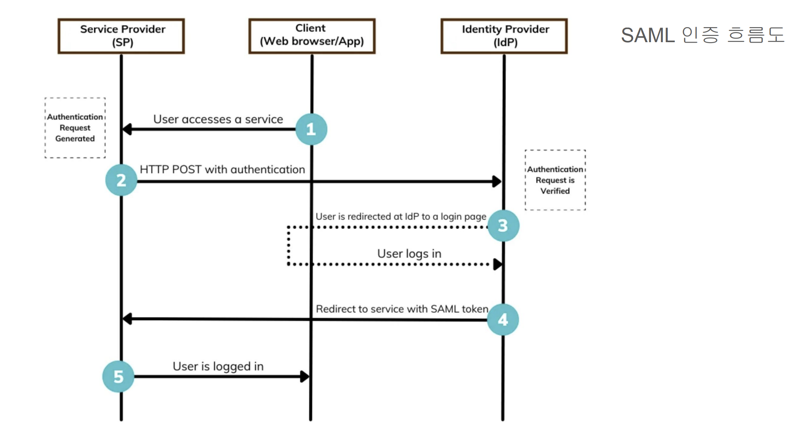

# SAML

## 정의
- Security Assertion Markup Language
- 주로 기업 환경에서 여러 애플리케이션에 대해 단일 로그인을 구현하기 위해 사용되는 XML 기반의 인증/권한 부여 프로토콜
- 사용자 인증을 중앙 집중식으로 관리하고 여러 시스템 간의 신뢰 관계를 설정하는 데 큰 도움

## 개념
- 아이덴티티 공급자(IdP): 
  - **사용자의 신원을 확인**하고, 인증이 완료되면 사용자 정보(예: 사용자 ID, 속성 등)를 담은 **SAML 어설션(assertion)** 을 생성하여 전달
- 서비스 공급자(SP): 
  - 사용자가 접근하려는 **애플리케이션**이나 서비스로, **IdP로부터 받은 SAML 어설션의 유효성을 검증**하여 사용자의 접근을 허용
- 어설션(Assertion): 
  - **XML 형식의 문서**로, **사용자의 인증 및 속성 정보를 포함**하며, 보통 디지털 서명되어 무결성과 신뢰성을 보장
- SSO(Single Sign-On): 
  - 사용자가 한 번 로그인하면 IdP를 통해 여러 서비스(SP)에 별도 재인증 없이 접근할 수 있게 해주는 기능

## SAML 인증 플로우

- 백엔드 시스템이 SAML을 도입할 때 일반적으로 다음과 같은 흐름을 따른다.

1. 사용자 요청: 사용자가 SP에 보호된 리소스에 접근하려고 하면, SP는 현재 사용자가 인증되어 있지 않다는 사실을 인지합니다.
2. 인증 요청 리디렉션: **SP는 사용자를 IdP의 로그인 페이지로 리디렉션**하며, 이때 **SAML 인증 요청(예: <samlp:AuthnRequest>)을 포함**합니다.
   1. SAML 인증 요청 xml 문서 작성 후 Base64 로 인코딩하여 SAMLRequest 파라미터로전달
3. 사용자 인증: IdP에서는 사용자가 로그인 페이지에서 인증 정보를 입력하여 신원을 확인합니다.
4. SAML 어설션 생성: 인증에 성공하면 **IdP는 사용자의 신원 정보와 속성을 담은 SAML 어설션을 생성**하고, 이를 디지털 서명한 후 **사용자의 브라우저를 통해 SP로 전달**합니다.
   1. SP 로그인에 필요한 정보가 포함된 xml 작성 후 private key 로 Sign 하고, Base64 로 인코딩하여 SAMLResponse 파라미터로전달
5. 어설션 검증 및 세션 생성: **SP는 전달받은 SAML 어설션의 서명을 검증**하고, 어설션에 포함된 정보(예: 유효 기간, 대상 정보 등)를 확인한 후 사용자에 대한 세션을 생성합니다.
6. 리소스 접근 허용: 검증이 완료되면 사용자는 SP 내의 보호된 리소스에 접근할 수 있게 됩니다.

## 백엔드 개발자가 주의해야 할 사항

- XML 파싱 및 보안: 
  - SAML 메시지는 XML로 구성되므로 XML 파싱 라이브러리를 활용할 때 외부 엔티티 공격(XXE) 같은 보안 취약점을 주의해야 합니다.
- 디지털 서명 검증: 
  - IdP가 어설션에 디지털 서명을 추가하므로, SP는 해당 서명을 올바른 공개키를 통해 검증해야 합니다.
- 인증서 관리: 
  - SAML 통신에서는 공개/비공개 키 쌍을 사용하여 서명과 암호화를 처리합니다. 인증서와 키의 안전한 저장 및 갱신 관리가 중요합니다.
- 바인딩 방식: 
  - SAML 메시지는 HTTP POST, HTTP Redirect, 또는 SOAP 바인딩을 통해 전송됩니다. 각 방식의 특성과 제한사항(예: URL 길이 제한)을 이해하고 적절하게 구성해야 합니다.
- 라이브러리 및 프레임워크 활용: 
  - 직접 SAML 메시지를 처리하기보다는, 검증된 SAML 라이브러리(예: Shibboleth, SimpleSAMLphp, Spring Security SAML 등)를 활용하여 복잡한 프로토콜 처리를 추상화하는 것이 좋습니다.

## SAML을 사용하는 장점과 고려 사항

- 장점:
  - 중앙 집중식 인증: 여러 애플리케이션에 대해 한 번의 로그인으로 접근이 가능해 사용자 편의성이 향상됩니다.
  - 보안 강화: 각 SP마다 별도의 비밀번호를 관리할 필요 없이, IdP를 통해 보안적으로 신뢰된 인증 정보를 공유할 수 있습니다.
  - 관리 효율성: 사용자 계정 관리와 정책 적용을 IdP에 집중시켜 전체 시스템의 관리 부담을 줄일 수 있습니다.
- 고려 사항:
  - 초기 설정 복잡성: IdP와 SP 간의 신뢰 관계, 메타데이터 설정, 인증서 관리 등 초기 구성이 다소 복잡할 수 있습니다.
  - 표준과 구현 차이: SAML은 표준은 명확하지만, 각 벤더마다 구현 방법에 약간의 차이가 있을 수 있으므로 상호 운용성을 신경써야 합니다.