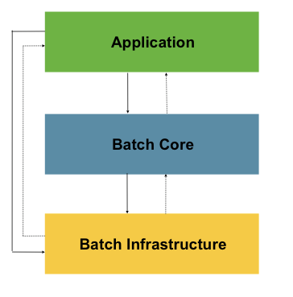
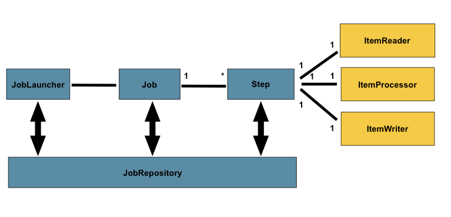
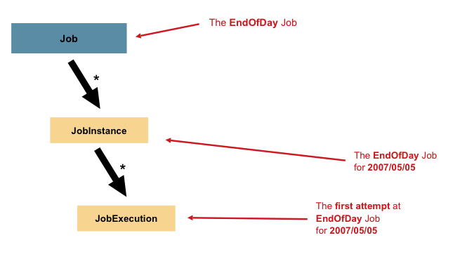

# Spring Batch

## 정의

포괄적인 경량 배치 프레임워크.

배치란? 개발자가 정의한 작업을 한 번에 일괄적으로 처리하는 애플리케이션

## 용도

1. 다량의 정보를 자동, 효율적으로 처리하는 복잡한 프로세싱.주로 시간 기반 이벤트 (월말 정산, 통지)
2. 매우 큰 데이터 set을 반복, 주기적으로 처리(보험료 조정)
3. 내/외부 시스템에서 받은 데이터를 통합하는 일.

## 장점

1. 자동화
2. 대용량 처리
3. 견고성 - 예외처리에 대한 대비
4. 재사용성 - 공통 코드 단위별로 재사용

## 주의점 

    가벼워야 한다.
    배치 처리시 Input, Output의 사용을 최소화해야 함.
    최대한 적은 횟수로 데이터를 가져와서 처리하고 저장하는 것이 좋음.

    스케쥴러가 아니다. (ex Quartz)
    스케줄러를 대체하는 개념이 아니라 함께 동작하도록 설계됨.

    배치의 목적은 대용량 데이터 처리. 

    스케쥴링 기능을 제공하지 않는다. 
    

## 기본 구조

1. Application
~~~
모든 배치 job과 커스텀 코드를 포함.
~~~
2. Batch Core
~~~
job을 실행하고 제어하는 데 필요한 핵심 런타임 클래스를 포함. 
JobLauncher, Job, Step 구현체도 포함.  
~~~
3. Spring Batch Infrastructure
~~~
Application과 Batch Core 모두 공통 Infrastructure 위에서 빌드함.
~~~

## Batch Diagram

### JobRepository
현재 실행 중인 프로세스의 메타정보는 JobRepository에 저장.           

### JobLauncher
Job을 실행하기 위한 런처.

### Job
전체 배치 프로세스를 캡슐화한 엔티티.

### Step
하나의 Job은 여러개의 Step

Step은 아래 Item들을 딱 한 개씩 가짐.

### ItemReader

### ItemProcessor

### ItemWriter

## 출처

https://www.youtube.com/watch?v=1xJU8HfBREY

https://ahndy84.tistory.com/18

https://godekdls.github.io/Spring%20Batch/domainlanguage/