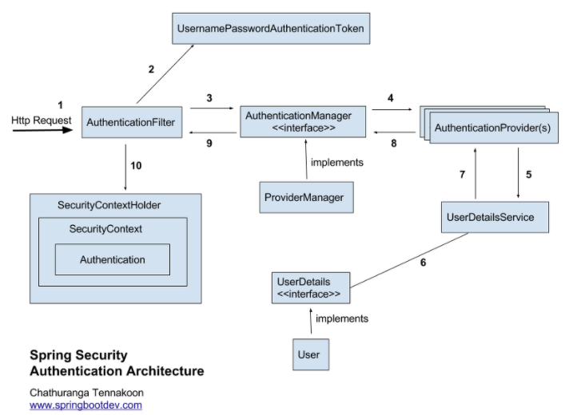
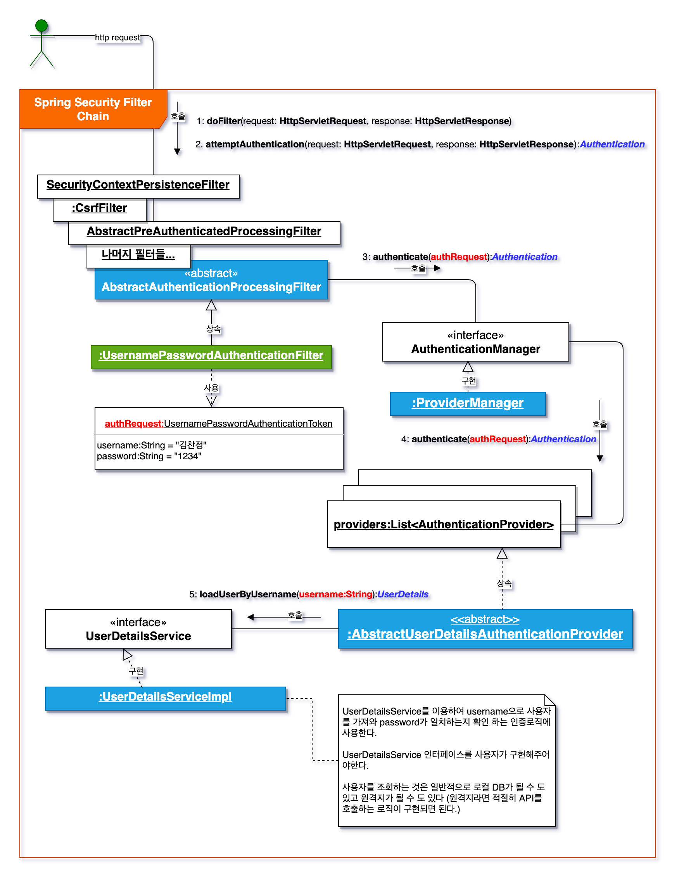

# 스프링 시큐리티 

## 개념

    Spring 기반 애플리케이션에 인증과 권한 부여를 모두 제공하는데 중점을 둔 프레임워크. 

    "인증"과 "권한"에 대한 부분을 Filter의 흐름으로 처리.

    기본적으로 인증 절차를 거친후에 인가 절차를 진행. 

    인가 과정에서 해당 리소스에 대한 접근 권한이 있는지 확인. 

    Principal을 아이디로, Credential을 비밀번호로 사용하는 Credential 기반의 인증방식 사용.

## 세션-쿠키 방식

    기본적으로 세션-쿠키 방식으로 인증. 

    세션-쿠키에 대한 개념은 아래 링크 참조 

https://github.com/namusik/TIL-SampleProject/blob/main/CS%20%EC%9D%B4%EB%A1%A0/Cookie%26Session.md

## 인증과 인가 

#### Authentication : 인증

    로그인과 같이 사용자의 신원을 확인하는 프로세스.
    
    일반적인 인증방법은 비밀번호를 사용하는 것.

    세션저장방식, JWT방식, OAuth 방식 등이 있다. 

#### Authorization : 인가

    누가 무엇을 할 수 있는지 결정하는 규칙 

    읽기, 수정, 삭제를 허용여부를 확인하는 것. 

    사용자의 신원이 성공적으로 인증된 후에 발생. 

## 구조 

    1. 요청이 들어오면 AuthenticationFilter 통해 6번까지 진행. 
    2. 존재하는 User이면 UserDetails로 꺼내서 7~10까지 진행. 
    3. spring security의 인메모리 세션저장소인 SecurityContextHolder에 세션저장. 
    4. 유저에게 저장한 SessionId를 쿠키에 담아 내려줌. 

## Filter 역할

    SecurityContextPersistenceFilter SecurityContextRepository에서 SecurityContext를 가져오거나 저장하는 역할 담당

    LogoutFilter 지정된 로그아웃 URL에 대한 요청을 감시하며, 매칭 되는 해당 유저를 로그아웃 처리

    UsernamePasswordAuthenticationFilter 사용자명과 비밀번호로 이뤄진 폼 기반 인증에 사용하는 가상 URL요청을 감시하고 요청이 있으면 사용자의 인증을 진행

    DefaultLoginPageGeneratingFilter 폼기반 또는 OpenID 기반 인증에 사용하는 가상 URL에 대한 요청을 감시하고 로그인 폼 기능을 수행하는데 필요한 HTML을 생성

    BasicAuthenticationFilter HTTP 기본 인증 헤더를 감시하여 처리

    RequestCacheAwareFilter 로그인 성공 후, 원래 요청 정보를 재구성하기 위해 사용

    SecurityContextHolderAwareRequestFilter HttpServletRequestWrapper를 상속한 SecurityContextHolderAwareRequestWapper 클래스로 HttpServletRequest 정보를 감싼다.

    SecurityContextHolderAwareRequestWrapper 클래스는 필터 체인상의 다음 필터들에게 부가정보를 제공

    AnonymousAuthenticationFilter 이 필터가 호출되는 시점까지 사용자 정보가 인증되지 않았다면 인증 토큰에 사용자가 익명 사용자로 나타난다

    SessionManagementFilter 인증된 주체를 바탕으로 세션 트래킹을 처리해 단일 주체와 관련한 모든 세션들이 트래킹 되도록 도운다.

    ExceptionTranslationFilter 이 필터는 보호된 요청을 처리하는 중에 발생할 수 있는 예외를 위임하거나 전달하는 역할을 한다.

    FilterSecurityInterceptor 이 필터는 AccessDecisionManager로 권한 부여 처리를 위임함으로써 접근 제어 결정을 쉽게 해 준다.

## 동작흐름 

1. 유저가 아이디와 비밀번호를 입력후, 로그인 요청을 보내면
    
2. **UsernamePasswordAuthenticationFilter**에 도착. 
   1. attempAuthentication(request, response) 메서드 실행.
   2. request로 부터 username, password 가져와서 **UsernamePasswordAuthenticationToken**(Authentication 구현체) 생성. 
 
3. Token을 **ProviderManager**(AuthenticationManager의 구현체)에 인증하도록 위임. 

## 참고 

https://kimchanjung.github.io/programming/2020/07/01/spring-security-01/

https://velog.io/@sa833591/Spring-Security-5-Spring-Security-Filter-%EC%A0%81%EC%9A%A9

https://www.youtube.com/watch?v=ry2pRoAnrIc&t=0s

https://velog.io/@dhk22/Spring-Security-%EC%84%B8%EC%85%98%EC%9D%84-%EC%9D%B4%EC%9A%A9%ED%95%9C-%EB%A1%9C%EA%B7%B8%EC%9D%B8-%EC%B2%98%EB%A6%AC

https://iyk2h.tistory.com/158

https://baek.dev/post/24/

https://wildeveloperetrain.tistory.com/50