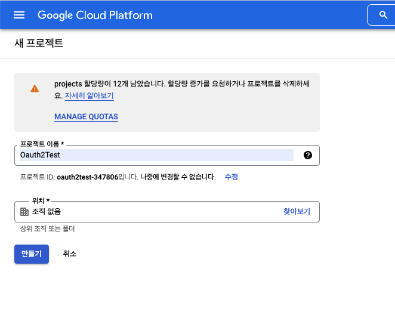
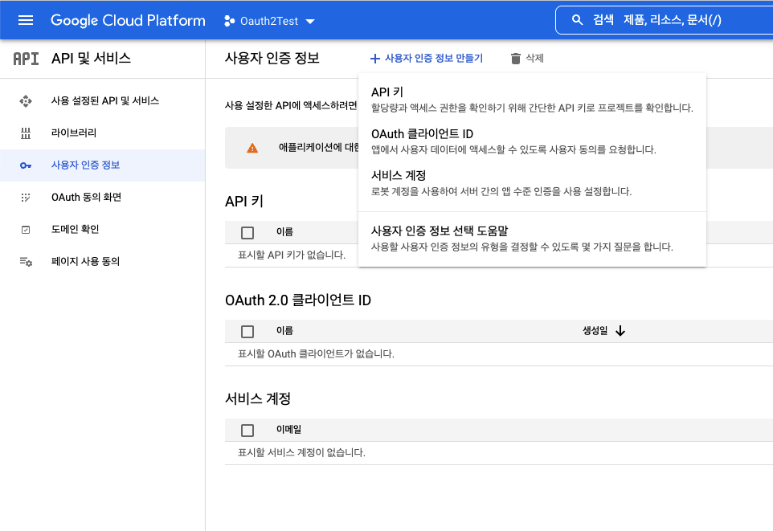
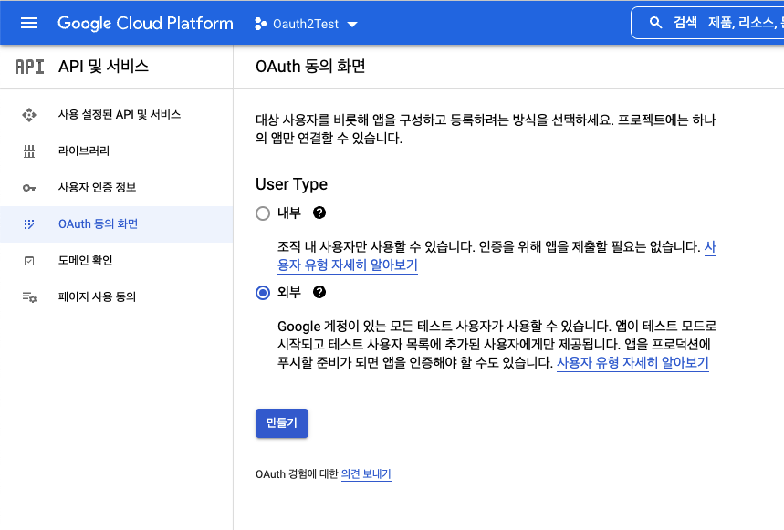
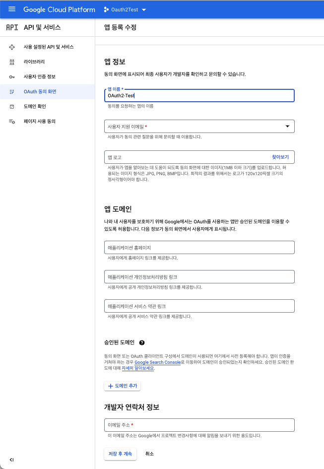
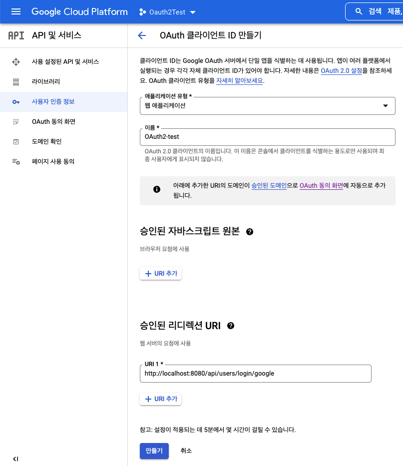

# Google

## 등록하기

1. 구글 클라우드 플랫폼 접속
https://console.cloud.google.com/getting-started?pli=1
 

2. 프로젝트 만들기

 

3. OAuth 클라이언트 ID 만들기

 

4. 먼저 동의화면 구성페이지로 이동됨 -> User Type 외부 선택

 

5. 앱이름, 이메일 입력해주기

 

6. 가져올 정보 범위 설정. email, profile, openid 3개 선택

 
7. 테스트 사용자 설정은 패스. 
 
8. 다시 OAuth 클라이언트 ID 만들기 클릭.
 
9. 애플리케이션 유형, 이름, 리다이렉트 URI 설정

 
10. 생성된 클라이언트ID, 클라이언트 Secret 기억해두기