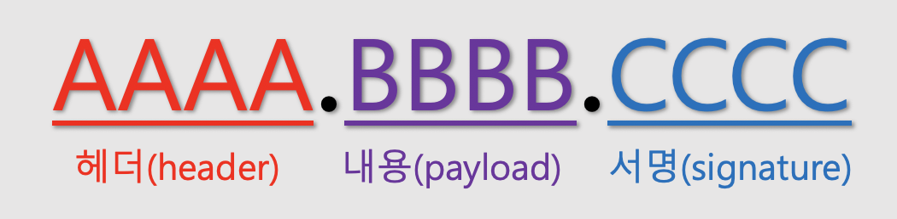
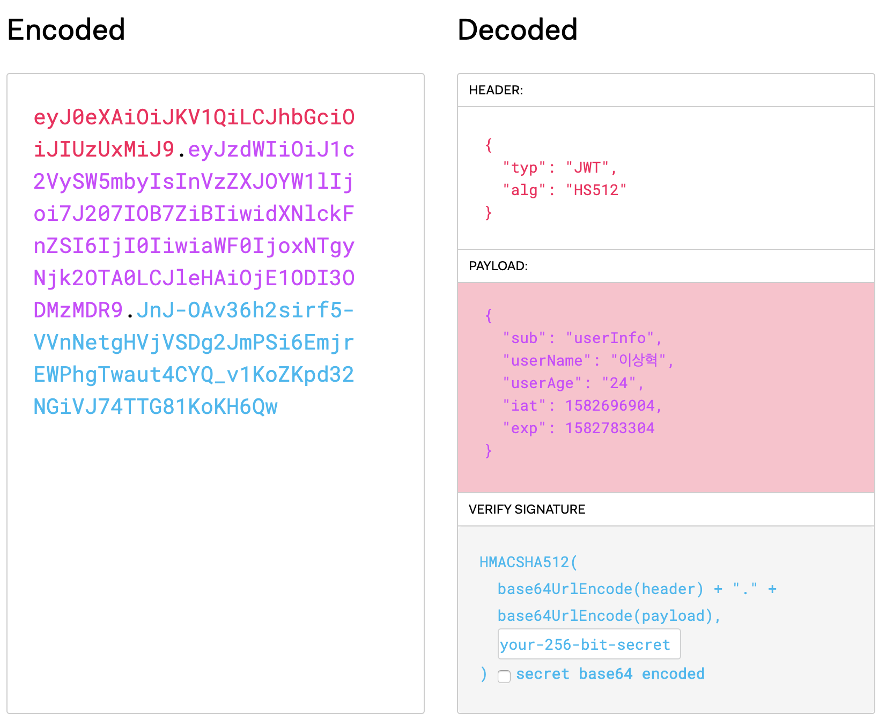

# JWT

## 정의 

    Jason Web Token (Json 형태를 지닌 토큰)

    토큰의 정보를 Json객체에 담고 있음.

## 특징 

    데이터를 따로 다른 곳에 저장하는 것이 아니라 자기가 데이터를 갖고 있어서 전달이 쉬움.

    제약이 없어서 길이가 길어도 됨. 

    JWT는 암호화 된것이 아님. 따라서, 비밀번호와 같은 민감한 정보는 담지않아야하며, secret key의 노출을 막아야 함. 

    JWT는 HTTP의 헤더 또는 URL 파라미터로 전달 가능.

## JWT TOKEN 구조 

#### 헤더

## JWT 생성 코드 (자바)

~~~java
public String generateJwt() {
    String jwt =
        Jwts.builder()
            //header
            .setHeaderParam("typ", "JWT")// token 타입 (Header)
            .setSubject("EXAMPLE") // token 제목 (Header)
            //payload
            .claim("userName", "이상혁") // private Claim 넣기
            .claim("userAge", "24") // private Claim 넣기
            .setIssuedAt(new Date(System.currentTimeMillis())) // token 생성날짜
            .setExpiration(
                new Date(System.currentTimeMillis() + 360000) // token 유효시간
            //signature
            .signWith(SignatureAlgorithm.HS512, "hyuk".getBytes("UTF-8"))
            .compact();
    return jwt;
  }
~~~

## JWT 로그인 동작과정

    1. 홍길동이 로그인을 하면, 
    2. 서버는 유저의 ID를 가지고 특정 알고리즘을 가지고 String형태인 토큰을 만듦. 
    3. 토큰을 클라이언트에 전달.  
    4. 유저는 서버에 요청을 보낼 때 토큰을 같이 전달
    5. 서버는 토큰이 유효한지 체크.

#### 장점 

    DB가 필요없음. 

    QR 체크인은 JWT방식 사용.

    facebook, google과 같은 토큰 기반 인증시스템에 접근이 용이함. 

#### 단점 

    토큰이 만료되기 전까지는 강제 로그아웃기능 불가. 

    주로 Access Token의 유효기간을 짧게 하고, Refresh Token의 유효기간을 길게 둠. 

    Payload에 유저의 중요한 정보를 담아선 안됨. 

## 출처 

https://ksshlee.github.io/spring/java/jwt/