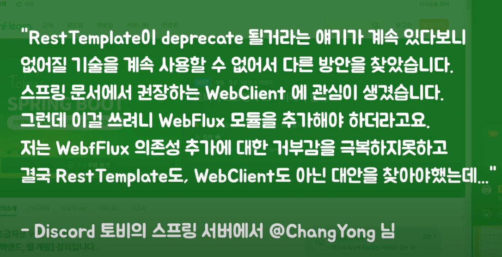

# RestTemplate이 스프링에서 제거되나??

## 질문

## 정리
httpApi를 호출할 때 대부분 restTemplate을 사용한다. 

그런데 사라지면? webclient? openfeign?

스프링 소스코드에서 직접 확인하자 

RestTemplate.java

###
As of 5.0 this class is in maintenance mode, with only minor requests for changes and bugs to be accepted going forward. Please, consider using the org.springframework.web.reactive.client.WebClient which has a more modern API and supports sync, async, and streaming scenarios.

maintenance mode : 신기능 개발은 없고 유지보수만 들어간다.
WebClinet 사용을 권장한다. 더 모던한 API이고 동기, 비동기, 스트리밍도 다 지원해준다.

결국 deprecated 된다는 말은 없다.

그럼 왜 Webclient 사용을 꺼리냐? 

기존의 WebMVC 방식에서는 딱히 장점이 없다. 

그런데 실제 커밋 기록을 보면 deprecated 된다는 말이 써있다. 

6에서 추가된 게 또 있다. 

Http interface가 추가됨.

retrofit

https://docs.spring.io/spring-framework/docs/current/reference/html/integration.html#spring-integration

