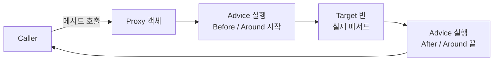
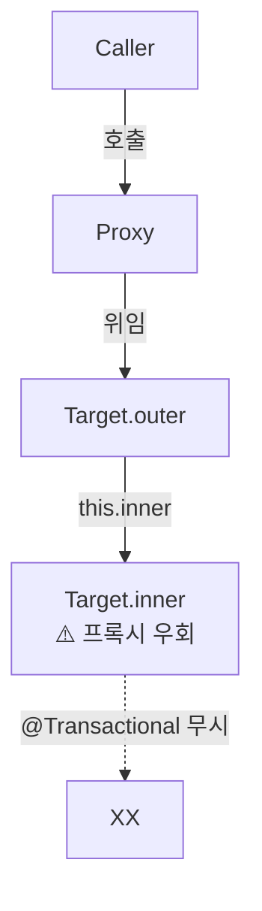

# Spring AOP 프록시

> 최종 업데이트: 2026-05-03 | Spring Boot 2.x+ 기본 (CGLIB Proxy) 기준 / AOP 일반론은 [AOP](../../CS%20이론/AOP/AOP.md) 참조

## 개념

Spring AOP 프록시는 **타깃 빈(target bean) 앞에 자동으로 끼어드는 대리자(proxy) 객체로, 메서드 호출을 가로채 어드바이스를 실행하는 메커니즘**이다. `@Transactional`·`@Async`·`@Cacheable`·`@Validated` 같은 Spring 어노테이션이 동작하는 근본 원리.

> 비유: **사장님(타깃 빈) 옆의 비서(프록시)**. 외부에서 사장님께 가는 모든 요청은 비서를 거친다. 비서가 "회의 전 차 준비, 회의 후 메모 작성"같은 부가 업무를 자동 처리.

핵심 명제: **Spring AOP는 [AOP](../../CS%20이론/AOP/AOP.md) 패러다임을 "런타임 프록시 객체" 방식으로 구현한 가벼운 변형**. 별도 컴파일러·Java Agent 없이 순수 자바만으로 동작한다는 게 가장 큰 장점.

## Spring AOP의 위치

Spring AOP는 일반 AOP의 **부분집합**이다.

| 항목 | Spring AOP | 일반 AOP (AspectJ) |
|---|---|---|
| Weaving 방식 | **런타임 프록시만** | 컴파일/로드/런타임 모두 |
| 가로챌 수 있는 지점 | **메서드 실행만** | 메서드·필드·생성자·정적 초기화 등 |
| 적용 대상 | Spring 빈만 | 모든 객체 |
| 빌드 복잡도 | 낮음 (자동) | 높음 (전용 컴파일러/에이전트) |

> Spring 2.0부터 `@AspectJ` 어노테이션 문법을 채택. **문법은 AspectJ 그대로**, 동작 방식은 런타임 프록시. 실무 95% 이상의 케이스는 Spring AOP로 충분.



## Spring 버전별 프록시 변천

| 버전 | 변경 |
|---|---|
| Spring 1.0 (2003) | 프록시 기반 AOP 도입 |
| Spring 2.0 (2005) | `@AspectJ` 어노테이션 스타일 채택 |
| Spring Boot 1.x | 인터페이스 있으면 JDK Dynamic Proxy 우선 |
| **Spring Boot 2.0+ (2018~)** | **CGLIB이 기본** (`spring.aop.proxy-target-class=true`) |

## 두 가지 프록시 방식: JDK Dynamic Proxy vs CGLIB

Spring AOP의 핵심. 어떤 프록시가 만들어지는지에 따라 동작·한계가 다르다.

### 1. JDK Dynamic Proxy (인터페이스 기반)

타깃이 **인터페이스를 구현**하고 있을 때만 가능. JDK 표준 `java.lang.reflect.Proxy` 사용.

```java
public interface UserService {
    User findById(Long id);
}

@Service
public class UserServiceImpl implements UserService {
    @Transactional
    public User findById(Long id) { ... }
}

// Spring이 만드는 프록시 (개념적)
class $Proxy0 implements UserService {  // 인터페이스만 구현
    private UserServiceImpl target;
    public User findById(Long id) {
        // before advice (트랜잭션 시작)
        User result = target.findById(id);
        // after advice (커밋/롤백)
        return result;
    }
}
```

### 2. CGLIB Proxy (클래스 상속 기반) — Spring Boot 2.x+ 기본

타깃 클래스를 **상속**해서 프록시 생성. 인터페이스 없어도 동작.

```java
@Service  // 인터페이스 없음
public class OrderService {
    @Transactional
    public void place(Order order) { ... }
}

// Spring이 만드는 프록시 (CGLIB이 OrderService를 상속)
class OrderService$$EnhancerBySpringCGLIB extends OrderService {
    @Override
    public void place(Order order) {
        // before advice
        super.place(order);
        // after advice
    }
}
```

### 두 방식 비교

| 항목 | JDK Dynamic Proxy | CGLIB Proxy |
|---|---|---|
| 요구사항 | 인터페이스 필수 | 클래스 (final 아니어야) |
| 동작 원리 | 인터페이스 동적 구현 | 타깃 클래스 상속 |
| 프록시 타입 | 인터페이스 타입만 | 타깃 클래스 타입 |
| `final` 클래스 | OK | ❌ `Cannot subclass final class` |
| `final` 메서드 | OK | ❌ 가로채기 불가 (조용히 무시) |
| `private` 메서드 | ❌ | ❌ (둘 다 불가) |
| 생성자 | 호출 안 함 | **두 번 호출**됨 (상속이라) |
| 성능 | 약간 느림 (reflection) | 빠름 (바이트코드 생성) |
| Spring Boot 2.x+ | 명시 시만 | **기본** |

설정 변경:

```properties
# application.properties — JDK Dynamic Proxy 강제
spring.aop.proxy-target-class=false
```

## 가장 중요한 함정: Self-Invocation (자기 호출)

Spring AOP 실무 트랜잭션 버그의 1순위.

```java
@Service
public class OrderService {

    @Transactional
    public void outer() {
        inner();   // ← this.inner() — 프록시를 거치지 않음!
    }

    @Transactional(propagation = REQUIRES_NEW)
    public void inner() {
        // 이 @Transactional은 동작하지 않음!
    }
}
```



**원인**: 같은 객체 내부에서 `this.method()`로 호출하면 **프록시를 거치지 않고 직접 타깃 메서드가 실행**됨. 어드바이스가 무시된다. 런타임 프록시 방식의 본질적 한계.

> 비유: 사장님이 본인이 자기 자신에게 직접 전화. 비서가 끼어들 틈이 없어 부가 업무 누락.

**대응 4가지**:

```java
// 방법 1: 자기 자신을 빈으로 주입받아 호출
@Service
public class OrderService {
    private final OrderService self;
    public OrderService(@Lazy OrderService self) { this.self = self; }

    @Transactional
    public void outer() {
        self.inner();  // ← 프록시 경유 ✓
    }
}

// 방법 2: 다른 빈으로 분리 (가장 권장)
@Service
public class OrderService {
    private final OrderInnerService inner;
    @Transactional
    public void outer() { inner.process(); }  // 별 빈 → 프록시 경유 ✓
}

// 방법 3: ApplicationContext에서 자기 빈 가져오기 (비추천)
((OrderService) applicationContext.getBean(OrderService.class)).inner();

// 방법 4: AspectJ 위빙 사용 — 런타임 프록시가 아닌 바이트코드 직접 위빙
```

→ **시니어 면접 단골 질문**. AspectJ 위빙은 자기 호출도 가로채지만 빌드 복잡도 ↑.

## Spring AOP가 적용되는 어노테이션

거의 모든 "선언적" Spring 기능이 AOP 프록시 기반:

| 어노테이션 | 역할 | 모듈 |
|---|---|---|
| `@Transactional` | 트랜잭션 시작·커밋·롤백 | spring-tx |
| `@Async` | 비동기 실행 | spring-context |
| `@Cacheable` / `@CachePut` / `@CacheEvict` | 캐싱 | spring-context |
| `@PreAuthorize` / `@PostAuthorize` | 권한 체크 | spring-security |
| `@Validated` (메서드 파라미터) | 빈 검증 | spring-context |
| `@Retryable` | 재시도 | spring-retry |
| `@Scheduled` | 스케줄링 | spring-context |
| `@EventListener` (일부) | 이벤트 처리 | spring-context |

→ **위 어노테이션이 안 동작하는 이유의 90%는 프록시 함정** (self-invocation, private 메서드, final 등).

## 직접 Aspect 작성

```java
@Aspect
@Component
public class LoggingAspect {

    @Around("execution(public * com.example..*Service.*(..))")
    public Object logExecutionTime(ProceedingJoinPoint pjp) throws Throwable {
        long start = System.currentTimeMillis();
        try {
            return pjp.proceed();  // 타깃 메서드 실행
        } finally {
            long elapsed = System.currentTimeMillis() - start;
            log.info("{} took {}ms", pjp.getSignature(), elapsed);
        }
    }
}
```

> Pointcut 표현식·Advice 종류(`@Before`/`@After`/`@AfterReturning`/`@AfterThrowing`/`@Around`)는 [AOP 일반 개념](../../CS%20이론/AOP/AOP.md#advice-종류-개념적-분류) 참조.

## Spring AOP의 한계 (프록시 방식의 본질적 제약)

| 한계 | 이유 |
|---|---|
| **자기 호출 시 어드바이스 미적용** | `this.method()`는 프록시 경유 안 함 (위 함정) |
| `private` / `static` 메서드 가로채기 불가 | 프록시는 오버라이드 가능한 메서드만 가로챔 |
| `final` 클래스·메서드 가로채기 불가 (CGLIB) | 상속 불가, 오버라이드 불가 |
| **메서드 실행 시점만 가능** | 필드 접근·생성자 호출 등은 불가 |
| 외부에서 직접 `new` 한 객체엔 적용 X | Spring 빈만 프록시됨 |
| Kotlin `data class`·`object` | `final`이 기본 → CGLIB과 충돌 (`all-open` 플러그인 필요) |

→ 위 한계가 진짜 발목 잡으면 **AspectJ 위빙**으로 전환. 단, 빌드·운영 복잡도 ↑.

## 백엔드 개발자 관점 실무 포인트

- **`@Transactional`이 안 먹으면 99% 자기 호출** — 같은 클래스 내 메서드 호출 점검
- **CGLIB 기본 인지** — Spring Boot 2.x+에선 인터페이스 없어도 프록시 생성. 단 `final` 메서드는 조용히 무시
- **CGLIB 프록시는 생성자 두 번 호출** — 생성자에 부수 효과(로그 출력, 카운터 증가) 넣지 말 것
- **`private` 메서드에 어노테이션 붙여도 동작 X** — 프록시는 오버라이드 가능한 메서드만 가로챔
- **`@Async`도 같은 자기 호출 함정** — 같은 클래스 내 호출은 비동기 안 됨
- **`@Cacheable`도 마찬가지** — `this.method()` 호출은 캐시 우회
- **순서 제어**: `@Order` 또는 `Ordered` 인터페이스로 여러 Aspect 적용 순서 결정
- **테스트 시 주의** — Spring 컨텍스트 없이 `new`로 만든 객체엔 프록시 X. `@SpringBootTest`로 통합 테스트
- **디버깅 팁** — `applicationContext.getBean(...).getClass()` 출력해서 `$$EnhancerBySpringCGLIB$$...`인지 확인. 프록시 적용 여부 즉시 확인
- **Kotlin 사용 시** — `kotlin-spring` 플러그인 추가하면 `@Component` 등이 붙은 클래스를 자동 `open` 처리 (CGLIB 호환)
- **Pointcut 표현식 `execution()`·`@annotation()`·`@within()`** 정도면 90% 커버

## 자주 만나는 에러 패턴

| 에러 / 증상 | 원인 | 해결 |
|---|---|---|
| `@Transactional`이 동작 안 함 | 자기 호출 | 자기 자신 빈 주입 또는 별 빈 분리 |
| `BeanCurrentlyInCreationException` | `@Lazy` 자기 주입 누락 | `@Lazy` 추가 |
| `Cannot subclass final class` | CGLIB이 final 클래스 상속 시도 | `final` 제거 또는 인터페이스 도입 |
| 생성자 부수 효과 두 번 실행 | CGLIB이 두 번 호출 | 생성자에서 부수 효과 빼기 |
| `IllegalStateException`: proxy not bean | 빈이 아닌 객체에 어노테이션 | 빈으로 등록 (`@Component` 등) |
| `@Async` 메서드 즉시 반환 안 함 | 같은 클래스 내 호출 | 다른 빈으로 분리 |

## 한 줄 요약

> **Spring AOP 프록시 = AOP를 "런타임 프록시 객체" 방식으로 구현한 Spring의 가벼운 AOP 변형.** Spring Boot 2.x+ 기본은 **CGLIB(클래스 상속 기반)**, 인터페이스 강제 시만 JDK Dynamic Proxy. `@Transactional`·`@Async`·`@Cacheable` 등 거의 모든 선언적 Spring 기능이 이 메커니즘으로 동작. 프록시 방식의 본질적 한계인 **Self-Invocation(자기 호출)**이 실무 트랜잭션 버그 1순위이며, 해결책은 자기 빈 주입·별 빈 분리·AspectJ 위빙 중 택일.

## 관련 문서

- [AOP](../../CS%20이론/AOP/AOP.md) — AOP 일반론 (언어 독립 패러다임, 다언어 구현체)
- [Spring 원리](../Spring%20원리/) — Spring 내부 동작
- [Spring Database](../Spring%20Database/) — `@Transactional` 깊이 다룸
- [annotation](../annotation/) — Spring 주요 어노테이션 정리

## 참조

- [Spring Framework Reference — Aspect Oriented Programming](https://docs.spring.io/spring-framework/reference/core/aop.html)
- [Spring Framework Reference — Proxying Mechanisms](https://docs.spring.io/spring-framework/reference/core/aop/proxying.html)
- [Spring Boot 2.0 Release Notes — CGLIB default](https://github.com/spring-projects/spring-boot/wiki/Spring-Boot-2.0-Migration-Guide)
- [Baeldung — Comparing Spring AOP and AspectJ](https://www.baeldung.com/spring-aop-vs-aspectj)
- https://sabarada.tistory.com/94
