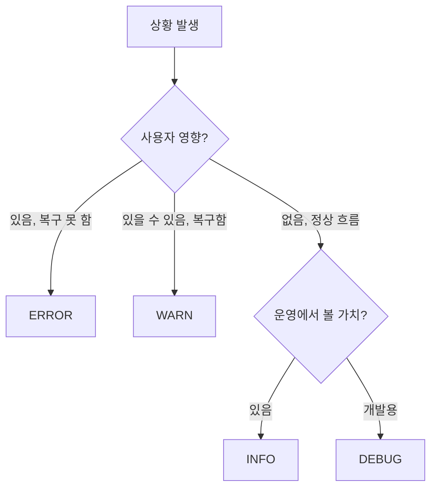

# Spring Boot 로그 사용법 (코드 레벨)

> 최종 업데이트: 2026-05-15 | Spring Boot 3.x + SLF4J 2.x + Logback 1.5.x + Lombok 기준

## 개념

이 문서는 **앱 코드에서 `log.info(...)`, `log.error(...)` 같은 로그 메서드를 어떻게 호출하느냐**에 집중한다. 프레임워크 구조나 설정은 다른 문서에서 다룸:

| 관점 | 문서 |
|---|---|
| 코드 사용법 (이 문서) | `log.info`, `@Slf4j`, MDC, Fluent API |
| 프레임워크 자체 | [[Logback]] — Logger 계층, Appender, Encoder |
| YAML 설정 | [[Springboot-로깅-설정]] — 레벨/포맷/JSON/롤링 |

> 비유: 자동차로 치면 [[Logback|Logback 문서]]가 엔진 구조, [[Springboot-로깅-설정|설정 문서]]가 자동차 옵션 카탈로그라면, **이 문서는 운전 매뉴얼**. "기어 변속은 언제, 깜빡이는 어떻게" 같은 실제 운전 동작.

## Logger 인스턴스 생성

### 방법 1: Lombok `@Slf4j` (Spring Boot 표준)

```java
import lombok.extern.slf4j.Slf4j;

@Slf4j
@Service
public class PaymentService {
    public void pay(Long userId) {
        log.info("결제 시작 userId={}", userId);
    }
}
```

`@Slf4j`가 컴파일 시점에 아래 코드를 자동 생성:

```java
private static final org.slf4j.Logger log =
    org.slf4j.LoggerFactory.getLogger(PaymentService.class);
```

→ 매 클래스마다 한 줄로 끝. 대부분의 Spring Boot 프로젝트 표준.

### 방법 2: `LoggerFactory` 직접 (Lombok 미사용 시)

```java
import org.slf4j.Logger;
import org.slf4j.LoggerFactory;

public class PaymentService {
    private static final Logger log = LoggerFactory.getLogger(PaymentService.class);

    public void pay(Long userId) {
        log.info("결제 시작 userId={}", userId);
    }
}
```

Lombok을 안 쓰거나 컴파일 결과에 명시적으로 두고 싶을 때.

### 방법 3: 이름 기반 Logger (전용 카테고리 분리)

```java
private static final Logger AUDIT = LoggerFactory.getLogger("AUDIT");
private static final Logger SLOW_QUERY = LoggerFactory.getLogger("SLOW_QUERY");

AUDIT.info("user={} action={}", userId, "LOGIN");
```

`logback-spring.xml` 또는 `application.yml`에서 `AUDIT`, `SLOW_QUERY` 카테고리만 별도 Appender(파일·Kafka)로 분리 가능. 감사 로그·슬로우 쿼리 등에 자주 쓰는 패턴.

### 비교

| 방법 | 권장 시점 |
|---|---|
| `@Slf4j` | **대부분** — Spring Boot + Lombok 표준 |
| `LoggerFactory.getLogger(Class)` | Lombok 미사용 / 라이브러리 코드 |
| `LoggerFactory.getLogger(String)` | 비즈니스와 다른 분류로 분리하고 싶을 때 (감사·메트릭·슬로우 쿼리) |

## 로그 레벨

SLF4J가 제공하는 5단계 + OFF:

```
TRACE < DEBUG < INFO < WARN < ERROR < OFF
```

| 레벨 | 의미 | 실무 사용 기준 |
|---|---|---|
| `log.trace(...)` | 매우 상세한 추적 | 거의 안 씀. 특정 함수 진입/탈출 추적 등 |
| `log.debug(...)` | 개발·디버깅 정보 | 변수 상태, 분기 결과 — **운영에서는 보통 꺼둠** |
| `log.info(...)` | 정상 흐름의 주요 이벤트 | 요청 시작/완료, 외부 호출 결과, 배치 진행 |
| `log.warn(...)` | 잠재적 문제, 복구 가능 | 재시도, 폴백 발동, deprecated 사용 감지 |
| `log.error(...)` | 처리 실패, 사람의 개입 필요 | 예외 발생, 외부 시스템 다운, DB 연결 실패 |

### 레벨 선택 가이드



> 핵심 기준: **"오전 3시에 이걸 보고 일어나야 하는가?"** → ERROR. **"보고서·통계에 쓸 가치 있나?"** → INFO. **"디버깅할 때만 필요"** → DEBUG.

### 설정 (yml에서 레벨 제어)

```yaml
logging:
  level:
    root: INFO
    com.example.payment: DEBUG       # 결제 모듈만 더 자세히
    org.hibernate.SQL: DEBUG         # SQL 보고 싶을 때
```

자세한 설정은 [[Springboot-로깅-설정]] 참고.

## 파라미터 치환 — `{}` 사용

SLF4J의 가장 중요한 코드 규칙. **문자열 `+` 연결을 쓰지 말 것**.

```java
// ❌ 나쁜 예 — 문자열 연결
log.info("user " + userId + " logged in from " + ip);

// ✅ 좋은 예 — 파라미터 치환
log.info("user {} logged in from {}", userId, ip);
```

### 왜 중요한가

1. **레벨 차단 시 비용**: `log.debug(...)`가 DEBUG 비활성화 상태여도, **`+` 연결은 항상 실행됨**. `{}` 방식은 차단되면 인자 처리 자체를 건너뜀
2. **객체 toString() 호출 회피**: `log.debug("data: " + bigObject)`는 `bigObject.toString()`을 항상 호출 → 큰 객체면 성능 저하
3. **JSON 로깅과 호환**: `{}` 치환 결과는 SLF4J 내부에서 별도 필드로 추적 가능 (구조화 로그 시 유용)

### 예외도 함께

```java
// ✅ 예외는 마지막 인자로 (메시지 파라미터 다음)
log.error("결제 실패 orderId={} amount={}", orderId, amount, exception);
```

`exception`은 `{}` 자리에 들어가지 않고 **스택트레이스로 별도 처리**된다 (SLF4J 규약).

## 예외 로깅 — 핵심 패턴

```java
try {
    paymentClient.charge(order);
} catch (PaymentException e) {
    log.error("결제 실패 orderId={}", order.getId(), e);  // ← Throwable을 마지막에
    throw e;  // 또는 변환
}
```

### 안티패턴

```java
// ❌ stdout 직접 출력 — Logback 파이프라인 우회. JSON 로깅·MDC 다 안 됨
e.printStackTrace();

// ❌ 메시지만 — 스택트레이스 사라짐
log.error("결제 실패: " + e.getMessage());

// ❌ 예외를 메시지 치환 자리에 — 스택트레이스 사라짐
log.error("결제 실패 e={}", e);

// ✅ 정답
log.error("결제 실패", e);                              // 메시지만 + 예외
log.error("결제 실패 orderId={}", orderId, e);          // 컨텍스트 + 예외
```

> **규칙**: `log.error(메시지, 파라미터들..., Throwable)` 순서. Throwable은 항상 **맨 마지막 인자**.

### 잡은 예외 통째로 로깅 + 재던지기는 중복

```java
// ❌ 안티패턴 — 한 예외가 두 번 로깅됨
try { ... }
catch (Exception e) {
    log.error("처리 실패", e);
    throw new ServiceException(e);   // 상위에서 또 로깅됨 → 같은 스택트레이스 중복
}

// ✅ 둘 중 하나만
// (a) 여기서 처리하고 끝
// (b) 로깅 안 하고 상위로 던지기만 (상위가 책임)
```

## SLF4J 2.x Fluent API — 구조화 로그용

SLF4J 2.0+ (Spring Boot 3.x 기본)부터 사용 가능. **JSON 로깅과 시너지가 큼**.

```java
log.atInfo()
   .addKeyValue("orderId", order.getId())
   .addKeyValue("amount", order.getAmount())
   .addKeyValue("currency", "KRW")
   .setMessage("결제 완료 userId={}")
   .addArgument(userId)
   .log();
```

### JSON 출력 결과 (Logstash 포맷)

```json
{
  "@timestamp": "2026-05-15T10:23:45.123Z",
  "level": "INFO",
  "message": "결제 완료 userId=42",
  "orderId": "ORD-123",
  "amount": 50000,
  "currency": "KRW"
}
```

→ `orderId`, `amount` 등이 **개별 JSON 필드**로 들어가 Kibana/Loki에서 필드 단위 검색·집계 가능. 평문 메시지에 `orderId=ORD-123` 박아넣는 것보다 훨씬 강력.

### 언제 쓰나

| 상황 | 권장 |
|---|---|
| 일반 메시지 로깅 | 기존 방식 `log.info("...", arg)` |
| 검색·집계할 필드가 있는 이벤트 | **Fluent API** (`addKeyValue`) |
| 결제 완료, 가입 완료 같은 비즈니스 이벤트 | **Fluent API** |
| 에러 로깅 | `log.error(...)` 그대로 (스택트레이스 자동) |

## `isXxxEnabled()` 가드 — 무거운 연산 회피

`{}` 치환이 알아서 처리해주므로 보통은 불필요. **무거운 연산을 인자로 줄 때만** 가드.

```java
// 평소엔 그냥 — {}가 알아서 처리
log.debug("user={}", userId);

// 인자 자체가 무거울 때만 가드
if (log.isDebugEnabled()) {
    String dump = expensiveSerialization(bigObject);   // toString이 비싼 경우
    log.debug("dump={}", dump);
}
```

또는 **`Supplier` 람다**로 처리 가능 (SLF4J 2.x):

```java
log.atDebug()
   .setMessage("dump={}")
   .addArgument(() -> expensiveSerialization(bigObject))   // 차단 시 호출 안 됨
   .log();
```

## MDC — 요청 컨텍스트 전파

스레드 로컬에 컨텍스트(traceId, userId 등)를 두고 모든 로그에 자동 첨부.

```java
import org.slf4j.MDC;

public class TraceFilter implements Filter {
    public void doFilter(ServletRequest req, ServletResponse res, FilterChain chain) {
        try {
            MDC.put("traceId", UUID.randomUUID().toString());
            MDC.put("userId", extractUser(req));
            chain.doFilter(req, res);
        } finally {
            MDC.clear();   // ★ 반드시 — 스레드 풀 재사용 시 다른 요청에 누수
        }
    }
}
```

### 활용

- **패턴에 박기** (yml 또는 logback-spring.xml):
  ```yaml
  logging:
    pattern:
      console: "%d [%X{traceId:-}] %-5p %logger - %msg%n"
  ```
- **JSON 로깅 시 자동 포함**: Structured Logging (`logging.structured.format.console: logstash`) 사용 시 MDC 전체가 JSON 필드로 자동 첨부

### 분산 추적과 통합

Spring Boot의 **Micrometer Tracing** (또는 옛 Spring Cloud Sleuth)이 활성화되면 `traceId`, `spanId`가 **자동으로 MDC에 주입**된다. 직접 `MDC.put("traceId", ...)` 안 해도 됨.

```yaml
management:
  tracing:
    sampling:
      probability: 1.0   # 100% 샘플링 (개발)
```

## 좋은 로그 메시지 작성법

### 1. 검색·집계 가능하게

```java
// ❌ 자연어 — 검색 어려움
log.info("결제가 완료되었습니다. 주문번호 " + order.getId() + " 금액은 " + order.getAmount() + "원입니다");

// ✅ 키=값 형태 — grep·필드 추출 쉬움
log.info("payment_completed orderId={} amount={}", order.getId(), order.getAmount());

// ✅✅ 구조화 로그 — Fluent API
log.atInfo()
   .addKeyValue("event", "payment_completed")
   .addKeyValue("orderId", order.getId())
   .addKeyValue("amount", order.getAmount())
   .log("결제 완료");
```

### 2. 일관된 키 이름

`userId`, `user_id`, `uid`를 섞어 쓰면 검색·집계 시 지옥. 팀 차원에서 표준 키 정하기.

### 3. PII (개인정보) 마스킹

```java
// ❌ 그대로 찍기 — 로그 시스템에 PII 누적 (법적 리스크)
log.info("user signup phone={} email={}", phone, email);

// ✅ 마스킹
log.info("user signup phone={} email={}", mask(phone), maskEmail(email));

// 또는 Logback Pattern에 마스킹 필터를 두는 방법도 있음
```

### 4. 동사 + 명사로 요약 가능하게

| 나쁨 | 좋음 |
|---|---|
| `"여기 들어옴"` | `"payment_started orderId={}"` |
| `"에러"` | `"db_query_failed table={} reason={}"` |
| `"OK"` | `"order_validated orderId={}"` |

### 5. 적절한 양 — 너무 많아도, 적어도 안 됨

| 단계 | INFO 로깅 권장도 |
|---|---|
| 요청 진입/종료 (HTTP) | ✅ (필터·인터셉터에서 자동) |
| 외부 API 호출 (start/end) | ✅ |
| 비즈니스 이벤트 (결제 완료 등) | ✅ |
| 일반 메서드 호출 | ❌ (DEBUG로) |
| for 루프 안 | ❌ (요약만 INFO, 상세는 DEBUG) |

## 자주 만나는 안티패턴 정리

| 안티패턴 | 왜 안 좋은가 |
|---|---|
| `e.printStackTrace()` | stdout 직접 출력, Logback 우회 → MDC·JSON 다 안 됨 |
| `log.info("user " + id)` (문자열 `+`) | 레벨 차단되어도 항상 연결 비용 발생 |
| `log.error("실패: " + e.getMessage())` | 스택트레이스 누락 |
| `log.error("실패 e={}", e)` | 예외를 `{}` 자리에 — 스택트레이스 누락 |
| `MDC.put(...)` 후 `clear()` 누락 | 스레드 풀에서 다른 요청에 컨텍스트 누수 |
| 같은 예외 두 번 로깅 (catch 후 throw) | 같은 스택트레이스가 로그에 중복 |
| 비밀번호·토큰·전화번호 그대로 로깅 | 개인정보 유출, 컴플라이언스 위반 |
| INFO에 디버깅 정보 폭주 | 로그 비용 증가, 진짜 INFO 묻힘 |
| `System.out.println` 사용 | Logback 완전 우회 |
| 로그 메시지에 자연어만 | 검색·grep 어려움 → 키=값 형태로 |
| `@Slf4j` 안 쓰고 매 메서드에서 LoggerFactory 호출 | 비용·가독성 모두 나쁨 — `static final`로 한 번만 |
| 운영에서 `root: DEBUG` | 로그 양 폭증, 디스크·비용 폭발 |

## 한 줄 요약

> **Spring Boot 코드에서 로그는 `@Slf4j` + `log.info("user={}", id)` 가 기본형.** 예외는 `log.error("msg", e)`로 Throwable을 마지막 인자에. 검색·집계할 필드가 있는 비즈니스 이벤트는 **SLF4J 2.x Fluent API** (`atInfo().addKeyValue(...)`)로 구조화. MDC + Micrometer Tracing으로 분산 환경 traceId 전파. 안티패턴은 **문자열 `+` 연결, `printStackTrace`, `e.getMessage()`만 로깅, MDC `clear()` 누락**.

## 관련 문서

- [[Logback]] — Logback 프레임워크 자체 (Logger 계층·Appender·Encoder)
- [[Springboot-로깅-설정]] — YAML 기반 Logback 설정 심화 (3.4+ Structured Logging)
- [[Fluent-Bit]] — JSON 로그를 K8s에서 수집
- [[Java-Exception]] — 스택트레이스가 어떻게 만들어지는지

## 참조

- [SLF4J 2.x Fluent API 공식](https://www.slf4j.org/manual.html#fluent)
- [Spring Boot Logging 공식](https://docs.spring.io/spring-boot/reference/features/logging.html)
- [Micrometer Tracing](https://docs.micrometer.io/tracing/reference/)
- [Lombok @Slf4j](https://projectlombok.org/features/log)
