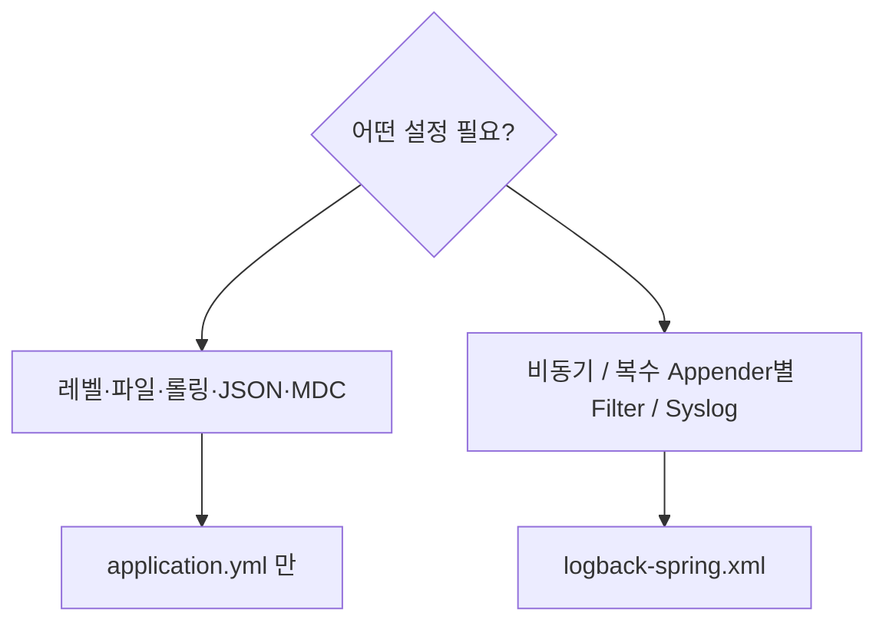

# Spring Boot 로깅 설정 (YAML 기반)

> 최종 업데이트: 2026-05-15 | Spring Boot 3.4+ + Logback 1.5.x 기준

## 개념

Spring Boot에서 Logback을 설정하는 방법은 두 가지다:
1. **`application.yml`(또는 `.properties`)** — Spring Boot가 제공하는 표준 설정 (이 문서의 주제)
2. **`logback-spring.xml`** — Logback 네이티브 XML 설정

> **요점**: 과거에는 운영에 필요한 거의 모든 설정에 XML이 필요했지만, **Spring Boot 3.4부터 Structured Logging(JSON)이 표준 기능으로 들어오면서** 대부분의 케이스를 YAML만으로 처리할 수 있게 됨. XML은 "**복잡한 Appender 조합·필터·비동기 래핑**" 같은 고급 시나리오로 좁아짐.

[[Logback]] 프레임워크 자체의 개념·아키텍처는 별도 문서 참고. 이 문서는 **Spring Boot에서 YAML로 Logback을 다루는 실용 가이드**.

## 배경 — 왜 YAML로 충분해졌나

| 시기 | Spring Boot의 로깅 설정 능력 |
|---|---|
| ~3.0 | 레벨/파일/패턴/롤링 정도만 YAML. JSON·고급 설정은 XML 필수 |
| 3.0~3.3 | YAML 커버리지 점진 확대 (롤링 정책 표준화 등) |
| **3.4 (2024-11)** | **Structured Logging 도입** — `logging.structured.format.console=ecs` 한 줄로 JSON 로깅. ECS/Logstash/GELF 포맷 표준 제공 |
| 3.5+ | Customizer 빈으로 Structured Logging 필드 세밀 조정 가능. JSON 파일 출력 표준화 |

> 즉 2024년 11월 이전 자료는 "JSON 로깅 = LogstashEncoder + XML"이 정답이었지만, **3.4 이상이면 YAML 한 줄로 끝**. 이게 가장 큰 변화.

## YAML로 가능한 것 vs XML이 필요한 것

| 기능 | YAML | XML |
|---|---|---|
| 로거 레벨 | ✅ | ✅ |
| 콘솔/파일 패턴 | ✅ | ✅ |
| 파일 출력 + 롤링 (크기/시간/총 용량) | ✅ | ✅ |
| **JSON 로깅 (ECS/Logstash/GELF)** ★ | **✅ (3.4+)** | ✅ |
| MDC 패턴(`%X{traceId}`) | ✅ | ✅ |
| 환경변수/프로퍼티 치환 | ✅ | ✅ |
| 프로파일별 레벨/포맷 분기 | ✅ (`application-{profile}.yml`) | ✅ (`<springProfile>`) |
| `AsyncAppender` 래핑 | ❌ | ✅ |
| 여러 Appender + Appender별 다른 Filter | ❌ | ✅ |
| `SyslogAppender` / `SocketAppender` / `SMTPAppender` | ❌ | ✅ |
| `EvaluatorFilter` (Groovy 표현식) | ❌ | ✅ |
| 커스텀 Encoder 구현체 주입 | ❌ | ✅ (또는 Customizer 빈) |



## 기본 설정 — 매일 쓰는 것

```yaml
logging:
  # 1. 로그 레벨
  level:
    root: INFO
    com.example.service: DEBUG       # 패키지별 세밀 제어
    org.hibernate.SQL: DEBUG         # JPA SQL 출력
    org.hibernate.orm.jdbc.bind: TRACE  # 바인딩 파라미터까지

  # 2. 콘솔/파일 패턴
  pattern:
    console: "%clr(%d{HH:mm:ss.SSS}) %clr(%-5p) %clr([%X{traceId:-}]){faint} %clr(%logger{20}){cyan} - %msg%n"
    file: "%d{yyyy-MM-dd HH:mm:ss.SSS} %-5p [%X{traceId:-}] %logger{40} - %msg%n%xEx"
    # %xEx = 확장 스택트레이스 (jar/버전 정보 포함)
    # %X{traceId:-} = MDC에 traceId 있으면 출력, 없으면 빈 문자열

  # 3. 파일 출력
  file:
    name: logs/app.log              # 절대/상대 경로
    # path: logs/                    # 또는 디렉터리만 (파일명 자동 = spring.log)

  # 4. 롤링 정책 (RollingFileAppender 자동 적용)
  logback:
    rollingpolicy:
      file-name-pattern: "logs/app.%d{yyyy-MM-dd}.%i.log.gz"
      max-file-size: 100MB
      max-history: 30                # 일수 (TimeBasedRollingPolicy 기준)
      total-size-cap: 10GB
      clean-history-on-start: false
```

> Spring Boot가 내부적으로 `RollingFileAppender` + `SizeAndTimeBasedRollingPolicy` 조합을 자동 생성. `.gz`로 끝나면 자동 압축.

## Structured Logging (Spring Boot 3.4+) ★ 핵심 신규

JSON 로깅을 LogstashEncoder/XML 없이 YAML만으로 활성화.

```yaml
logging:
  structured:
    format:
      console: ecs                   # 콘솔을 JSON으로
      file: logstash                 # 파일은 다른 포맷도 가능
```

지원 포맷 3종:

| 포맷 | 출력 스키마 | 적합한 곳 |
|---|---|---|
| **`ecs`** | Elastic Common Schema 8.x | Elastic Stack (Elasticsearch/Kibana) |
| **`logstash`** | Logstash JSON (`@timestamp`, `logger_name`, `level`, `message`, `stack_trace`...) | Logstash/Loki/일반 |
| **`gelf`** | Graylog Extended Log Format | Graylog |

### ECS 출력 예시

```json
{
  "@timestamp": "2026-05-15T10:23:45.123Z",
  "log.level": "ERROR",
  "log.logger": "com.example.PaymentService",
  "message": "결제 실패",
  "error.type": "java.sql.SQLException",
  "error.message": "connection refused",
  "error.stack_trace": "java.sql.SQLException...\n\tat ...",
  "service.name": "payment-service",
  "service.version": "2.1.0",
  "ecs.version": "8.11"
}
```

### 메타데이터 추가 (ECS 기준)

```yaml
logging:
  structured:
    format:
      console: ecs
    ecs:
      service:
        name: ${spring.application.name}
        version: 2.1.0
        environment: ${spring.profiles.active:default}
        node-name: ${HOSTNAME:unknown}
```

### Logstash 포맷 필드 추가/제거

```yaml
logging:
  structured:
    format:
      console: logstash
    logstash:
      # 필드 추가는 SLF4J fluent API로 (코드 레벨)
```

Java 코드:

```java
log.atInfo()
   .addKeyValue("orderId", order.getId())
   .addKeyValue("amount", order.getAmount())
   .log("결제 완료");
```

→ JSON에 `orderId`, `amount` 키가 자동 추가. **개별 로그 호출에서 구조화 필드 추가**가 가장 깔끔한 방법.

### Customizer 빈으로 고급 변경 (3.4+)

YAML로 안 되는 세밀한 커스터마이즈는 빈으로:

```java
@Component
public class MyLogstashCustomizer implements StructuredLoggingJsonMembersCustomizer<...> {
    @Override
    public void customize(Members<...> members) {
        members.add("env", "prod")
               .add("region", System.getenv("AWS_REGION"));
    }
}
```

> 이 방식은 XML 없이도 LogstashEncoder 시절의 거의 모든 커스터마이즈를 대체.

## 프로파일별 로깅 분리

### 방법 1: 프로파일별 application.yml

```
src/main/resources/
├── application.yml              # 공통
├── application-local.yml        # 로컬 (사람이 읽는 평문)
├── application-dev.yml          # 개발 (JSON, DEBUG 일부)
└── application-prod.yml         # 운영 (JSON, INFO 이상)
```

`application-local.yml`:

```yaml
logging:
  level:
    com.example: DEBUG
  pattern:
    console: "%d{HH:mm:ss} %-5p %logger{20} - %msg%n"   # 평문, 컬러
```

`application-prod.yml`:

```yaml
logging:
  level:
    com.example: INFO
  structured:
    format:
      console: ecs
    ecs:
      service:
        name: ${spring.application.name}
```

### 방법 2: 단일 yml의 spring.profiles

```yaml
spring:
  profiles: prod
---
logging:
  structured:
    format:
      console: ecs
```

> 일반적으로 **방법 1(파일 분리)** 이 가독성·관리 편의 면에서 권장.

## SQL / HTTP / 외부 라이브러리 로깅

### SQL 로깅 (Hibernate/JPA)

```yaml
logging:
  level:
    org.hibernate.SQL: DEBUG               # SQL 문장
    org.hibernate.orm.jdbc.bind: TRACE     # 바인딩 값 (Hibernate 6+, ? 자리에 들어가는 실제 값)

spring:
  jpa:
    properties:
      hibernate:
        format_sql: true                   # SQL 줄바꿈 정리
    show-sql: false                        # System.out 사용 — 운영에서는 false (Logback으로 보내야)
```

> `spring.jpa.show-sql: true`는 **Logback을 거치지 않고 stdout 직접 출력**해서 운영 환경에서 비권장. `logging.level.org.hibernate.SQL` 사용이 표준.

### HTTP 요청/응답 메시지 로깅 (Tomcat 레벨)

```yaml
logging:
  level:
    org.apache.coyote.http11: DEBUG        # HTTP 요청/응답 메시지 raw
```

Spring 6+의 `CommonsRequestLoggingFilter` 또는 `RestClient`/`WebClient` 인터셉터가 더 깔끔한 대안.

### Spring Web 관련

```yaml
logging:
  level:
    org.springframework.web: DEBUG          # MVC 처리
    org.springframework.security: DEBUG     # 시큐리티 필터 체인
    org.springframework.boot.autoconfigure: DEBUG  # 자동 구성 디버깅
```

### 외부 호출 (RestClient/WebClient/HTTP Client)

```yaml
logging:
  level:
    org.springframework.web.client.RestClient: DEBUG
    reactor.netty.http.client: DEBUG        # WebClient의 Netty
```

## MDC + traceId 활용

Micrometer Tracing / Spring Cloud Sleuth가 활성화되면 `traceId`·`spanId`가 MDC에 자동 주입.

```yaml
logging:
  pattern:
    console: "%d{HH:mm:ss.SSS} [%X{traceId:-},%X{spanId:-}] %-5p %logger{20} - %msg%n"
  structured:
    format:
      console: logstash
    # logstash 포맷은 MDC 전체를 자동 포함
```

분산 환경에서 한 요청을 모든 마이크로서비스 로그에 걸쳐 추적 가능.

## XML과 병행 사용

YAML에 없는 고급 기능만 XML로 덧붙이는 패턴이 가능. `application.yml`의 일부 설정 + `logback-spring.xml` 동시 사용 시 **XML이 우선**.

```xml
<!-- src/main/resources/logback-spring.xml -->
<configuration>
    <include resource="org/springframework/boot/logging/logback/defaults.xml"/>
    <include resource="org/springframework/boot/logging/logback/console-appender.xml"/>

    <!-- YAML에 없는 AsyncAppender만 추가 -->
    <appender name="ASYNC_FILE" class="ch.qos.logback.classic.AsyncAppender">
        <appender-ref ref="FILE"/>
        <queueSize>8192</queueSize>
        <discardingThreshold>0</discardingThreshold>
    </appender>

    <root level="INFO">
        <appender-ref ref="CONSOLE"/>
        <appender-ref ref="ASYNC_FILE"/>
    </root>
</configuration>
```

`<include>`로 Spring Boot의 기본 정의를 가져온 뒤, 필요한 부분만 추가하는 게 깔끔하다.

## 운영에서 자주 보는 함정

| 안티패턴 | 왜 위험 |
|---|---|
| `spring.jpa.show-sql: true` 사용 | stdout 직접 출력 → Logback 우회. K8s 환경에서 JSON 깨짐 |
| 프로파일 없이 단일 yml에 평문+JSON 혼재 | 운영/개발 어느 한쪽이 항상 불편. `application-{profile}.yml` 분리 권장 |
| `logging.file.name` + 컨테이너 환경 | 컨테이너 파일시스템 재시작 시 소실. **stdout + 외부 수집기**가 표준 |
| `total-size-cap` 미설정 | 디스크 가득 차서 노드 장애 |
| 운영에서 `DEBUG` 글로벌 | 로그 양 폭증, 비용·성능 ↓. 패키지 단위로 좁혀 적용 |
| MDC 사용하면서 traceId 패턴 누락 | 분산 추적 정보가 로그에 안 찍힘 |
| Spring Boot 3.4 미만에서 JSON 로깅 시도 | YAML로 안 됨 — 3.4 미만이면 LogstashEncoder + XML 사용 |
| `show-sql`과 `org.hibernate.SQL=DEBUG` 동시 설정 | 같은 SQL이 두 번 출력 |

## 한 줄 요약

> **Spring Boot 3.4부터 YAML만으로 JSON 로깅·롤링·MDC·프로파일 분기까지 다 됨.** XML은 비동기 래핑·복수 Appender Filter·Syslog 같은 고급 시나리오에만 필요. 컨테이너 환경 표준 = **`application.yml` + `structured.format.console: ecs(또는 logstash)` + `stdout`**. 이래야 [[Fluent-Bit]] 같은 수집기에서 스택트레이스 안 쪼개지고 필드 단위 검색·집계가 깔끔.

## 관련 문서

- [[Springboot-로그-사용법]] — 코드에서 `log.info`, `@Slf4j`, MDC, Fluent API 호출하는 실용 가이드
- [[Logback]] — Logback 프레임워크 자체의 개념·아키텍처·Appender·Encoder 심화 (`Java/Logback.md`)
- [[Fluent-Bit]] — JSON 로그를 K8s에서 수집하는 차세대 수집기
- [[Spring-모니터링-설정]] — 로깅 외 메트릭·트레이스 모니터링 전반
- [[application-과-bootstrap-yml-차이]] — Spring Boot 설정 파일 종류

## 참조

- [Spring Boot Logging 공식 문서](https://docs.spring.io/spring-boot/reference/features/logging.html)
- [Structured logging in Spring Boot 3.4 (Spring 공식 블로그, 2024-08)](https://spring.io/blog/2024/08/23/structured-logging-in-spring-boot-3-4/)
- [Logback 공식](https://logback.qos.ch/)
- [Elastic Common Schema (ECS)](https://www.elastic.co/guide/en/ecs/current/index.html)
- [Micrometer Tracing](https://docs.micrometer.io/tracing/reference/)
