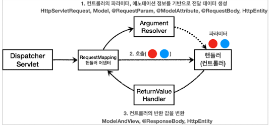

# MVC pattern

## 개념
과거에 servlet 혹은 jsp 안에서 비즈니스 로직, 뷰 처리를 모두 한번에 하던 것에서 탈피. 

비즈니스 로직과 뷰 로직을 구분한다. 

## Front Controller Pattern (서블릿)

DispatcherServlet이 이 패턴이다. 

## Spring MVC

### 1. 서버에 HTTP 요청이 오면 DispatcherServlet.doDispatch()가 호출된다. 

#### DispatcherServlet
핵심 메서드
~~~java
doDispatch()
~~~
DispatcherServlet은 HttpServlet을 상속받았다.

이 method안에 아래의 HTTP 요청을 처리하는 작업이 모두 들어있다. 

### 2. 먼저, 등록된 핸들러 매핑들을 우선순위 순서대로 쭉 돌린다. 각 핸들러 매핑에서 핸들러(컨트롤러)를 찾아서 반환한다. 없으면 다음 순위 핸들러 매핑 실행.
URI가 일치하는 Handler 반환.
~~~java
mappedHandler=getHandler(processRequest)
~~~

#### HandlerMapping
최종 구현체 핸들러 매핑이 등록되어 있다. 각 HandlerMapping에는 Order, 우선순위가 있다. 

* RequestMappingHandlerMapping @Controller가 붙어있는 경우 인식 (0)
* BeanNameUrlHandlerMapping 스프링 빈의 이름(url) order(2)
* WelcomePageHandlerMapping (2)
* RouterFunctionMapping order(3)
* SimpleUrlHandlerMapping (2147483646)

등이 있다.

**위에 3개는 WebMvcConfigurationSupport에서 setOrder()를 통해 우선순위를 부과한다.** 

**SimpleUrlHandlerMapping의 order가 특이한 이유는 Integer의 MaxValue에서 1을 뺀 크기로 지정해놨기 때문이다.**

#### AbstractHandlerMapping
HandlerMapping의 구현체. 
여기서 구현한 getHandler()가 호출된다.

### 3. 핸들러 매핑으로 찾은 Handler를 실행하기 위해 HandlerAdapter가 필요하다. 반환받은 Handler를 support하는 HanlderAdapter를 반환한다. HandlerAdapter 내부에서 Handler를 실행. 그리고 ModelAndView를 반환한다.

~~~java
HandlerAdapter ha = getHandlerAdapter(mappedHandler.getHandler());

mv = ha.handle(processedRequest, response, mappedHandler.getHandler());
~~~

#### HandlerAdapter
핸들러 매핑으로 찾은 핸들러를 실행할 수 있는 핸들러 어댑터

* RequestMappingHandlerAdapter 애노티에션 기반. @RequestMapping.
* HttpRequestHandlerAdapter HttpRequestHandler 처리
* SimpleControllerHandlerAdapter Controller 인터페이스 처리.

핸들러어댑터 우선순위부터 순차적으로 supports를 실행해서 true를 찾는다.
~~~java
boolean supports(Object handler)
//handler instance가 주어졌을 때, support 여부 boolean 반환

ModelAndView handle(HttpServletRequest request, HttpServletResponse response, Object handler)
//http request, response, hanlder를 받아 handle한다. 여기서 ModelAndView를 반환한다.
~~~

#### HandlerMethod
`RequestMappingHandlerAdapter`를 사용하면 불러오는 Handler들이 HandlerMethod 형태로 넘어온다.

#### ArgumentResolver

핸들러 어댑터, 그 중에서도 애노테이션 기반을 처리하는 **RequestMappingHandlerAdapter**가 핸들러(Controller)를 호출할 때, ArgumentResolver를 사용한다. 

argumentResolver의 역할은 다양한 파라미터들의 객체를 생성해서 핸들러에 넘겨 주는 것이다. 

#### ReturnValueHandler
ArgumentResolver가 요청을 받을 때 사용된다면, ReturnValueHandler는 응답을 보낼 때 사용된다. 

#### HTTP 메시지 컨버터 

@ReponseBody를 사용하면, View로 이동하는 것이 아니라, HTTP 바디 메세지에 직접 쓰기 때문에, ViewResolver 대신 HTTPMessageConverter를 사용한다.

참고로, @RequestBody로 요청 데이터를 읽을 때도 HTTP 메시지 컨버터가 쓰인다. 

* StringHttpMessageConverter : String 처리
  * String 클래스 읽거나 반환 할 때. 
  * 미디어 타입은 무엇이나 가능
* MappingJackson2HttpMessageConverter : 객체 처리
  * HashMap이나 객체 클래스 읽거나 반환할 때.
  * 미디어 타입은 application/json 만.

HTTP 메시지 컨버터는 ArugmentResolver와 ReturnValueHandler에서 사용된다.

### 4. 뷰 렌더링 함수 호출 
~~~java
private void processDispatchResult(
  render(mv, request, response);
)
~~~

### 5. ViewResolver 를 통해서 View 반환
~~~java
view = resolveViewName(viewName, mv.getModelInternal(), locale, request);
~~~

#### ViewResolver
뷰 리졸버.
스프링은 아래의 ViewResolver들을 자동으로 등록해준다. 

* BeanNameResolver - Bean 이름으로 View 탐색.
* JSP - InternalResourceViewResolver
* Thymeleaf - ThymeleafViewResolver

#### View

뷰 리졸버가 반환하는 뷰.

JSP 사용 - InternalResourceView 반환
JSTL 라이브러리 존재 - JstlView 반환.
Thymeleaf - ThymeleafView

#### 6. 반환받은 View 렌더링해서 HTML 응답.
~~~java
view.render(mv.getModelInternal(), request, response);
~~~

InternalResourceView
~~~java
renderMergedOutputModel(
  rd.forward(request, response);
)
~~~
InternalResourceView는 render()안에서 forward를 통해 JSP 실행

ThymeleafView는 바로 렌더링함.

