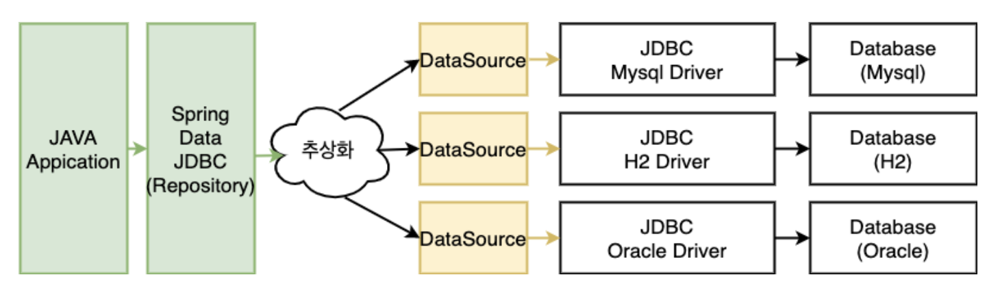

# Multiple DataSource

## 개념
- 일반적으로는 단일 관계형 데이터베이스에 데이터를 저장한다. 하지만 여러 데이터베이스에 액세스해야 할 때도 있다.

## DataSourceProperties
```java
spring:
  datasource:
    url: ...
    username: ...
    password: ...
    driverClassname: ...
```

```java
@ConfigurationProperties(prefix = "spring.datasource")
public class DataSourceProperties implements BeanClassLoaderAware, InitializingBean {
  ......
	/**
	 * Fully qualified name of the JDBC driver. Auto-detected based on the URL by default.
	 */
	private String driverClassName;

	/**
	 * JDBC URL of the database.
	 */
	private String url;

	/**
	 * Login username of the database.
	 */
	private String username;

	/**
	 * Login password of the database.
	 */
	private String password;
```
- db 연결을 위해 적어준 설정들은 `@ConfigurationProperties(prefix = "spring.datasource")`로 인해서 `DataSourceProperties` 인스턴스의 필드로 바인딩된다.

## Multiple Datasource



- Data Source가 하나일 경우에는 자동으로 생성된다.
- 그러나 여러개의 db에 connection을 맺어야 하는 경우에는 직접 Data Source를 생성해줘야 한다.
  - HikariCP가 최신 스프링부트에서의 표준 DataSource 구현체

```yml
spring:
  datasource:
    primary:
      url: 
      username: 
      password:
      driver-class-name: 
    secondary:
      url: 
      username: 
      password:
      driver-class-name: 
```
- datasource 속성을 이름을 2개로 분리시켜서 작성

```java
@Configuration
@EnableTransactionManagement
@EnableJpaRepositories(
    basePackages = "com.example.primary.repository",
    entityManagerFactoryRef = "primaryEntityManagerFactory",
    transactionManagerRef = "primaryTransactionManager"
)
public class PrimaryDataSourceConfig {

    @Primary
    @Bean(name = "primaryDataSource")
    @ConfigurationProperties(prefix = "spring.datasource.primary")
    public DataSource primaryDataSource() {
        return DataSourceBuilder.create().build();
    }

    @Primary
    @Bean(name = "primaryEntityManagerFactory")
    public LocalContainerEntityManagerFactoryBean primaryEntityManagerFactory(
            EntityManagerFactoryBuilder builder,
            @Qualifier("primaryDataSource") DataSource dataSource) {
        return builder
                .dataSource(dataSource)
                .packages("com.example.primary.entity")
                .persistenceUnit("primary")
                .build();
    }

    @Primary
    @Bean(name = "primaryTransactionManager")
    public PlatformTransactionManager primaryTransactionManager(
            @Qualifier("primaryEntityManagerFactory") EntityManagerFactory primaryEntityManagerFactory) {
        return new JpaTransactionManager(primaryEntityManagerFactory);
    }
}
```
- @EnableTransactionManagement
  - 애플리케이션 컨텍스트에서 트랜잭션 관리 기능을 활성화
  - Spring이 @Transactional 애노테이션을 인식하고, 해당 애노테이션이 적용된 메서드에 대해 트랜잭션 경계를 자동으로 설정할 수 있도록 함.
  - 다중 데이터 소스를 설정할 때 각 데이터 소스에 대해 별도의 트랜잭션 관리자가 필요합니다. 
  - @EnableTransactionManagement는 이러한 트랜잭션 관리자를 활성화하고 구성하는 데 필요한 설정을 포함하고 있다. 이로 인해 트랜잭션이 각각의 데이터 소스에 대해 올바르게 작동하도록 보장
  - 비즈니스 로직에서 @Transactional을 사용하는 메서드가 다중 데이터 소스를 사용할 때, 각 데이터 소스에 대한 트랜잭션 매니저가 올바르게 설정되고 작동하기 위해서는 구성 파일에서 트랜잭션 관리가 활성화되어야 한다.
  - 
  


## 출처
- https://www.baeldung.com/spring-boot-configure-multiple-datasources
