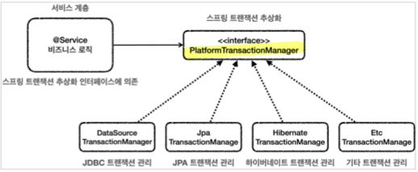
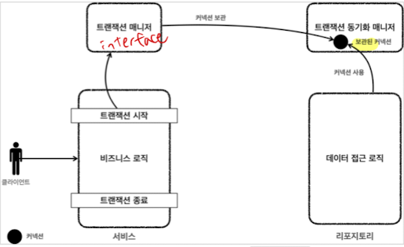
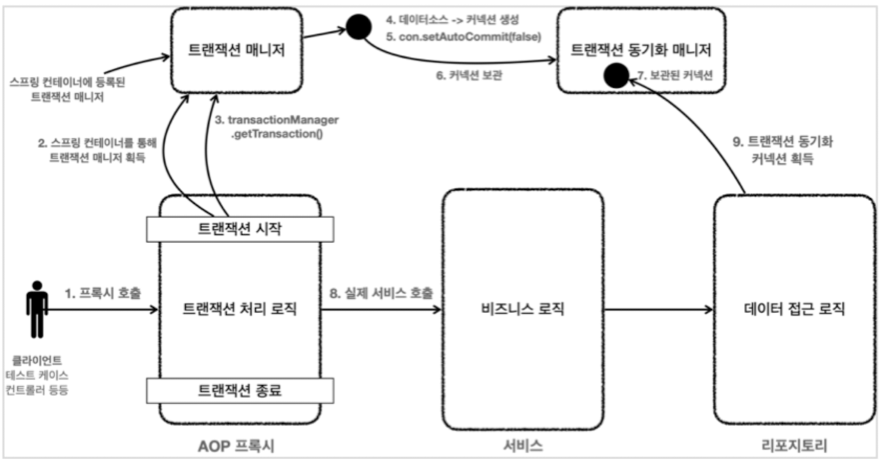

# Spring Transaction 추상화

[java transactoin](../../Java/Java%20Database/Java%20Transaction.md)
- Connection으로 트랜잭션을 직접 조절하는 코드의 문제점은 서비스계층에 순수 비즈니스로직만 있는것이 아니라 JDBC 클래스에 의존하고 혼재되어있다는 점이다.
- JDBC의 트랜잭션 코드와 JPA의 트랜잭션 코드도 서로 다르기 때문에 DB 기술을 변경할 때마다 서비스계층의 코드도 수정되어야 하는 문제가 있다.
- 그래서 Spring에서는 

## PlatformTransactionManager



- 스프링 트랜잭션 인터페이스 (트랜잭션 매니저)
- 각 DB 기술마다 서로 다른 트랜잭션 연결 코드를 추상화한 인터페이스.
- DB기술에 맞게 구현체가 있다.
  - ex) JpaTransactionManager, JdbcTransactionManager(spring 5.3)

### 동작 흐름

### 초기화

- DataSource의 구현체를 주입받아야 한다. 

~~~java
DriverManagerDataSource dataSource = new DriverManagerDataSource(URL, USERNAME, PASSWORD);
// JDBC 구현체
PlatformTransactionManager transactionManager = new DataSourceTransactionManager(dataSource);
~~~

### 관련 method

```java
//트랜잭션 시작
TransactionStatus status = transactionManager.getTransaction(new DefaultTransactionDefinition());

//커밋
transactionManager.commit(status);

//롤백
transactionManager.rollback(status);
```

- transaction 시작, 커밋, 롤백
- TransactionStatus
  - 현재 트랜잭션의 상태 정보가 포함된 객체
- DefaultTransactionDefinition
  - 트랜잭션과 관련된 옵션 지정가능한 객체


```java
status.isNewTransaction()
```
- 처음 수행되는 트랜잭션인지 확인

### 자동등록
- 트랜잭션 매니져 역시 스프링이 `transactionManager` 이름으로 자동등록을 해준다.
- 현재 등록된 라이브러리를 보고
- JDBC 라이브러리가 있으면, DataSourceTransactionManager.
- JPA 라이브러리가 있으면, JpaTransactionManager. (jdbc기능도 가지고 있다.) 

--------------------------------------------------------------------------------------------------------------------------------------------------------------------------------------------------------------------------------

## TransactionSynchronizationManager


- 트랜잭션 동기화 매니저.
- ThreadLocal을 사용해서 커넥션을 동기화. 
  - 각각의 Thread 마다 별도의 저장소가 생기게 됨.
  - 멀테쓰레드 환경에도 대응 가능
- 트랜잭션 매니저가 내부에서 동기화매니저를 호출.

### 함수
```java
TransactionSynchronizationManager.isActualTransactionActive();
```

- 현재 쓰레드에 트랜잭션이 적용되어 있는지 확인하는 메서드.

```java
TransactionSynchronizationManager.isCurrentTransactionReadOnly()
```

- 현재 트랜잭션이 readOnly인지 아닌지 boolean 반환.

### 동작방식
- 데이터소스가 Connection을 맺고, 이 데이터 소스를 가지고 트랜잭션 매니저가 커넥션을 시작한다.
- 트랜잭션 매니저가 트랜잭션이 시작된 Connection을 **트랜잭션 동기화 매니저**에 보관한다. 
- Repository는 **트랜잭션 동기화 매니저**에 보관된 Connection에 sql을 보낸다.

--------------------------------------------------------------------------------------------------------------------------------------------------------------------------------------------------------------------------------

## DataSourceUtils
 
### 함수

~~~java
DataSourceUtils.getConnection()
~~~
- 커넥션 호출
- 내부에서 ConnectionHolder conHolder = (ConnectionHolder)TransactionSynchronizationManager.getResource(dataSource); 를 사용.
- **트랜잭션 동기화 매니저**가 관리하는 커넥션을 꺼내옴. 없으면 새로 생성해서 반환

- 커넥션 반환
~~~java
DataSourceUtils.releaseConnection()
~~~
- close()가 아니라 release()
- 커넥션을 종료시키는 것이 아니라, 트랜잭션 동기화 매니저에 돌려줌.

--------------------------------------------------------------------------------------------------------------------------------------------------------------------------------------------------------------------------------

## TransactionTemplate
- 비즈니스 로직에서 반복되는 try cath commit rollback을 **템플릿 콜백 패턴**으로 만들어주는 템플릿 클래스

~~~java
public TransactionTemplate(PlatformTransactionManager transactionManager) {
        this.transactionManager = transactionManager;
    }
~~~
- transactiontemplate은 주입받은 PlatformTransactionManager를 가지고 만든다.

```java
  txTemplate.executeWithoutResult((status) -> {
      try {
          // 비즈니스 로직
      } catch (SQLException e) {
          throw new IllegalStateException(e);
      }
  });
```

- 비즈니스 로직이 정상 수행되면 commit
- **언체크 예외**가 발생하면 rollback
  - 체크 예외인 경우 commit 한다.

--------------------------------------------------------------------------------------------------------------------------------------------------------------------------------------------------------------------------------

## @Transactional

- 스프링AOP를 통해 프록시 도입.
- 서비스 계층에 여전히 남아있는 트랜잭션 코드를 없애기 위해.



- @Transactional을 쓰더라도 내부에서 DataSource, PlatformTransactionalManager 모두 빈 등록이 필요하다.

### 사용방법
```java
  @Transactional
  public void test(){
    ......
  }
```
 - 사용하고자 하는 메서드 붙인다.
 - 클래스에 붙이면 외부에서 호출가능한 public 메서드 전체에 적용됨.

```java
AopUtils.isAopProxy(Object object)
```
- AOP 프록시가 적용되었는지 boolean 반환

### 선언적 트랜잭션 관리

- @Transactional 선언해서 편리하게 트랜잭션 적용하는 방식
- 실무 대부분에서 선언적 트랜잭션 관리를 사용

### 특징

1. @Transactional을 구체적인 곳에 붙을 수록 우선순위를 가진다.

   1. 클래스 method
   2. 클래스
   3. 인터페이스 method
   4. 인터페이스

2. 클래스에 @Transactional이 붙으면 method에도 자동 적용된다.
3. 프록시 내부 호출
   1. @Transactional 이 안붙은 메서드를 호출하고 그 내부에서 @Transactional이 붙은 같은 클래스의 메서드를 호출하면, 프록시가 생성되지 않는다.
4. @Transactional을 테스트코드에서 쓰면, 각 테스트가 완료 후, 자동으로 트랜잭션을 롤백시켜버린다.
