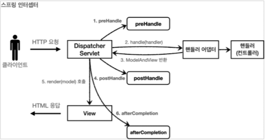
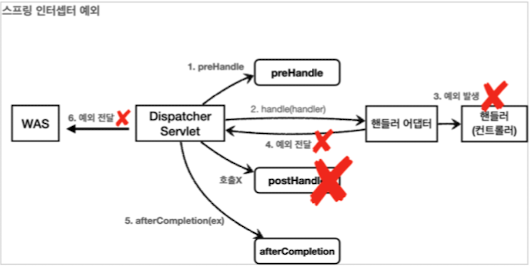

# Interceptor


## 정의

컨트롤러에 들어오는 요청과 컨트롤러의 응답을 가로채는 역할.

관리자 인증을 하는 용도로 활용가능.

## 흐름
>HTTP 요청 -> WAS -> Filter -> Servlet -> `Interceptor` -> AOP -> Controller

Controller 직전에 호출된다.

Interceptor는 스프링 MVC가 제공하기 때문에 디스패처 서블릿 이후에 등장한다.

## 장점 

    공통 코드 사용으로 재사용성 증가

    메모리 낭비, 서버 부하 감소

    코드 누락에 대한 위험성 감소

## 인터셉터 제한
interceptor를 통해 요청이 해당 컨트롤러에 가도록 할지, 끝을 낼지 결정할 수 있다.

## 인터셉터 체인
여러 인터셉터를 순서대로 호출할 수 있다.

## HandlerInterceptor

인터셉터를 사용하기 위해 HandlerInterceptor를 구현해준다.

```java
public class MyInterceptor implements HandlerInterceptor {
    @Override
    public boolean preHandle

    @Override
    public boolean postHandle

    @Override
    public boolean afterCompletion
}
```
스프링 인터셉터는 컨트롤러 호출 전, 호출 후, 요청 완료 이후 3단계 별 행동을 지원해준다. 

또한, request, response, handler를 parameter로 받기 때문에 내부에서 관련 코드를 짤 수 있다.





### preHandle
핸들러 어댑터 전에 호출.
true가 반환되면 진행이 되고, false 일 때는 핸들러 어댑터에도 도달하지 않는다.


### postHandle

핸들러 어댑터 후에 호출.

ModelAndView를 받아서 응답정보를 확인 할 수 있다.

컨트롤러에서 예외가 발생하면, 호출되지 않는다.

### afterCompletion

View가 렌더링 된 후에 호출.

예외가 발생해도 항상 호출된다. 그래서 예외와 무관한 로직은 afterCompletion에 적어준다. 

## Interceptor 팁
각 메소드들이 공통된 변수를 공유하고 싶으면 값을 어딘가에 담아놔야 한다. 

Interceptor 역시 싱글톤처럼 사용되기 때문에 멤버변수는 위험하다.

~~~java
HttpServletRequest.setAttribute(name, object)
~~~
그래서, request에 attribute를 등록해주는 방법을 쓴다.

## Interceptor configuration

```java
@Configuration
public class WebConfig implements WebMvcConfigurer{

    @Override
    public void addInterceptors(InterceptorRegistry registry){
        registry.addInterceptor(new MyInterceptor())
        .order(1)               //인터셉터 호출 순서
        .addPathPatterns("/**") //적용시킬 URL
        .excludePatterns("/css");//제외시킬 URL
    }
}
```

preHandle의 순서는 순서대로
postHandle과 afterCompletion의 순서는 역순으로 된다.

[스프링 path pattern](https://docs.spring.io/spring-framework/docs/current/javadoc-api/org/springframework/web/util/pattern/PathPattern.html)

## 참고
https://www.baeldung.com/spring-mvc-handlerinterceptor