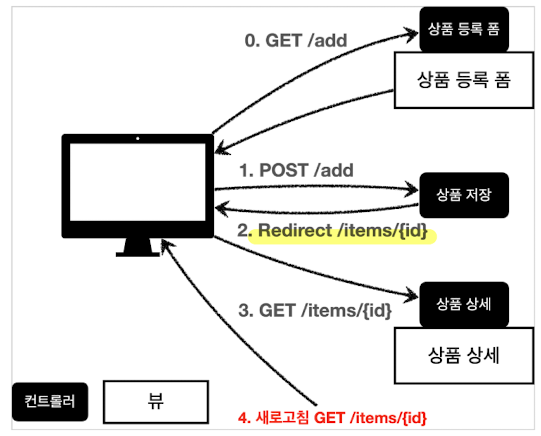

# PRG 오류 
Post - Redirect - Get 

보통 상품을 저장할 때, Post 요청을 보내고 View를 반환해서 View로 이동하는 경우가 있다. 

이때, 새로고침을 누르면 POST 요청이 계속 반복되는 것을 확인할 수 있다. 

이유는, 마지막 HTTP 요청인 POST가 계속 들어가기 때문이다. 

이를 방지하기 위해서는 POST 요청을 보낸 후, redirect로 GET 요청을 보내 View를 반환할 필요가 있다. 

그러면 아무리 새로고침을 해도 마지막 요청인 GET이 반복되게 된다. 

