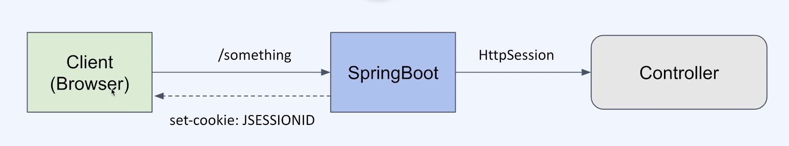
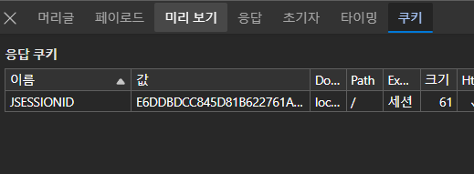

# Spring Session

## Httpsession



- 세션을 손쉽게 생성하고 관리할 수 있게 해주는 인터페이스
- UUID로 session id를 생성
- JSESSIONID 라는 이름의 cookie를 설정해서 내려줌
  - 다음 요청부터 HTTP header에 JSESSIONID가 전달됨.



#### 관련 메서드

```java
HttpSession session = request.getSession(true);
    이미 세션이 있으면 그 세션을 return하고, 세션이 없으면 새로운 세션을 생성

HttpSsession session = request.getSession(false)
    이미 세션이 있으면, 그 세션을 return하고, 세션이 없으면 null 반환

sessoin.setAttribute(String "key", Object value)
    객체를 세션에 key-value로 저장
    value는 Object 타입으로 저장

session.getAttribute("key")
    "key"로 바인딩된 객체를 return. 없으면 null return

    value는 Object 타입으로 저장되었기에 다운캐스팅을 해줘야 함

session.getId()
    session 객체에 저장된 session Id 반환
```

## session 확인 플로우

1. client가 server에 요청을 보냄.
2. server는 request 헤더의 session cookie를 통해 session-id를 확인
3. session-id가 존재하면, server를 유효성 검사를 한 후, 요청을 처리하여 응답을 보냄
4. session-id가 없으면, server는 set-cookie를 통해 session-id를 생성. reponse 헤더에 추가해서 반환
   1. client는 받은 session-id를 다음 request부터 헤더에 넣어서 요청보냄

## session 종료 시기
1. 타임아웃
   1. web.xml에 session 지속시간 설정 가능. 분단위
    ```
    <session-config>
       <session-timeout>10</session-timeout>
    </session-config>
    ```
2. session.invalidate()
   1. 세션 종료 메서드
3. 애플리케이션 혹은 서버 종료 시

## 참고 

https://lindarex.github.io/concepts/java-httpsession-introduction/