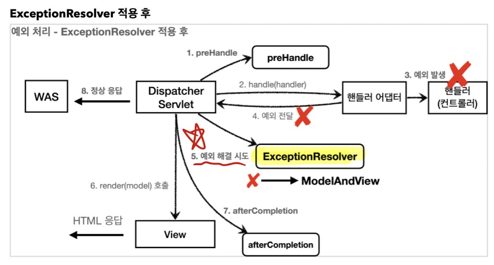

# API 예외 처리

## API 응답 처리
- API는 정상이든 예외이든 JSON으로 응답이 나가줘야 함.

### 1. BasicErrorController
- API 예외 처리도 스프링부트에서 제공하는 기본 오류 방식을 사용할 수 있다.

```java
@RequestMapping
public ResponseEntity<Map<String, Object>> error(HttpServletRequest request) {
  HttpStatus status = getStatus(request);
  if (status == HttpStatus.NO_CONTENT) {
    return new ResponseEntity<>(status);
  }
  Map<String, Object> body = getErrorAttributes(request, getErrorAttributeOptions(request, MediaType.ALL));
  return new ResponseEntity<>(body, status);
}
```
- **/error** 경로로 요청이 오면 ResponseEntity로 Http Body에 JSON을 반환한다. 

### 2. HandlerExceptionResolver 직접 구현하기 
- API 마다, 각각의 컨트롤러나 예외마다 서로 다른 응답 결과를 출력해야 할 수 도 있음.

- 예외가 핸들러 밖으로 던져진 경우, 예외를 해결하고, 동작을  새로 정의
- ExceptionResolver는 Interceptor의 postHandle 시점에 예외 해결을 시도 한다.


- 활용법 3가지
  - 1. 예외 상태 코드 변환
    - 예외를 response.sendError() 호출로 변경해서, 서블릿이 오류를 처리하도록 한다.
    - 이때, ModelAndView는 빈값으로 보낸다. new ModelAndView()
  - 2. 뷰 템플릿 처리
    - ModelAndView에 값을 채워서 반환하여 오류 화면을 렌더링해서 보여줄 수 있다.
  - 3. API 응답 처리
    - response.getWriter().println("hello") 처럼 HTTP 응답 바디에 직접 데이터를 넣어주는 것도 가능하다.

- WebMvcConfigurer에 resolver 등록
```java
@Override
public void extendHandlerExceptionResolvers(List<HandlerExceptionResolver> resolvers) {
    resolvers.add(new MyHandlerExceptionResolver());
}
```
- extendHandlerExceptionResolvers를 사용해야 스프링 기본 exceptonResolver도 동시에 사용할 수 있다.

### 3. 스프링이 제공하는 HandlerExceptionResolver 구현체
스프링은 HandlerExceptionResolverComposite에 다음 우선순위 순서대로 등록한다. 
1. ExceptionHandlerExceptionResolver
2. ResponseStatusExceptionResolver
3. DefaultHandlerExceptionResolver

#### ResponseStatusExceptionResolver 

- 예외에 따라서 HTTP 상태 코드를 지정해주는 역할

##### @ResponseStatus가 붙어있는 예외
```java
@ResponseStatus(code = HttpStatus.BAD_REQUEST, reason = "error.bad")
  public class BadRequestException extends RuntimeException{
}
```
- custom exception을 만들 때, @ResponseStatus를 사용해준다.
- reaseon의 내용은 message.properties에서 참조할 수 있다.
- 해당 예외가 controller 밖으로 던져지면, postHandle 시점에 ResponseStatusExceptionResolver가 해당 예외를 확인하고 code와 reason에 따라 response.sendError(statusCode, resolvedReason);를 호출한다. 

##### ResponseStatusException 예외
- @ResponseStatus의 단점은 custom exception에만 사용할 수 있다는 점이다.

```java
@GetMapping("/api/response-status-ex2")
public String responseStatusEx2() {
    throw new ResponseStatusException(HttpStatus.NOT_FOUND, "error.bad", new IllegalArgumentException());
}
```
- 이럴 때는 아예 ResponseStatusException를 발생시키면 된다. status와 예외 메세지, 근본원인예외를 넣어서 생성해주면 된다.
- 예외 메세지는 역시 messages.properties에서 가져올 수 있다.


#### DefaultHandlerExceptionResolver 
- 스프링 내부에서 발생하는 스프링 예외 해결
- 대표적으로 파라미터 바인딩에서 발생하는 500오류인 TypeMismatchException을 400 오류로 변경해서 처리하도록 한다.


#### @ExceptionHandler, @ControllerAdvice
- 예외에 따라 웹페이지를 보여줄 때는 기본 `BasicErrorController`를 사용하는 것이 낫다. 
- ExceptionHandlerExceptionResolver

```java
@Slf4j
@RestCtrollerAdvice // 모든 컨트롤러
@RestControllerAdvice(assignableTypes = {ApiExceptionV2Controller.class, sample.class}) // controller 지정
@RestControllerAdvice("org.example.controllers") // package를 지정
@RestControllerAdvice(annotations = RestController.class) // 특정 어노테이션 붙은 컨트롤러 지정
public class ExControllerAdvice {
  // 1
  @ResponseStatus(HttpStatus.BAD_REQUEST)
  @ExceptionHandler(IllegalArgumentException.class)
  public ErrorResult illegalExHandler(IllegalArgumentException e) {
      log.error("[exceptionHandler] ex", e);
      return new ErrorResult("BAD", e.getMessage());
  }

  // 2
  @ExceptionHandler()
  public ResponseEntity<ErrorResult> userExHandler(UserException e) {
      log.error("[exceptionHandler] ex", e);
      ErrorResult errorResult = new ErrorResult("USER-EX", e.getMessage());
      return new ResponseEntity<>(errorResult, HttpStatus.BAD_REQUEST);
  }

  // 3
  @ResponseStatus(HttpStatus.INTERNAL_SERVER_ERROR)
  @ExceptionHandler
  public ErrorResult exHandler(Exception e) {
      log.error("[exceptionHandler e]", e);
      return new ErrorResult("EX", "내부오류");
  }

  // 4 
  @ExceptionHandler(ViewException.class)
  public ModelAndView ex(ViewException e){
    log.info("exception e", e);
    return new ModelAndView("error");
  }
}
```
- **@RestControllerAdvice**
  - 대상으로 지정된 controller에 **@ExceptionHandler**와 **@InitBinder** 기능을 부여해준다.
  - @ControllerAdvice에 @ResponseBody 를 추가한 어노테이션
  - contorller를 따로 지정해주지 않으면 모든 controller에 적용된다.
- **@ExceptionHandler(처리할 예외 class 타입)** 선언해준다.
  - 생략하면 메서드의 파라미터로 지정된 exception을 처리한다.
  - 상세한 설정이 우선이라는 법칙이 있기 때문에 자식 exception은 우선 호출된다. 

- 1번 케이스 
  - **@ResponseStatus(HttpStatus)** 는 Custom Exception 뿐만 아니라, ExceptionHandler에도 쓰일 수 있다. 이러면 응답의 HttpStatus를 지정할 수 있다.
- 2번 케이스 
  - 응답의 형식을 직접 생성한 객체로 할 수도 있고, **ResponseEntity<>(객체,Httpstatus)** 로 할 수 도 있다. 
  - **ResponseEntity<>**를 사용하면 자동으로 **@ResponseStatus**를 쓸 필요가 없어진다. 대신 코드 내에서 동적으로 상태코드를 바꿀 수 있다는 장점이 있다.
- 3번 케이스 
  - Exception 전체를 인자로 받고 있다. 상세한 설정 외의 모든 예외를 이렇게 처리하겠다는 뜻이다.
- 4번 케이스
  - ModelAndView를 반환해서 오류 화면을 띄울 수 도 있다.