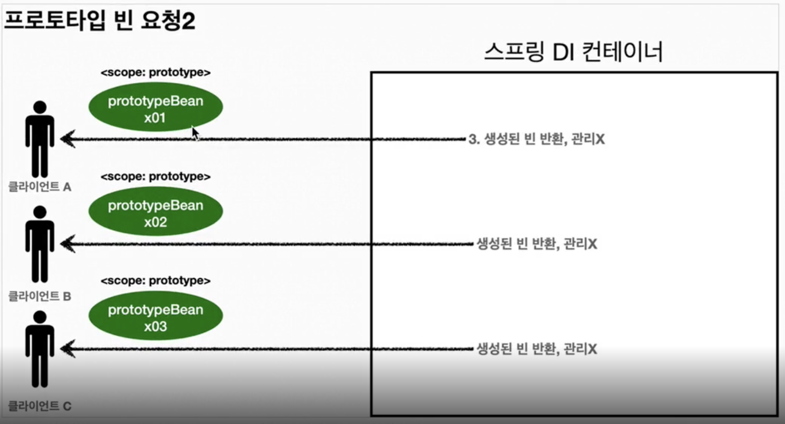

# 스프링 빈

## 스프링 빈 라이프 사이클
1. 객체 생성
2. 의존관계 주입

>생성자 주입은 예외. 객체 생성할 때, 의존관계가 같이 들어옴.  

따라서, 스프링 빈은 객체가 생성되고, 외부에서 의존관계 주입이 끝나야 사용할 수 있는 준비가 된다.

## 빈 생명주기 콜백
1. 스프링 컨테이너 생성
2. 스프링 빈 생성
3. 의존관게 주입
4. **초기화 콜백**
5. 객체 사용
6. **소멸 전 콜백**
   1. 싱글톤 빈 - 컨테이너 종료 직전에 소멸전 콜백
   2. 생명주기 짧은 빈 - 종료 직전에 소멸전 콜백
7. 스프링 종료

#### InitializingBean, DisposableBean
~~~java
public class MyClass implements InitializingBean, DisposableBean{
    @Override
    public void afterPropertiesSet() throws Exception {}

    @Override
    public void destroy() throws Exception {}
}
~~~
`afterPropertiesSet()` : 의존관계 주입이 끝나면 호출됨

`destroy()` : 소멸 직전 호출됨

스프링 초창기 방법이라 거의 사용하지 않음.

#### @Bean 옵션 
~~~java
@Bean(initMethod = "init", destroyMethod = "close")
public MyClass myClass() {}
~~~
`initMethod`와 `destroyMethod` 옵션을 `@Bean` 애노테이션에 줄 수 있다. 값에는 해당 클래스에 만든 메소드명을 적어주면 된다.

`destroyMethod`의 default값은 `(inferred)`인데,
말그대로 라이브러리 대부분이 사용하는 close, shutdown 메소드르 자동으로 추론해서 등록해준다.

코드가 아니라 설정 정보를 사용하기 때문에, 외부 라이브러리에도 초기화, 종료 메서드를 적용할 수 있다.

#### @PostConstruct, @PreDestroy
각각, 초기화 콜백과 소멸전 콜백에 붙여주면 된다.
자바 표준 기술. 
스프링이 아니어도 동작한다.

대부분 이 방법을 쓰고, 외부 라이브러리에는 @Bean 기능을 사용하자.

## 빈 스코프

#### 싱글톤
기본 빈 스코프. 컨테이너 시작에서 종료까지 유지.

#### 프로토타입

프로토타입 빈을 조회하면 스프링 컨테이너는 항상 새로운 인스턴스를 생성해서 반환한다.

빈의 생성과 의존관계 주입, 초기화까지만 책임짐.
그 뒤로는 컨테이너는 관리하지 않음. `@PreDestory `호출 안된다.

#### 싱글톤과 프로토타입 혼재의 문제점.
싱글톤 빈이 프로토타입 빈을 필드로 가지고 있게 된 경우.

프로토타입 빈은 생성시점에만 새로운 인스턴스이고, 한번 싱글톤 빈의 필드로 들어가면 값은 참조 값이 유지된다. 

공유되는 필드값과 같은 상황.

#### ObjectProvider
~~~java
@Autowired
private ObjectProvider<PrototypeBean> prototypeBeanProvider;

PrototypeBean prototypeBean = prototypeBeanProvider.getObject();
~~~
`ObjectProvider.getObject()`를 사용해서 스프링 컨테이너에서 해당 빈을 찾아 반환한다.

꼭, 프로토타입 빈에 쓰이기만 하는 것은 아니고 대신 조회해주는 역할이라 보면 된다.

#### JSR-330 Provider
~~~java
implementation 'javax.inject:javax.inject:1'

//springboot3
implementation 'jakarta.inject:jakarta.inject-api:2.0.1'
~~~

#### 웹 스코프
웹 환경에서 동작.
* request
  * HTTP 요청이 오고 나갈때까지 유지. 각 HTTP 요청마다 빈 인스턴스 생성
* session
  * HTTP 세션과 동일한 생명주기
* application
  * ServletContext와 동일한 생명주기
* websocket
  * 웹소켓과 동일한 생명주기

#### Request Scope