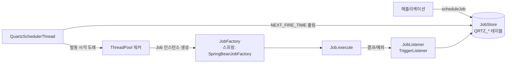

# Quartz Scheduler

> 최종 업데이트: 2026-05-12 | 기준: Quartz 2.3.x ~ 2.5.x, Spring Boot 3.x (`spring-boot-starter-quartz`)

## 개념

Quartz는 **Java 기반 오픈소스 Job 스케줄링 라이브러리**다. "특정 시각·주기에 어떤 작업을 실행할지"를 코드와 DB로 관리할 수 있게 해준다. `cron`처럼 동작하지만, **JVM 안에서 돌고 + DB에 상태를 저장 + 클러스터 분산**이 가능하다는 점이 결정적 차이.

> 비유: 회사의 "총무팀 스케줄러"에 가깝다. 누구(Job)에게 언제(Trigger) 어떤 일을 시킬지(JobDetail) 종합 일정표에 적어두고, 총무팀장(Scheduler)이 정해진 시각마다 그 사람을 호출한다. 일정표가 종이(메모리)면 사무실 정전 시 사라지지만, 캐비닛(DB)에 두면 정전 후에도 살아남고, 지점이 여럿이어도 한 사람만 일하도록 조율할 수 있다.

### 핵심 구성요소

| 구성요소 | 역할 | 비유 |
|---|---|---|
| **Scheduler** | Job과 Trigger를 관리하고 실행을 조율하는 핵심 엔진 | 총무팀장 |
| **Job** | 실제 수행할 작업. `Job.execute()` 구현 | 일을 수행할 사람 |
| **JobDetail** | Job의 메타데이터(이름, 그룹, JobDataMap) | 그 사람의 인사기록카드 |
| **Trigger** | Job 실행 시점/주기 결정. `SimpleTrigger`·`CronTrigger` 등 | "언제 부를지" 일정표 |
| **JobStore** | Job/Trigger 정보 저장소. `RAMJobStore`(메모리) / `JDBCJobStore`(DB) | 일정표 보관함 |
| **ThreadPool** | Job을 실행할 워커 스레드 풀 | 동시에 일할 수 있는 인원 수 |

DB 기반 JobStore(`JDBCJobStore`)를 쓰면 **재시작 후에도 스케줄 보존** + **클러스터 환경에서 동일 Job 중복 실행 방지**가 가능하다. 운영 환경의 기본 선택지.

## 배경/역사

| 시기 | 사건 |
|------|------|
| **2001** | James House가 Quartz를 만들고 OpenSymphony 프로젝트로 공개 |
| **2009** | **Terracotta**가 OpenSymphony Quartz 프로젝트 인수 (Terracotta는 Java 분산 캐시로 유명) |
| **2014** | **Software AG**가 Terracotta 인수 → Quartz 소유권 이전 |
| **2019** | Quartz **2.3.2** 릴리스. 한동안 사실상의 안정판 |
| **2024~** | Quartz **2.4.x / 2.5.x** — Java 17/21, 최신 DB 드라이버 호환 강화 |

> 라이센스: **Apache License 2.0**. 상용 사용 자유.

Spring 진영과의 연결:
- Spring 3.x까지는 `spring-context-support`의 `SchedulerFactoryBean`으로 통합
- **Spring Boot 2.0**(2018)부터 **`spring-boot-starter-quartz`** 공식 스타터 제공 → 설정 자동화, DataSource 자동 주입
- 대안인 `@Scheduled`(Spring TaskScheduler)는 가볍지만 **영속성·클러스터 부재** → 동적 등록/장애 복구가 필요하면 Quartz가 사실상 표준

## 동작 흐름



### 단계별 설명

1. `JobDetail` + `Trigger`를 만들어 `scheduler.scheduleJob()` 호출 → JobStore(메모리/DB)에 저장
2. **`QuartzSchedulerThread`**(전용 스레드)가 주기적으로 JobStore의 `NEXT_FIRE_TIME`을 폴링
3. 현재 시각 ≥ `NEXT_FIRE_TIME`이면 Trigger를 "발동(Fire)" 상태로 표시 (QRTZ_LOCKS로 동시성 보호)
4. ThreadPool에서 워커 스레드 할당 → **JobFactory**가 Job 인스턴스 생성 (Spring 환경은 `SpringBeanJobFactory`로 DI 가능)
5. `Job.execute(JobExecutionContext)` 호출 — 이때 `JobDataMap`으로 파라미터 전달
6. 등록된 `JobListener` / `TriggerListener` 콜백 호출 → JobStore의 상태 갱신 (`PREV_FIRE_TIME`, `NEXT_FIRE_TIME` 등)

## Spring Boot 통합

### build.gradle

```gradle
dependencies {
    implementation 'org.springframework.boot:spring-boot-starter-quartz'
}
```

### application.yml

```yaml
spring:
  quartz:
    job-store-type: jdbc                # jdbc | memory (기본값: memory)
    scheduler-name: MyScheduler
    wait-for-jobs-to-complete-on-shutdown: true  # 종료 시 실행 중인 Job 완료 대기
    overwrite-existing-jobs: true       # 기존 Job 덮어쓰기 허용
    properties:
      org.quartz:
        scheduler:
          instanceId: AUTO              # 클러스터 환경에서 인스턴스 자동 식별
        jobStore:
          class: org.quartz.impl.jdbcjobstore.JobStoreTX
          driverDelegateClass: org.quartz.impl.jdbcjobstore.StdJDBCDelegate
          tablePrefix: QRTZ_
          isClustered: true             # 클러스터 모드 활성화
          clusterCheckinInterval: 15000 # 클러스터 체크인 간격 (ms)
          misfireThreshold: 60000       # misfire 판단 임계값 (ms)
          useProperties: true           # JobDataMap을 문자열로만 저장 (직렬화 안전)
        threadPool:
          threadCount: 10               # 동시 실행 가능한 Job 스레드 수
          threadPriority: 5
    jdbc:
      initialize-schema: always         # always | never | embedded (Quartz 테이블 자동 생성)
```

**핵심 옵션 요약**

| 옵션 | 권장값 | 이유 |
|---|---|---|
| `job-store-type` | `jdbc` (운영) / `memory` (테스트) | 영속성·클러스터링 |
| `wait-for-jobs-to-complete-on-shutdown` | `true` | 그레이스풀 셧다운 |
| `isClustered` | `true` | 다중 인스턴스 시 필수. 단일 노드면 `false` |
| `instanceId` | `AUTO` | 클러스터에서 노드별 자동 식별 |
| `useProperties` | `true` | `JobDataMap`을 문자열로만 저장 — 클래스 시그니처 변경 시 deserialize 실패 방지 |
| `initialize-schema` | `embedded` 또는 `never` | 운영 DB에 `always`는 위험 (스키마 변경 가능). 마이그레이션 도구로 관리 권장 |

## Job/Trigger 구현

### SampleJob

```java
import org.quartz.*;
import org.slf4j.Logger;
import org.slf4j.LoggerFactory;
import org.springframework.stereotype.Component;

@Component
@DisallowConcurrentExecution
public class SampleJob implements Job {

    private static final Logger logger = LoggerFactory.getLogger(SampleJob.class);

    @Override
    public void execute(JobExecutionContext context) throws JobExecutionException {
        JobDataMap dataMap = context.getJobDetail().getJobDataMap();
        String jobSays = dataMap.getString("jobSays");

        logger.info("SampleJob 실행! 실행 시간: {}, message: {}",
                    context.getFireTime(), jobSays);
    }
}
```

| 어노테이션 | 역할 |
|---|---|
| `@DisallowConcurrentExecution` | **동일 `JobDetail`(같은 JobKey) 인스턴스의 동시 실행 차단**. 별도 JobDetail이면 막지 않음. 직전 실행이 길어지면 새 Trigger 발동은 보류/스킵 (misfire 정책에 따름) |
| `@PersistJobDataAfterExecution` | `execute()` 안에서 `JobDataMap`을 수정했을 때 그 변경을 DB에 영속화. 진행 카운터·체크포인트에 유용. 거의 항상 `@DisallowConcurrentExecution`과 짝으로 사용 |

### ScheduleJobService

```java
import com.example.quartz.SampleJob;
import lombok.RequiredArgsConstructor;
import org.quartz.*;
import org.springframework.stereotype.Service;

import java.util.Date;

@Service
@RequiredArgsConstructor
public class ScheduleJobService {

    private final Scheduler scheduler;

    /**
     * Cron 표현식으로 예약 작업 등록
     * @param cronExpression 예: "0 0 12 ? * *" — 매일 정오
     */
    public void scheduleJob(String jobName, String groupName, String cronExpression)
            throws SchedulerException {

        JobDetail jobDetail = JobBuilder.newJob(SampleJob.class)
                .withIdentity(jobName, groupName)
                .usingJobData("jobSays", "Hello Quartz")
                .storeDurably(true)
                .build();

        Trigger trigger = TriggerBuilder.newTrigger()
                .withIdentity(jobName + "Trigger", groupName)
                .withSchedule(CronScheduleBuilder.cronSchedule(cronExpression))
                .build();

        scheduler.scheduleJob(jobDetail, trigger);
    }

    /** 기존 trigger를 새 cron으로 교체. 다음 실행 시각을 반환 */
    public Date updateJobTrigger(String jobName, String groupName, String newCronExpression)
            throws SchedulerException {
        TriggerKey triggerKey = new TriggerKey(jobName + "Trigger", groupName);

        CronTrigger newTrigger = TriggerBuilder.newTrigger()
                .withIdentity(triggerKey)
                .withSchedule(CronScheduleBuilder.cronSchedule(newCronExpression))
                .build();

        return scheduler.rescheduleJob(triggerKey, newTrigger);
    }

    public boolean deleteJob(String jobName, String groupName) throws SchedulerException {
        return scheduler.deleteJob(new JobKey(jobName, groupName));
    }

    public void pauseJob(String jobName, String groupName) throws SchedulerException {
        scheduler.pauseJob(new JobKey(jobName, groupName));
    }

    public void resumeJob(String jobName, String groupName) throws SchedulerException {
        scheduler.resumeJob(new JobKey(jobName, groupName));
    }
}
```

| 메서드/빌더 | 핵심 |
|---|---|
| `JobBuilder.newJob(...).withIdentity(name, group)` | Job의 고유 키 = `(name, group)` |
| `.usingJobData(k, v)` | `JobDataMap`에 파라미터 저장 |
| `.storeDurably(true)` | Trigger가 없어도 JobDetail을 JobStore에 유지 (재사용·동적 트리거 부여용) |
| `scheduler.rescheduleJob(key, newTrigger)` | 기존 Trigger를 통째로 교체. 기존 Trigger는 자동 삭제 |
| `scheduler.scheduleJob(jobDetail, trigger)` | JobDetail + Trigger를 함께 등록 (가장 일반적) |
| `TriggerBuilder...forJob(jobDetail)` | Trigger를 기존 Job과 연결. 함께 등록하면 자동 연결되므로 생략 가능, 별도 등록 시에는 명시 권장 |

### ScheduleController

```java
import lombok.RequiredArgsConstructor;
import org.quartz.SchedulerException;
import org.springframework.http.ResponseEntity;
import org.springframework.web.bind.annotation.*;

@RestController
@RequestMapping("/api/schedule")
@RequiredArgsConstructor
public class ScheduleController {

    private final ScheduleJobService scheduleJobService;

    @PostMapping
    public ResponseEntity<String> createJob(
            @RequestParam String jobName,
            @RequestParam String groupName,
            @RequestParam String cronExpression) throws SchedulerException {
        scheduleJobService.scheduleJob(jobName, groupName, cronExpression);
        return ResponseEntity.ok("Job 등록 완료");
    }

    @PutMapping
    public ResponseEntity<String> updateJob(
            @RequestParam String jobName,
            @RequestParam String groupName,
            @RequestParam String cronExpression) throws SchedulerException {
        scheduleJobService.updateJobTrigger(jobName, groupName, cronExpression);
        return ResponseEntity.ok("Job 수정 완료");
    }

    @DeleteMapping
    public ResponseEntity<String> deleteJob(
            @RequestParam String jobName,
            @RequestParam String groupName) throws SchedulerException {
        scheduleJobService.deleteJob(jobName, groupName);
        return ResponseEntity.ok("Job 삭제 완료");
    }

    @PostMapping("/pause")
    public ResponseEntity<String> pauseJob(
            @RequestParam String jobName,
            @RequestParam String groupName) throws SchedulerException {
        scheduleJobService.pauseJob(jobName, groupName);
        return ResponseEntity.ok("Job 일시정지");
    }

    @PostMapping("/resume")
    public ResponseEntity<String> resumeJob(
            @RequestParam String jobName,
            @RequestParam String groupName) throws SchedulerException {
        scheduleJobService.resumeJob(jobName, groupName);
        return ResponseEntity.ok("Job 재개");
    }
}
```

## 리스너 (Listener)

Job/Trigger의 라이프사이클 이벤트를 가로채는 훅. 로깅·모니터링·메트릭에 활용.

### QuartzTriggerListener

```java
import lombok.extern.slf4j.Slf4j;
import org.quartz.JobExecutionContext;
import org.quartz.Trigger;
import org.quartz.Trigger.CompletedExecutionInstruction;
import org.quartz.TriggerListener;
import org.springframework.stereotype.Component;

@Slf4j
@Component
public class QuartzTriggerListener implements TriggerListener {

    @Override
    public String getName() { return "commonTriggerListener"; }

    /** 트리거 발동 시 호출 — Job 이름 기록 */
    @Override
    public void triggerFired(Trigger trigger, JobExecutionContext context) {
        log.info("trigger success, job name: {}", context.getJobDetail().getKey().getName());
    }

    /**
     * 실행 직전 veto 여부 판단. true 반환 시 이번 실행을 취소.
     * 일반적으로 false 반환 (조건부 차단이 필요한 케이스에만 true)
     */
    @Override
    public boolean vetoJobExecution(Trigger trigger, JobExecutionContext context) {
        return false;
    }

    /** Trigger misfire 시 호출 */
    @Override
    public void triggerMisfired(Trigger trigger) {
        log.info("trigger failed, trigger name: {}", trigger.getKey().getName());
    }

    /** Job 완료 후 호출 — JobListener와 중복되므로 비워둠 */
    @Override
    public void triggerComplete(Trigger trigger, JobExecutionContext context,
                                CompletedExecutionInstruction triggerInstructionCode) {}
}
```

### QuartzJobListener

```java
import lombok.extern.slf4j.Slf4j;
import org.quartz.JobExecutionContext;
import org.quartz.JobExecutionException;
import org.quartz.JobListener;
import org.springframework.stereotype.Component;

@Slf4j
@Component
public class QuartzJobListener implements JobListener {

    @Override
    public String getName() { return "commonJobListener"; }

    /** Job 실행 직전 */
    @Override
    public void jobToBeExecuted(JobExecutionContext context) {
        log.info("job start, group: {}, name: {}",
                 context.getJobDetail().getKey().getGroup(),
                 context.getJobDetail().getKey().getName());
    }

    /** veto된 경우 */
    @Override
    public void jobExecutionVetoed(JobExecutionContext context) {
        log.info("job vetoed, group: {}, name: {}",
                 context.getJobDetail().getKey().getGroup(),
                 context.getJobDetail().getKey().getName());
    }

    /** Job 실행 후 — 성공/예외 모두 호출 */
    @Override
    public void jobWasExecuted(JobExecutionContext context, JobExecutionException jobException) {
        log.info("job complete, group: {}, name: {}, exception: {}",
                 context.getJobDetail().getKey().getGroup(),
                 context.getJobDetail().getKey().getName(),
                 jobException == null ? "none" : jobException.getMessage());
    }
}
```

### QuartzConfig — 리스너 등록

```java
import jakarta.annotation.PostConstruct;  // Spring Boot 3.x (Boot 2.x는 javax.annotation.PostConstruct)
import lombok.RequiredArgsConstructor;
import org.quartz.ListenerManager;
import org.quartz.Scheduler;
import org.quartz.SchedulerException;
import org.springframework.context.annotation.Configuration;

@Configuration
@RequiredArgsConstructor
public class QuartzConfig {

    private final Scheduler scheduler;
    private final QuartzJobListener quartzJobListener;
    private final QuartzTriggerListener quartzTriggerListener;

    @PostConstruct
    public void addListeners() throws SchedulerException {
        ListenerManager listenerManager = scheduler.getListenerManager();
        listenerManager.addJobListener(quartzJobListener);
        listenerManager.addTriggerListener(quartzTriggerListener);
    }
}
```

## QRTZ_* 테이블 구조

JDBCJobStore가 사용하는 테이블. `tablePrefix` 옵션으로 prefix 변경 가능 (기본 `QRTZ_`).

### QRTZ_JOB_DETAILS — 등록된 Job 정의

| 컬럼 | 설명 |
|---|---|
| `SCHED_NAME` | 스케줄러 인스턴스 이름 |
| `JOB_NAME` / `JOB_GROUP` | Job의 고유 식별 (복합키) |
| `JOB_CLASS_NAME` | 실행할 Job 구현체 FQCN |
| `IS_DURABLE` | `1`이면 Trigger 없어도 보존 (`storeDurably(true)`) |
| `IS_NONCONCURRENT` | `1`이면 동시 실행 불가 (`@DisallowConcurrentExecution`) |
| `IS_UPDATE_DATA` | `1`이면 `JobDataMap` 변경 영속화 (`@PersistJobDataAfterExecution`) |
| `REQUESTS_RECOVERY` | `1`이면 장애 시 복구 대상 |
| `JOB_DATA` | `JobDataMap`을 직렬화한 BLOB |

### QRTZ_TRIGGERS — 모든 Trigger의 공통 정보

| 컬럼 | 설명 |
|---|---|
| `SCHED_NAME`, `TRIGGER_NAME`, `TRIGGER_GROUP` | Trigger 고유 식별 |
| `JOB_NAME`, `JOB_GROUP` | 연결된 Job (FK) |
| `NEXT_FIRE_TIME` | 다음 실행 시각 (epoch ms) — 스케줄러가 폴링하는 핵심 컬럼 |
| `PREV_FIRE_TIME` | 직전 실행 시각. `-1`은 미실행 |
| `PRIORITY` | 동시 실행 후보 시 우선순위 |
| `TRIGGER_STATE` | `WAITING`, `ACQUIRED`, `EXECUTING`, `PAUSED`, `BLOCKED`, `ERROR` 등 |
| `TRIGGER_TYPE` | `SIMPLE`, `CRON`, `CAL_INT`, `DAILY_I` 등 |
| `START_TIME`, `END_TIME` | 활성화 기간. `END_TIME=0`은 무기한 |
| `MISFIRE_INSTR` | misfire 처리 지침 |

### QRTZ_CRON_TRIGGERS — CronTrigger 부가 정보

| 컬럼 | 설명 |
|---|---|
| `CRON_EXPRESSION` | Cron 표현식 |
| `TIME_ZONE_ID` | 시간대 (예: `Asia/Seoul`) |

`QRTZ_TRIGGERS`와 FK로 연결. CronTrigger 등록 시 두 테이블 모두에 행 생성.

### 그 외 트리거 보조 테이블

| 테이블 | 역할 |
|---|---|
| `QRTZ_SIMPLE_TRIGGERS` | SimpleTrigger의 반복 횟수(`REPEAT_COUNT`)·간격(`REPEAT_INTERVAL`)·실행 누적치(`TIMES_TRIGGERED`) |
| `QRTZ_SIMPROP_TRIGGERS` | CalendarInterval/DailyTime 등 속성 기반 Trigger의 STR/INT/LONG/DEC/BOOL 속성 슬롯 |
| `QRTZ_BLOB_TRIGGERS` | 위 어디에도 안 맞는 커스텀 Trigger의 직렬화 저장소. 실무에서는 거의 쓰지 않음 |

### 실행/상태 관리

| 테이블 | 역할 |
|---|---|
| `QRTZ_FIRED_TRIGGERS` | **현재 실행 중**인 Trigger 기록. 클러스터 환경에서 어느 노드가 어떤 Job을 잡았는지 추적 + 장애 복구 |
| `QRTZ_SCHEDULER_STATE` | 클러스터 각 노드의 `LAST_CHECKIN_TIME`. `clusterCheckinInterval`보다 오래 미체크인이면 죽은 노드로 간주, 미완료 Job 복구 |
| `QRTZ_LOCKS` | `TRIGGER_ACCESS`, `STATE_ACCESS` 등의 행 락. 멀티 노드 동시 접근 시 정합성 보장 |
| `QRTZ_PAUSED_TRIGGER_GRPS` | `pauseTriggers(GroupMatcher.groupEquals("X"))` 결과 |
| `QRTZ_CALENDARS` | 휴일·제외일 캘린더 (Trigger에 attach해서 사용) |

## Misfire 정책

**Misfire**: 스케줄된 시각에 Job을 실행하지 못한 상태. 원인은 다양함 — 서버 다운, ThreadPool 고갈, 직전 실행이 너무 길어서, `@DisallowConcurrentExecution`으로 막혀서 등.

- `misfireThreshold`(기본 60초): 이 시간 이내의 지연은 misfire로 **간주하지 않음** → 그냥 정상 실행

### CronTrigger Misfire 정책

| 정책 | 설명 |
|---|---|
| `MISFIRE_INSTRUCTION_FIRE_ONCE_NOW` | 놓친 실행 1회만 즉시 실행 후, 다음 정상 스케줄로 복귀 |
| `MISFIRE_INSTRUCTION_DO_NOTHING` | 놓친 건 버리고 다음 정상 스케줄까지 대기 |
| `MISFIRE_INSTRUCTION_IGNORE_MISFIRE_POLICY` | 놓친 **모든** 실행을 즉시 연속으로 실행 (주의: 누적이 많으면 폭주) |

### SimpleTrigger Misfire 정책

| 정책 | 설명 |
|---|---|
| `MISFIRE_INSTRUCTION_FIRE_NOW` | 즉시 1회 실행 |
| `MISFIRE_INSTRUCTION_RESCHEDULE_NOW_WITH_REMAINING_REPEAT_COUNT` | 즉시 실행 + 남은 반복 횟수 그대로 |
| `MISFIRE_INSTRUCTION_RESCHEDULE_NEXT_WITH_REMAINING_COUNT` | 다음 스케줄 시각에 남은 횟수 실행 |
| `MISFIRE_INSTRUCTION_RESCHEDULE_NOW_WITH_EXISTING_REPEAT_COUNT` | 즉시 실행 + 반복 횟수 리셋 |
| `MISFIRE_INSTRUCTION_RESCHEDULE_NEXT_WITH_EXISTING_COUNT` | 다음 시각에 반복 횟수 리셋해 실행 |

### 설정 예시

```java
Trigger trigger = TriggerBuilder.newTrigger()
        .withSchedule(CronScheduleBuilder.cronSchedule("0 0 12 * * ?")
                .withMisfireHandlingInstructionFireAndProceed())  // FIRE_ONCE_NOW
        .build();
```

| Builder 메서드 | 매핑되는 INSTRUCTION |
|---|---|
| `.withMisfireHandlingInstructionFireAndProceed()` | `FIRE_ONCE_NOW` |
| `.withMisfireHandlingInstructionDoNothing()` | `DO_NOTHING` |
| `.withMisfireHandlingInstructionIgnoreMisfires()` | `IGNORE_MISFIRE_POLICY` |

## Cron 표현식

| 필드 | 허용 값 | 특수 문자 |
|---|---|---|
| 초 | 0-59 | `, - * /` |
| 분 | 0-59 | `, - * /` |
| 시 | 0-23 | `, - * /` |
| 일 | 1-31 | `, - * ? / L W` |
| 월 | 1-12 또는 JAN-DEC | `, - * /` |
| 요일 | 1-7 또는 SUN-SAT | `, - * ? / L #` |
| 연도(선택) | 비우거나 1970-2099 | `, - * /` |

> **`?` vs `*`**: 일/요일은 둘 중 하나만 지정 가능. 다른 한 쪽은 반드시 `?`. 예: `0 0 12 * * ?` (일 지정, 요일 무시), `0 0 12 ? * MON` (요일 지정, 일 무시).

### 자주 쓰는 예시

| 표현식 | 설명 |
|---|---|
| `0 0 12 * * ?` | 매일 정오 |
| `0 0/30 * * * ?` | 30분마다 |
| `0 0 9-17 * * MON-FRI` | 평일 매시 정각 (9시~17시) |
| `0 0 0 1 * ?` | 매월 1일 자정 |
| `0 0 2 ? * SAT` | 매주 토요일 새벽 2시 |
| `0 0 0 L * ?` | 매월 말일 자정 (`L` = last) |
| `0 0 9 ? * MON#1` | 매월 첫째 월요일 9시 (`#` = nth weekday) |

## Spring `@Scheduled` vs Quartz

비슷해 보이지만 **운영 요구사항이 다르면 답이 다르다**.

| 기준 | `@Scheduled` | Quartz |
|---|---|---|
| 설정 복잡도 | 매우 단순 | 중간 |
| 영속성 | 없음 (재시작 시 다음 주기부터) | DB 저장 → 재시작 후에도 유지 |
| 동적 등록/수정 | 어려움 (재배포 또는 별도 구현) | 표준 API로 지원 |
| 클러스터 분산 실행 | 자체 지원 X (`ShedLock` 등 별도 필요) | **내장 지원** (`isClustered=true`) |
| Misfire 처리 | 없음 | 정책 단위 제어 |
| 장애 복구 | 없음 | `requestRecovery=true`로 자동 |
| Job 메타데이터/이력 | 없음 | DB 테이블에 남음 |

**선택 가이드**
- 정적 + 단일 노드 + 간단한 주기 → `@Scheduled`
- 동적 등록 / 다중 노드 / 영속성 / 복구 필요 → **Quartz**

## 흔한 함정

### 1. Spring Bean 주입이 안 됨

기본 `JobFactory`는 `new Class()`로 Job 인스턴스를 만든다. 그래서 `@Autowired` 필드가 `null`. Spring Boot 스타터는 `SpringBeanJobFactory`를 자동 설정해주므로 보통 문제없지만, 커스텀 설정을 하다 깨뜨리는 경우가 종종 있음.

```java
// 직접 SchedulerFactoryBean을 구성한다면
SpringBeanJobFactory jobFactory = new SpringBeanJobFactory();
jobFactory.setApplicationContext(applicationContext);
schedulerFactory.setJobFactory(jobFactory);
```

### 2. `JobDataMap` 직렬화 문제

`JobDataMap`에 임의 객체를 넣고 DB에 저장하면, **그 객체 클래스의 `serialVersionUID`나 필드 시그니처가 바뀐 순간 deserialize 실패**.

→ `useProperties: true` 옵션을 켜서 **JobDataMap을 문자열만 허용**하도록 강제. 객체는 ID·키만 저장하고, 실행 시점에 다시 조회.

### 3. `@DisallowConcurrentExecution` 오해

| 막아주는 것 | 막지 못하는 것 |
|---|---|
| **같은 JobKey**의 동시 실행 | 다른 JobKey(이름·그룹 다름)는 동시 실행됨 |
| 단일 노드 내 동시성 | 클러스터 모드(`isClustered=true`)에서도 보장됨 (QRTZ_LOCKS로) |

즉, "Job 클래스가 같으면 막는다"가 아니라 "**같은 JobDetail 인스턴스**일 때 막는다".

### 4. 클러스터 시간 동기화 필수

Quartz 클러스터는 **각 노드의 시계가 같다는 가정**으로 `NEXT_FIRE_TIME` 비교를 한다. NTP가 동기화 안 된 노드가 끼면 중복 실행·미실행이 발생. → 모든 노드에 NTP/chrony 강제.

### 5. `isClustered=true`인데 단일 노드 운영

DB 락 오버헤드(QRTZ_LOCKS)만 추가되고 이득이 없음. **단일 인스턴스 운영이 확실하면 `isClustered=false`**.

### 6. `initialize-schema: always`를 운영에 켬

스타터의 `quartz_tables_*.sql`이 DB 부팅마다 적용 시도. 권한 부족·기존 스키마 충돌 가능. **운영은 `never` + 마이그레이션 도구(Flyway/Liquibase)에 위임** 권장.

### 7. Long-running Job + misfire

Job 실행 시간이 trigger 주기를 초과하면 다음 발동이 misfire로 처리됨. 그런데 `IGNORE_MISFIRE_POLICY`로 두면 누적된 실행이 일제히 폭주. → 보통 `DO_NOTHING` 또는 `FIRE_ONCE_NOW`가 안전한 기본.

### 8. `pauseJob` vs `pauseTrigger` 혼동

| API | 효과 |
|---|---|
| `scheduler.pauseJob(jobKey)` | 해당 Job에 **연결된 모든 Trigger**를 PAUSED 상태로 |
| `scheduler.pauseTrigger(triggerKey)` | 그 Trigger 하나만 PAUSED |

같은 Job에 여러 Trigger가 붙는 경우 의도가 달라짐. `resume*`도 마찬가지로 짝을 맞춰야 함.

### 9. 동적 cron 변경 시 `rescheduleJob` 사용

기존 Trigger를 두고 새로 `scheduleJob`을 부르면 **중복 Trigger 등록** 또는 `ObjectAlreadyExistsException`. **반드시 `rescheduleJob(triggerKey, newTrigger)`**.

### 10. `storeDurably(true)` 안 한 JobDetail

연결된 Trigger를 모두 지우면 JobDetail까지 자동 삭제됨. 동적 등록 패턴에서는 `storeDurably(true)`로 JobDetail을 먼저 등록해두는 게 안전.

## 관련 문서

- [[@Scheduled]] — Spring의 가벼운 스케줄링 대안 (단일 노드·정적 스케줄용)
- [[Cron-Expression]] — Cron 표현식 상세
- [[../../Database/MySQL/MySQL-비밀번호]] — Quartz가 사용하는 DB 계정의 비밀번호 정책 운영

## 참조

- Quartz 공식 문서: https://www.quartz-scheduler.org/documentation/
- Quartz GitHub: https://github.com/quartz-scheduler/quartz
- Spring Boot Quartz 가이드: https://docs.spring.io/spring-boot/reference/io/quartz.html
- Cron 표현식 도우미: https://www.freeformatter.com/cron-expression-generator-quartz.html
