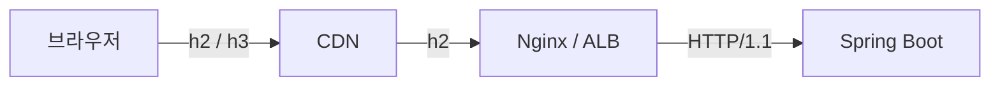

# Spring Boot HTTP 버전 설정

> 최종 업데이트: 2026-05-17 | 기준: Spring Boot 3.x, 임베디드 Tomcat 10.1

## 개념

Spring Boot에서 HTTP 버전은 **개발자가 강제로 "고르는" 것이 아니라, 서버가 "지원 가능한 버전 목록"을 열어두면 클라이언트와 서버가 매 연결마다 협상(negotiation)해서 결정**된다. 개발자가 설정 파일에서 하는 일은 협상 테이블에 HTTP/2를 올려둘지 말지 정하는 것뿐이다.

> 비유하자면 식당이 "한식·중식·일식 다 됩니다"라고 메뉴판을 여는 것(서버 설정)과, 손님이 그중 하나를 주문하는 것(클라이언트 선택)은 별개다. 식당이 손님 메뉴를 대신 정하지 않는다.

## 누가 HTTP 버전을 정하는가

| 구분 | 결정 주체 | 메커니즘 |
|------|----------|----------|
| **1.1 ↔ 2** | TLS 핸드셰이크 중 자동 협상 | **ALPN** — 클라이언트가 `h2, http/1.1` 지원 목록 제시 → 서버가 공통 최상위 선택 |
| **→ 3** | 클라이언트가 *다음* 연결에서 전환 | 서버가 응답에 `Alt-Svc: h3=":443"` 광고 → 클라이언트가 이후 QUIC 사용 |
| **평문(h2c)** | Upgrade 헤더 협상 | 브라우저는 거의 안 씀. 내부 서비스/테스트 용도 |

핵심 규칙: **둘 다 지원하는 가장 높은 버전**이 선택된다. 서버가 HTTP/2를 켜놨어도 클라이언트가 1.1만 말하면 그 연결은 1.1로 동작한다. 즉 서버는 *범위*를 정하고, 그 범위 안에서 *클라이언트가* 최종 선택권을 쥔다.

## 기본 설정

```properties
# HTTP/2 활성화 (Spring Boot 기본값: false → HTTP/1.1만)
server.http2.enabled=true

# 브라우저는 HTTPS에서만 h2 사용 → TLS 사실상 필수
server.ssl.enabled=true
server.ssl.key-store=classpath:keystore.p12
server.ssl.key-store-type=PKCS12
```

```yaml
# application.yml 동등 설정
server:
  http2:
    enabled: true
  ssl:
    enabled: true
    key-store: classpath:keystore.p12
    key-store-type: PKCS12
```

- **HTTP/1.1은 끌 수 없다** — 항상 폴백용 기본값으로 존재
- **HTTP/2만 강제 불가** — `http2.enabled=true`는 "h2도 가능"이지 "h2만"이 아니다
- `server.http2.enabled=true` 인데 TLS가 없으면 → 브라우저는 그냥 HTTP/1.1로 붙음 (h2c는 브라우저 미지원)

## h2 vs h2c

| 구분 | 의미 | 사용처 |
|------|------|--------|
| **h2** | HTTP/2 over TLS | 브라우저 ↔ 서버 (사실상 표준) |
| **h2c** | HTTP/2 over Cleartext (평문) | 내부 서비스 간, 테스트. 브라우저 미지원 |

- `server.http2.enabled=true` + TLS → **h2** (ALPN으로 협상)
- TLS 없이 h2c를 쓰려면 임베디드 서버(Tomcat)의 별도 커넥터 설정 필요. gRPC·내부 통신이 아니면 거의 불필요

## 임베디드 서버별 지원 현황

Spring Boot의 HTTP 버전 지원은 결국 **임베디드 웹 서버**가 무엇을 지원하느냐에 달려 있다.

| 서버 | HTTP/2 | HTTP/3 (QUIC) |
|------|--------|---------------|
| **Tomcat** (기본) | O | X (표준 미지원) |
| **Jetty** | O | 실험적 |
| **Undertow** | O | X |
| **Netty** (WebFlux) | O | 실험적/모듈별 |

→ **HTTP/3가 필요하면 임베디드 서버에 기대지 말고 앞단 Nginx/CDN/LB가 QUIC을 종단**하게 하는 것이 현재 표준 구성이다.

## 실무에서 가장 중요한 함정 — 구간마다 버전이 다르다



요즘 흔한 운영 구성은 **TLS와 HTTP 버전을 앞단(CDN·Nginx·ALB)이 종단**하고, 거기서 Spring까지는 평범한 HTTP/1.1로 가는 경우가 많다.

- 브라우저 개발자도구에서 `h2`로 보여도 → **Spring Boot는 HTTP/1.1로 수신** 중일 수 있음
- `server.http2.enabled`는 **클라이언트가 Spring에 *직접* 붙을 때만** 의미가 있음
- 앞에 리버스 프록시가 있으면 **그 프록시 설정이 실질적 결정권자**. 끝단(브라우저↔CDN) 버전만 보고 전 구간을 가정하면 안 됨

## 버전 확인 방법

```bash
# 협상된 프로토콜 확인 (--http2 옵션으로 시도)
curl -v --http2 https://localhost:8443/ 2>&1 | grep -i "ALPN\|HTTP/"

# ALPN 협상 결과 직접 확인
openssl s_client -connect localhost:8443 -alpn h2,http/1.1 < /dev/null 2>/dev/null | grep ALPN
```

- 컨트롤러에서 직접 확인: `request.getProtocol()` → `"HTTP/1.1"` / `"HTTP/2.0"`
- 단, 프록시 뒤에 있으면 Spring이 보는 값은 **프록시↔Spring 구간**의 버전임에 유의

## gRPC와의 관계

- gRPC는 **HTTP/2가 필수**이며 HTTP/1.1로 폴백 불가
- Spring에서 gRPC 서버를 운영한다면 프록시·LB가 **h2 end-to-end**를 지원하는지 반드시 확인해야 함 (앞단에서 h2 → h1으로 깎이면 gRPC가 깨짐)
- 자세한 내용은 [[gRPC]] 참고

## 관련 문서

- [HTTP 버전별 차이](../../../CS-이론/네트워크/통신-프로토콜/HTTP/HTTP-버전별-차이.md) — 1.1/2/3가 무엇을·왜 바꿨는지
- [HTTP 개념](../../../CS-이론/네트워크/통신-프로토콜/HTTP/HTTP.md) — 메서드·상태코드·헤더 기본
- [gRPC](../../../CS-이론/네트워크/통신-프로토콜/gRPC.md) — HTTP/2 기반 RPC
- [HTTP-interface.md](HTTP-interface.md) — Spring의 선언적 HTTP 클라이언트
