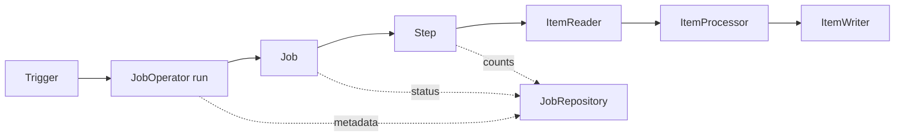
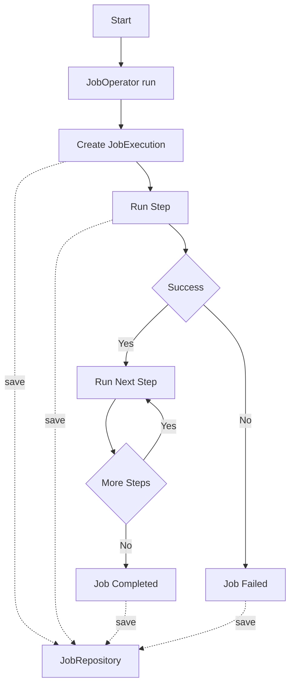
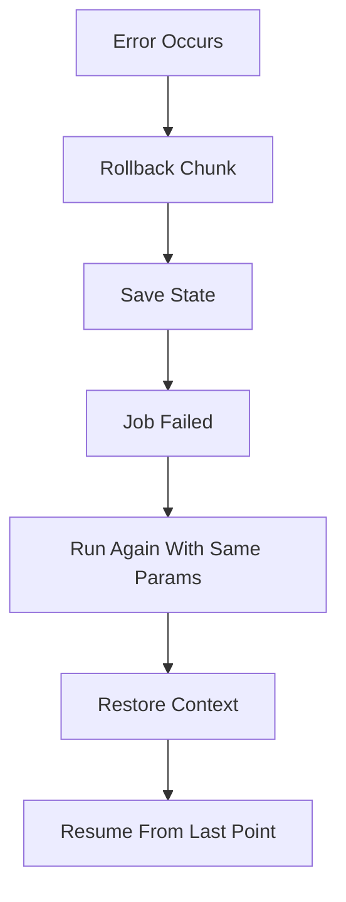

# Spring Batch 개념 정리

> 기준 버전: Spring Boot 4.0 / Spring Batch 6.0 / Java 25 (LTS)

## 목차
- [빠르게 시작하기](#빠르게-시작하기)
  - [프로젝트 셋업](#프로젝트-셋업)
  - [완성 예제: 메시지 가공 배치](#완성-예제-메시지-가공-배치)
  - [실행 방법](#실행-방법)
  - [실행 결과](#실행-결과)
- [소개](#소개)
  - [Spring Batch란](#spring-batch란)
  - [왜 사용하는가](#왜-사용하는가)
  - [장점](#장점)
  - [언제 사용하는가](#언제-사용하는가)
- [동작 원리](#동작-원리)
  - [전체 흐름](#전체-흐름)
  - [실행 라이프사이클](#실행-라이프사이클)
  - [Chunk 처리 개요](#chunk-처리-개요)
  - [실패와 재시작](#실패와-재시작)
- [핵심 클래스](#핵심-클래스)
  - [직접 작성하는 것 (입문 필수)](#직접-작성하는-것-입문-필수)
  - [프레임워크가 관리하는 것 (역할만 이해)](#프레임워크가-관리하는-것-역할만-이해)
  - [배치 인프라 설정](#배치-인프라-설정)
- [심화 문서](#심화-문서)

## 빠르게 시작하기

### 프로젝트 셋업

build.gradle:
```groovy
plugins {
    id 'java'
    id 'org.springframework.boot' version '4.0.3'
    id 'io.spring.dependency-management' version '1.1.7'
}

group = 'com.example'
version = '0.0.1-SNAPSHOT'

java {
    sourceCompatibility = '25'
}

repositories {
    mavenCentral()
}

dependencies {
    implementation 'org.springframework.boot:spring-boot-starter-batch'

    // 메타데이터 저장이 필요한 경우 (선택)
    // runtimeOnly 'com.h2database:h2'

    testImplementation 'org.springframework.boot:spring-boot-starter-test'
    testImplementation 'org.springframework.batch:spring-batch-test'
}
```

application.yml:
```yaml
spring:
  batch:
    job:
      # 애플리케이션 시작 시 자동 실행할 Job 이름 (생략하면 모든 Job 실행)
      name: messageJob
```

### 완성 예제: 메시지 가공 배치
"메시지 목록을 읽어 → 공백 제거 + 대문자 변환 → 출력" 하는 배치 전체 코드다.

프로젝트 구조:
```
src/main/java/com/example/batch/
├── BatchApplication.java
├── Message.java
└── MessageJobConfig.java
```

**1. Message.java** — 도메인 객체:
```java
package com.example.batch;

public class Message {

    private Long id;
    private String content;

    public Message() {}

    public Message(Long id, String content) {
        this.id = id;
        this.content = content;
    }

    public Long getId() { return id; }
    public void setId(Long id) { this.id = id; }
    public String getContent() { return content; }
    public void setContent(String content) { this.content = content; }

    @Override
    public String toString() {
        return "Message{id=" + id + ", content='" + content + "'}";
    }
}
```

**2. MessageJobConfig.java** — Job/Step/Reader/Processor/Writer 전체 구성:
```java
package com.example.batch;

import java.util.Iterator;
import java.util.List;

import org.springframework.batch.core.Job;
import org.springframework.batch.core.Step;
import org.springframework.batch.core.job.builder.JobBuilder;
import org.springframework.batch.core.repository.JobRepository;
import org.springframework.batch.core.step.builder.ChunkOrientedStepBuilder;
import org.springframework.batch.item.Chunk;
import org.springframework.batch.item.ItemProcessor;
import org.springframework.batch.item.ItemReader;
import org.springframework.batch.item.ItemWriter;
import org.springframework.context.annotation.Bean;
import org.springframework.context.annotation.Configuration;

@Configuration
public class MessageJobConfig {

    // --- Reader: 데이터를 한 건씩 읽는다 ---
    @Bean
    ItemReader<Message> messageReader() {
        Iterator<Message> iterator = List.of(
                new Message(1L, " hello "),
                new Message(2L, " spring batch "),
                new Message(3L, " world ")
        ).iterator();

        return () -> iterator.hasNext() ? iterator.next() : null;
    }

    // --- Processor: 읽은 데이터를 가공한다 ---
    @Bean
    ItemProcessor<Message, Message> messageProcessor() {
        return item -> {
            item.setContent(item.getContent().trim().toUpperCase());
            return item;
        };
    }

    // --- Writer: 가공된 데이터를 chunk 단위로 출력한다 ---
    @Bean
    ItemWriter<Message> messageWriter() {
        return (Chunk<? extends Message> chunk) -> {
            for (Message message : chunk.getItems()) {
                System.out.println("WRITE: " + message);
            }
        };
    }

    // --- Step: Reader → Processor → Writer를 2건 단위(chunk)로 묶어 실행 ---
    @Bean
    Step messageStep(JobRepository jobRepository,
                     ItemReader<Message> messageReader,
                     ItemProcessor<Message, Message> messageProcessor,
                     ItemWriter<Message> messageWriter) {
        return new ChunkOrientedStepBuilder<Message, Message>(
                        "messageStep", jobRepository, 2)
                .reader(messageReader)
                .processor(messageProcessor)
                .writer(messageWriter)
                .build();
    }

    // --- Job: Step을 묶어 하나의 배치 작업으로 정의 ---
    @Bean
    Job messageJob(JobRepository jobRepository, Step messageStep) {
        return new JobBuilder("messageJob", jobRepository)
                .start(messageStep)
                .build();
    }
}
```

**3. BatchApplication.java** — Spring Boot 메인 클래스:
```java
package com.example.batch;

import org.springframework.boot.SpringApplication;
import org.springframework.boot.autoconfigure.SpringBootApplication;

@SpringBootApplication
public class BatchApplication {

    public static void main(String[] args) {
        SpringApplication.run(BatchApplication.class, args);
    }
}
```

### 실행 방법

커맨드라인 실행:
```bash
# Gradle 빌드 후 실행
./gradlew bootRun

# 또는 JAR로 빌드 후 실행
./gradlew bootJar
java -jar build/libs/batch-0.0.1-SNAPSHOT.jar

# Job 파라미터를 전달하는 경우
java -jar build/libs/batch-0.0.1-SNAPSHOT.jar targetDate=2026-03-04
```

### 실행 결과
```
WRITE: Message{id=1, content='HELLO'}
WRITE: Message{id=2, content='SPRING BATCH'}
WRITE: Message{id=3, content='WORLD'}
```
- chunkSize=2이므로 1,2번이 한 트랜잭션, 3번이 다음 트랜잭션으로 처리된다
- 각 메시지의 앞뒤 공백이 제거되고 대문자로 변환되었다

## 소개

### Spring Batch란
Spring Batch는 대량 데이터를 정해진 단위로 읽고, 가공하고, 저장하는 배치 처리 프레임워크다.
예를 들어 "매일 새벽 전날 주문 데이터를 집계해 정산 테이블에 반영" 같은 작업을 안정적으로 실행할 때 사용한다.

### 왜 사용하는가
- 단순 반복 스크립트보다 실패 복구, 재실행, 실행 이력 관리가 체계적
- 대량 데이터 처리 시 성능과 안정성을 함께 고려한 구조를 기본 제공
- 운영 중 문제(실패/지연/부분처리)를 추적하기 쉬움

### 장점
- 재시작 가능: 중간 실패 후 이어서 처리 가능
- 메타데이터 관리: 언제 시작/종료했고 몇 건 처리했는지 기록
- 트랜잭션 제어: chunk 단위 커밋/롤백 가능
- 확장성: 병렬 처리, 분할 처리로 처리량 확장 가능
- 표준화: Reader/Processor/Writer 패턴으로 코드 구조 일관성 확보

### 언제 사용하는가
- 일/월 정산, 통계 집계, 리포트 생성
- 외부 시스템 파일 수집 및 적재(ETL)
- 대량 데이터 보정/마이그레이션

## 동작 원리

### 전체 흐름

텍스트 플로우:
`Trigger -> JobOperator run -> Job -> Step -> ItemReader -> ItemProcessor -> ItemWriter`
`JobOperator/Job/Step 상태는 JobRepository에 기록`

### 실행 라이프사이클
개념:
- Job 실행 요청이 들어오면 `JobOperator`가 실행을 시작한다.
- `JobRepository`에 `JobExecution`/`StepExecution` 상태를 계속 기록한다.
- 모든 Step 성공 시 `COMPLETED`, 실패 시 `FAILED`로 종료된다.


텍스트 플로우:
`Start -> JobOperator run -> Create JobExecution -> Run Step`
`성공 시 다음 Step 반복 후 Completed, 실패 시 Failed`
`실행/상태 정보는 JobRepository에 저장`

### Chunk 처리 개요
개념:
- `chunkSize`는 "몇 건을 한 트랜잭션으로 묶어 커밋할지(=commit interval)"를 의미한다.
- 기본 구조는 `Reader -> (Processor) -> Writer`이며 Processor는 선택이다.
- Batch 6에서는 `ChunkOrientedStep`이 chunk 처리의 기본 구현체다.
- 상세 동작(캐시, 필터링, skip/retry, 재시작)은 심화 문서에서 다룬다.

심화 문서:
- `spring batch 심화 08 - chunk 처리원리.md`

### 실패와 재시작
개념:
- 실패 시점의 상태를 `ExecutionContext`와 메타테이블에 저장한다.
- 같은 파라미터로 재실행하면 저장된 상태를 기준으로 이어서 처리할 수 있다.
- `JobOperator.recover()`로 실패한 Job을 일관되게 복구할 수 있다.


텍스트 플로우:
`Error -> Rollback Chunk -> Save State -> Failed -> Rerun Same Params -> Restore Context -> Resume`

## 핵심 클래스

### 직접 작성하는 것 (입문 필수)

이 클래스들은 배치 코드를 작성할 때 직접 구성하거나 구현한다.
완성 예제의 `MessageJobConfig.java`에서 모두 사용된다.

| 클래스 | 역할 | 코드에서 하는 일 |
|--------|------|------------------|
| **Job** | 배치 작업의 최상위 단위 | `JobBuilder`로 생성, Step 실행 순서 정의 |
| **Step** | Job 안의 실제 처리 단위 | `ChunkOrientedStepBuilder`로 생성, Reader/Writer 연결 |
| **ItemReader** | 데이터를 한 건씩 읽음 | `read()` 구현, 끝나면 `null` 반환 |
| **ItemProcessor** | 읽은 데이터를 가공 (선택) | `process()` 구현, `null` 반환 시 해당 건 필터링 |
| **ItemWriter** | chunk 단위로 데이터 저장/전송 | `write(Chunk)` 구현 |
| **Tasklet** | 단순 작업용 Step (Reader/Writer 불필요) | `RepeatStatus.FINISHED` 반환 시 종료 |

Tasklet 예시 코드:
```java
@Bean
Step cleanUpStep(JobRepository jobRepository,
                 PlatformTransactionManager transactionManager) {
    return new StepBuilder("cleanUpStep", jobRepository)
            .tasklet((contribution, chunkContext) -> {
                Files.deleteIfExists(Path.of("/tmp/batch-temp.csv"));
                return RepeatStatus.FINISHED;
            }, transactionManager)
            .build();
}
```

### 프레임워크가 관리하는 것 (역할만 이해)

이 클래스들은 직접 생성하지 않는다. 프레임워크가 자동으로 만들고 관리하며, 동작 원리를 이해하면 된다.

| 클래스 | 역할 | 언제 알아야 하나 |
|--------|------|------------------|
| **JobRepository** | 실행 메타데이터(상태, 건수, 시각) 저장/조회. `JobExplorer`를 상속하여 조회 기능 포함. 기본값은 `ResourcelessJobRepository`(DB 불필요) | Job/Step 빌더에 주입할 때 |
| **JobOperator** | Job 실행(`run`), 중지(`stop`), 복구(`recover`)를 하나로 통합. `JobLauncher`를 상속 | 수동 실행이나 운영 API 연동 시 |
| **JobParameters** | Job 실행 시 전달하는 파라미터. 같은 Job도 파라미터가 다르면 다른 실행으로 인식 | 날짜별 실행 등 파라미터 구분이 필요할 때 |
| **JobInstance** | `Job + JobParameters` 조합의 논리적 실행 단위 | 재실행/중복 실행 판단 시 |
| **JobExecution** | JobInstance의 실제 실행 1회 기록. 상태(COMPLETED/FAILED), 시작/종료 시각 보유 | 실행 결과 확인 시 |
| **StepExecution** | Step 실행 1회 기록. read/write/skip 건수 등 통계 보유 | 처리 건수 확인, 디버깅 시 |
| **ExecutionContext** | 재시작용 상태 key-value 저장소. Job/Step 범위로 관리 | 실패 후 이어서 처리할 때 |

### 배치 인프라 설정
개념:
- 기본값은 `ResourcelessJobRepository`로, 별도 설정 없이 동작 가능
- 메타데이터를 DB에 저장하려면 `@EnableJdbcJobRepository`를 추가

예시 코드:
```java
// 기본: 별도 설정 없이 동작
@Configuration
public class BatchConfig {
}

// JDBC 기반 메타데이터 저장이 필요한 경우
@Configuration
@EnableBatchProcessing
@EnableJdbcJobRepository(dataSourceRef = "batchDataSource")
public class JdbcBatchConfig {
}
```

## 심화 문서
- `spring batch 심화 01 - 실행모델과 재시작.md`
- `spring batch 심화 02 - 트랜잭션과 오류처리.md`
- `spring batch 심화 03 - 메타테이블과 조회포인트.md`
- `spring batch 심화 04 - 확장성과 병렬처리.md`
- `spring batch 심화 05 - 성능튜닝.md`
- `spring batch 심화 06 - 운영관측과 배포.md`
- `spring batch 심화 07 - 테스트전략.md`
- `spring batch 심화 08 - chunk 처리원리.md`
