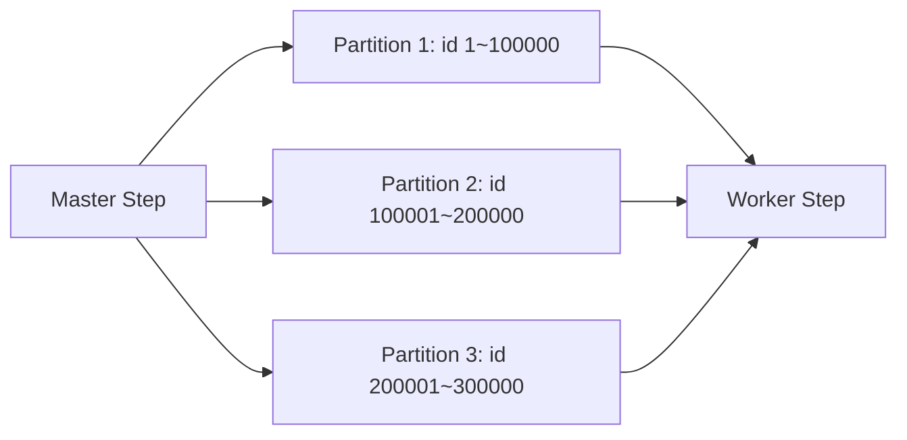

# Spring Batch 심화 04: 확장성과 병렬처리

## 1. 병렬화 전략 선택지

- 멀티스레드 Step: 한 Step에서 병렬 chunk 처리
- Parallel Steps: 서로 다른 Step을 동시에 실행
- Partitioning: 같은 Step을 데이터 분할 후 병렬 실행
- Remote Chunking/Partitioning: 외부 워커로 분산

## 2. 선택 기준

- 분할 키 명확: Partitioning 우선
- CPU 연산 중심: 멀티스레드 효과 큼
- DB I/O 병목: 병렬화보다 쿼리 튜닝 우선
- 수평 확장 필요: Remote 방식 고려

## 3. Partitioning 구조 예시

## 4. 병렬 처리 시 필수 고려사항

- 순서 보장 필요 여부
- 동일 레코드 중복 처리 방지 키
- DB connection pool 크기와 thread 수 균형
- 외부 API rate limit

## 5. 운영 리스크

- thread 수 과다로 오히려 처리량 하락
- 락 경합/데드락 증가
- 파티션 불균형으로 특정 워커만 지연

## 6. 체크리스트

- 파티션 키가 치우치지 않는가
- 실행 중단 시 일부 파티션만 재시작 가능한가
- 동시성 증가에 따라 알림 임계치를 재설정했는가
