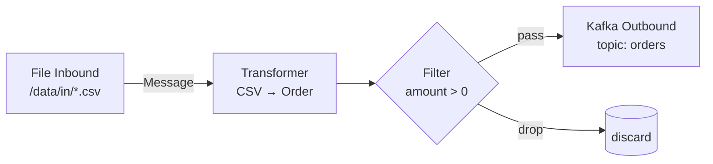

# Spring Integration 개념

> 최종 업데이트: 2026-06-04 | 기준: Spring Integration 6.x

## 개념

**Spring Integration**은 서로 다른 시스템·프로토콜을 **메시지 기반으로 연결**하는 스프링의 통합 프레임워크다. 책 *Enterprise Integration Patterns*(EIP, 2003)에 정리된 메시징 패턴들을 스프링 스타일로 구현했다.

> 비유하자면 **공장 컨베이어 벨트 시스템**이다. 원재료(파일·HTTP 요청·DB 데이터)가 한쪽에서 들어와 → 라인을 따라 변환·필터·분기·합치기 작업소를 거쳐 → 다른 쪽 출구(Kafka·이메일·다른 API)로 빠져나간다. 각 작업소는 단순한 일 하나만 하고 다음 칸으로 넘긴다.

핵심 아이디어는 **모든 처리 단위 사이를 "메시지 채널"로 연결**하고, 각 단계는 메시지를 받아 가공해 다음 채널로 넘기는 것이다. 시스템 간 결합이 느슨해지고, 흐름을 부품처럼 조립할 수 있다.

## 배경/역사

- **2003년**: Gregor Hohpe와 Bobby Woolf의 책 *Enterprise Integration Patterns* 출간. 메시징 기반 시스템 통합의 65개 패턴을 정리한 업계 바이블
- **2007년경**: **Mark Fisher**가 스프링 진영에서 EIP를 구현한 프로젝트 시작
- **2008년 11월**: Spring Integration 1.0 출시
- **2010년대**: Java DSL 도입, Reactive Streams 지원 추가
- **2017년 5.0**: Java 8 기반 재작성, WebFlux·RSocket 지원
- **현재 6.x**: Java 17, Spring Framework 6 기반. Spring Boot 3.x와 통합. Spring Cloud Stream의 기반 엔진이기도 함

## 왜 쓰는가

엔터프라이즈 환경에서 **이런 요구사항이 흔하다**:

> "FTP 서버에서 매시간 CSV 파일을 가져와 → 검증 → DB에 저장 → 슬랙 알림 → Kafka에도 동일 데이터 발행"

이걸 직접 구현하면 FTP 클라이언트, 스케줄러, 파일 파서, DB 트랜잭션, HTTP 호출, Kafka 프로듀서를 일일이 엮어야 한다. Spring Integration은 이를 **메시지 채널 + 엔드포인트 조합**으로 선언적으로 표현해준다.

## 핵심 개념 (EIP 패턴)

### 기본 요소

| 요소 | 역할 | 비유 |
|---|---|---|
| **Message** | 헤더 + 페이로드로 구성된 데이터 단위 | 컨베이어 위 박스 |
| **Channel** | 메시지가 흐르는 통로 | 컨베이어 벨트 |
| **Endpoint** | 채널에 연결된 처리기 (Producer/Consumer/Processor) | 작업소 |
| **Adapter** | 외부 시스템 ↔ 메시지 채널 다리 | 입구/출구 도크 |

### 처리 패턴

| 패턴 | 역할 |
|---|---|
| **Filter** | 조건 맞는 메시지만 통과시킴 (검수대) |
| **Transformer** | 메시지 형태 변환 (JSON↔XML, DTO↔Entity) |
| **Router** | 조건에 따라 다른 채널로 분기 |
| **Splitter** | 메시지 하나를 여러 개로 쪼갬 (List → 개별 메시지들) |
| **Aggregator** | 여러 메시지를 하나로 합침 (Splitter의 역) |
| **Service Activator** | 메시지를 일반 메서드 호출로 위임 (비즈니스 로직 진입점) |
| **Gateway** | 일반 Java 인터페이스를 메시징 시스템에 연결 |

### 메시지 구조

```java
Message<Order> msg = MessageBuilder
    .withPayload(new Order(...))
    .setHeader("source", "ftp")
    .setHeader("priority", "high")
    .build();
```

- **Payload**: 실제 데이터 (어떤 타입이든 가능)
- **Header**: 메타정보(`Map<String, Object>`). 라우팅·필터링·추적에 사용

## 메시지 채널 종류

같은 "채널"이라도 동작 방식이 다르다. 선택이 흐름의 성격을 결정한다.

| 채널 | 동작 | 쓰임새 |
|---|---|---|
| **DirectChannel** | 호출자 스레드에서 즉시 동기 처리 (기본값) | 빠른 in-process 처리, 트랜잭션 이어가야 할 때 |
| **QueueChannel** | 큐에 적재 → 소비자가 별도 폴링 | 비동기 처리, 백프레셔 |
| **PublishSubscribeChannel** | 메시지 하나를 **여러 구독자**에게 발행 | 이벤트 브로드캐스트 (1:N) |
| **ExecutorChannel** | `Executor`(스레드풀)로 비동기 전달 | 비동기 fan-out |
| **PriorityChannel** | 우선순위 기반 큐 | 긴급 메시지 먼저 처리 |
| **RendezvousChannel** | 송신자·수신자가 만날 때까지 대기 | 동기 핸드오프 |
| **FluxMessageChannel** | Reactive Streams 기반 | 리액티브 흐름 |

## 어댑터 (외부 시스템 연동)

스프링이 자랑하는 부분 — **이미 만들어진 어댑터가 많다**.

| 카테고리 | 어댑터 |
|---|---|
| 파일 | File, FTP, SFTP |
| 메시징 | JMS, AMQP(RabbitMQ), Kafka, MQTT, STOMP |
| 네트워크 | HTTP, WebSocket, TCP, UDP, RSocket |
| DB | JDBC, JPA, MongoDB, Redis, R2DBC |
| 이메일 | SMTP, IMAP, POP3 |
| 기타 | XMPP, ZooKeeper, Twitter, SOAP |

각 어댑터는 **Inbound**(외부 → 채널)와 **Outbound**(채널 → 외부) 두 방향이 짝으로 제공된다.

## 흐름 구성 방식

### Java DSL (현대 표준)

```java
@Configuration
@EnableIntegration
public class FileToKafkaFlow {

    @Bean
    public IntegrationFlow fileToKafka(KafkaTemplate<String, Order> kafkaTemplate) {
        return IntegrationFlow
            .from(Files.inboundAdapter(new File("/data/in"))
                       .patternFilter("*.csv"),
                  e -> e.poller(Pollers.fixedDelay(5000)))
            .transform(Transformers.fromCsv(Order.class))
            .filter((Order o) -> o.getAmount() > 0)
            .handle(Kafka.outboundChannelAdapter(kafkaTemplate)
                          .topic("orders"))
            .get();
    }
}
```

"`/data/in` 폴더 5초마다 폴링 → CSV 파싱 → 금액 0 초과만 → Kafka `orders` 토픽 발행" 흐름이 **한 체인**으로 표현된다.

### Annotation 방식

```java
@ServiceActivator(inputChannel = "ordersChannel")
public void process(Order order) {
    // 비즈니스 로직
}

@Filter(inputChannel = "rawOrders", outputChannel = "validOrders")
public boolean isValid(Order order) {
    return order.getAmount() > 0;
}
```

각 메서드에 어노테이션을 붙여 채널과 연결한다.

### XML 방식 (레거시)

초창기 표준. 현재 신규 프로젝트에선 거의 사용 안 함. Java DSL 권장.

## 흐름 다이어그램 예시

위 코드의 메시지 흐름:



## 비슷한 도구와 비교

| 도구 | 포지션 | 강점 |
|---|---|---|
| **Spring Integration** | 스프링 내장, 단일 앱 안에서 EIP 흐름 구성 | 가볍고 스프링 친화. Boot와 자연스럽게 통합 |
| **Apache Camel** | 자바 진영 EIP 표준, 더 광범위 | 어댑터·DSL 수 압도적, 비스프링 환경에서도 사용 |
| **Spring Cloud Stream** | 메시지 브로커(Kafka/Rabbit) 추상화 상위 레이어 | MSA 간 이벤트 통신 단순화. 내부적으로 SI 사용 |
| **Spring Batch** | 대용량 배치 처리 전문 | ETL·청크 처리, 재시작·메타테이블 |
| **Apache NiFi** | GUI 기반 데이터 플로우 도구 | 시각적 흐름 구성, 데이터 엔지니어링 |

### 선택 기준

- 스프링 앱 내부의 복합 메시지 흐름 → **Spring Integration**
- 다양한 시스템 + 비스프링 환경 → **Camel**
- MSA 간 이벤트 메시징 추상화 → **Spring Cloud Stream**
- 대량 데이터 배치 처리 → **Spring Batch**
- 노코드 데이터 파이프라인 → **NiFi**

## 언제 안 써도 되나

| 상황 | 더 나은 선택 |
|---|---|
| 단순 REST API 호출 1~2개 | `RestTemplate` / `WebClient` |
| Kafka 발행·구독만 단순히 | `spring-kafka` 직접 |
| 단순 스케줄링 | `@Scheduled` |
| 단순 비동기 메서드 호출 | `@Async` |
| 대량 데이터 배치 처리 | Spring Batch |

**여러 시스템이 얽힌 복합 흐름**이거나, **EIP 패턴(라우팅·분기·합치기 등)이 필요**해진 시점부터 가치가 명확해진다.

## 관련 문서

- [../spring-batch/spring-batch-개념.md](../spring-batch/spring-batch-개념.md)
- [../비동기성/](../비동기성/)
- [../../Kafka/](../../Kafka/)
- [../../Messaging-System/](../../Messaging-System/)
