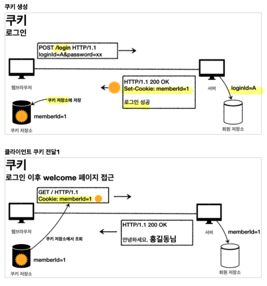

# Cookie Login

## 쿠키 이용법
한번 로그인에 성공하면, Response에 쿠키를 생성해서 담아 보내자.

그러면 브라우저는 받은 쿠키를 저장해서 매 Request 때 마다 쿠키가 자동으로 담기게 된다.

#### 동작 흐름

브라우저 종료 시, 로그아웃이 되게 하기위해서는 
`세션 쿠키`에 저장되어야 한다.

~~~java
Cookie cookie = new Cookie("id", String.valueOf(id));
response.addCookie(cookie);
~~~

Cookie를 만들어준다. 이 때, 만료 날짜를 세팅해주지 않으면 자동으로 브라우저 종료 시 삭제된다.

`HttpServletResponse`에 addCookie로 담아준다.

~~~java
 @GetMapping("/")
public String home(
    @CookieValue(name = "id", required = false) Long id)
~~~
요청에 담긴 Cookie를 조회할 때는, `@CookieValue`를 사용하면 된다.

로그아웃 기능은 2가지로 동작되는데
1. 브라우저를 종료할 때
2. 서버에서 쿠키의 종료 날짜를 0으로 만들 때

~~~java
Cookie cookie = new Cookie("저장된 쿠키이름과 동일하게", null);
cookie.setMaxAge(0);
httpServletResponse.addCookie(cookie);
~~~
여기서 팁은 쿠키 이름을 로그인 쿠키와 똑같이 해서 덮어씌우는 거다.
setMaxAge(0)를 통해 유효기간을 즉시없앤다.

#### 쿠키 방식의 단점

> 쿠기의 치명적인 보안적 문제점은 클라이언트가 쿠키를 임의로 바꿔서 요청을 보낼 수 있다는 점이다.

> 또한, 쿠키에 개인정보를 담을 경우 해킹당할 위험이 있다.