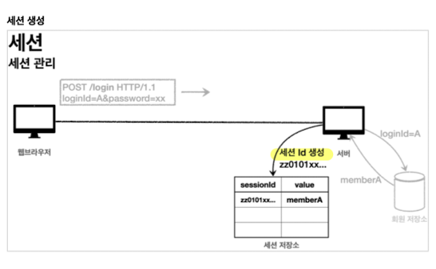
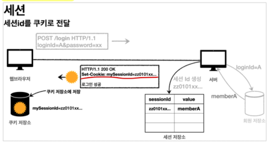

# Session Login

## 세션 이용법
로그인 기능을 만들 때, 다음과 같은 기능이 추가되어야 보안적으로 안전해진다.

1. 쿠키에는 의미가 없는 토큰(랜덤 값)을 넣는다.
2. 서버에서 토큰과 사용자를 매핑한다.
3. 서버에서 토큰을 관리하게 된다.
4. 해커가 토큰을 가져가도 사용할 수 없도록 만료시간을 짧게 한다. 
5. 해킹이 의심되면 서버에서 토큰을 삭제한다.

#### 동작 흐름

유저가 로그인을 하면, DB에서 일치하는지 확인후, `Session ID`를 만들어서 세션저장소에 저장한다.

이때, session id는 유추나 추적이 불가능하도록 랜덤 값을 사용한다. **UUID**같은

생성한 session id를 Response에 Cookie로 담아 보낸다.

결론적으로, 클라이언트는 의미를 알 수 없는 session id만 가지고 있지 개인정보는 모르는 상태가 된다.

이제, 브라우저는 모든 요청 때마다 cookie를 담아서 보내게 되고, 서버는 요청을 받을 때 Cookie의 session id를 확인해서 인증을 진행한다.

#### HttpSession
Servlet이 공식으로 지원하는 Session interface

HttpSession에서 생성하는 session id는 
`JSESSIONID=랜덤값`으로 Cookie에 저장된다.

~~~java
<HttpSession 생성>
HttpSession session = request.getSession();
~~~
`HttpServletRequest`에서 부터 session을 가져온다.

ture/false 옵션을 줄 수 있다.
`getSession(true) `: 기존 세션을 반환하는데, 없으면 생성해서 반환. 로그인하는 시점에는 true 값을 준다. 무조건 session이 생겨야 되기 때문에.

`getSession(false)` : 기존 세션을 반환하는데, 없으면 null 반환.
로그인한 사람이 아니면 세션이 필요없는 곳에선 false 사용. 

안적어주면 true랑 같다.

~~~java
<session에 저장>
session.setAttribute(String name, Object object);
~~~

~~~java
<session 제거>
session.invalidate();
~~~
세션을 무효화하고, 저장된 객체를 모두 제거

#### @SessionAttribute
~~~java
@GetMapping("/")
public String homeLoginv3Spring(
    @SessionAttribute(name = "", 
    required = false) Member member){}
~~~
session의 Attribute를 가져오기위해 `@SessionAttribute`애노테이션을 지원한다.

~~~java
Member member = (Member) session.getAttribute("");
~~~
이 코드를 대체해주는 것이다.

#### ArgumentResolver
기존에는 @SessionAttribute를 사용해서 직접 session에 있는 값을 가져왔다. 

ArgumentResolver를 사용하면 직접 만든 애노테이션과 함께 결합해서 자동으로 session에 있는 값을 가져오도록 할 수 있다.

##### @Login
~~~java
@Target(ElementType.PARAMETER) //parameter에만 사용
@Retention(RetentionPolicy.RUNTIME) //runtime까지 애노테이션 정보가 남아있도록
public @interface Login {
}
~~~

##### HandlerMethodArumentResolver
~~~java
public class MyAgResolver implements HandlerMethodArgumentResolver{
    @Override
    public boolean supportsParameter(MethodParameter parameter) {
        log.info("supportsParameter 실행");

        //parameter에 붙어있는 annotation 검증.
        //만들어준 annotation.class를 써준다.
        boolean hasLoginAnnotation = parameter.hasParameterAnnotation(Login.class);

        //해당 parameter의 객체 타입 검증.
        //parameter의 객체 타입을 특정지을 때 쓰면 된다.
        boolean hasMemberType = Member.class.isAssignableFrom(parameter.getParameterType());

        //애노테이션 일치 && 객체 타입 모두 true일 때 검증통과
        return hasLoginAnnotation && hasMemberType;
    }
}
~~~
`supportsParameter()`는 해당 parameter가 조건에 부합하는지 확인하는 method이다. 

~~~java
@Override
public Object resolveArgument(MethodParameter parameter, ModelAndViewContainer mavContainer, NativeWebRequest webRequest, WebDataBinderFactory binderFactory) throws Exception {
    return ....;
}
~~~
resolveArgument()는 return할 Object를 적어준다. 
parameter의 타입에 맞게 객체를 만들어서 return해주면 된다.

##### configuartion
~~~java
@Override
public void addArgumentResolvers(List<HandlerMethodArgumentResolver> resolvers) {
    resolvers.add(new 만들어준 resolver());
}
~~~

#### 세션 타임아웃
쿠키를 사용하는 경우에는 브라우저가 종료되면 알아서 쿠키를 삭제했기에 자동으로 로그아웃이 처리되었다.

세션의 경우에는 직접 로그아웃 버튼을 누르지 않는 이상, 자동으로 로그아웃이 되지 않는다.

~~~properties
server.servlet.session.timeout=60
~~~
서버에 마지막으로 요청한 시간을 기준으로 유효기간을 설정한다. 
default는 1800(30분)

#### 관련설정
~~~properties
server.servlet.session.tracking-modes=cookie
~~~
서버는 브라우저가 쿠키 지원여부를 최초에는 모르기 때문에, URL에 session id를 넣어서 세션을 유지하려고 한다. 이를 끄려면 cookie로만 세션을 유지한다고 설정을 주면 된다.

## remember me 기능

## 여러 기기에서 접속하기

