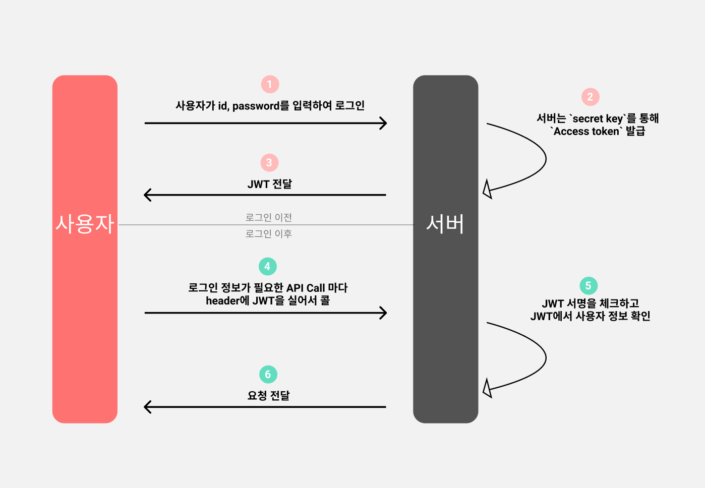

# JWT

## 정의 

    Jason Web Token

    토큰의 정보를 Json객체에 담고 있음.

## 특징 

    데이터를 따로 다른 곳에 저장하는 것이 아니라 자기가 데이터를 갖고 있어서 전달이 쉬움.

    제약이 없어서 길이가 길어도 됨. 

    JWT는 암호화 된것이 아님. 따라서, 비밀번호와 같은 민감한 정보는 담지않아야하며, 
    secret key의 노출을 막아야 함. 

    JWT는 HTTP의 헤더 또는 URL 파라미터로 전달 가능.

## JWT TOKEN 구조 

JWT는 .을 구분점으로 헤더, 내용, 서명으로 구분된다. 

#### 헤더(header)

~~~
{
  "typ": "JWT",    // 토큰의 타입. 
  "alg": "HS512"   // 해싱알고리즘 종류. 뭘 쓰느냐에 따라 달라짐.
}
~~~

#### 내용(payload) 

    실질적으로 전달할 정보가 담김. 

    Body 부분이다. 

    payload에 들어가는 정보 각각들을 클레임(claim)이라 부른다. 

    클레임은 key-value 형태로 저장해야함.

#####클레임

클레임에는 registered, public, private 3가지 종류로 나뉘는데, 

##### registered claim

    토큰의 등록내용? 혹은 설정정보 등을 담는 claim이다. 

    여러가지가 있는데 전부 쓸 필요는 없고 필요에 따라 사용하면 되는 option이다. 

    주로, sub(토큰제목), exp(토큰 만료시간) 등을 사용해줌. 

##### private claim

    이제 토큰에 담아 전달하려는 인증정보들을 저장하는 클레임이다. 

~~~
{
    "email" : "aaa@aaa.aaa",
    "name" : "aaa"
}
~~~

#### 서명(signature)

    헤더와 내용의 인코딩값을 합친 후, 비밀키로 Hash하여 생성을 하게 됨.

    서버에 요청이 들어올 때, 이 서명부분을 해석하여 유효성을 검사한다. 

    즉, 서명의 값과 헤더,내용의 값에 변화가 있으면 검사에 실패하게 되는 것이다. 

## JWT 생성 코드 (자바)

~~~java
    //JWT 토큰 생성
    public String createToken(String email, UserRoleEnum role) {

        //payload 설정
        //registered claims
        Date now = new Date();
        Claims claims = Jwts.claims()
                .setSubject("access_token") //토큰제목
                .setIssuedAt(now) //발행시간
                .setExpiration(new Date(now.getTime() + tokenValidTime)); // 토큰 만료기한

        //private claims
        claims.put("email", email);
        claims.put("role", role);  // 정보는 key - value 쌍으로 저장.

        return Jwts.builder()
                .setHeaderParam("typ", "JWT") //헤더
                .setClaims(claims) // 페이로드
                .signWith(SignatureAlgorithm.HS256, secretKey)  // 서명. 사용할 암호화 알고리즘과 signature 에 들어갈 secretKey 세팅
                .compact();
    }
~~~

## JWT 로그인 동작과정

## 장점 

    별도 저장소 DB가 필요없음. 

    QR 체크인은 JWT방식 사용.

    facebook, google과 같은 토큰 기반 인증시스템에 접근이 용이함. 

## 단점 

    토큰이 만료되기 전까지는 강제 로그아웃기능 불가. 

    주로 Access Token의 유효기간을 짧게 하고, Refresh Token의 유효기간을 길게 둠. 

    Payload에 유저의 중요한 정보를 담아선 안됨. 

## 출처 

https://ksshlee.github.io/spring/java/jwt/

http://www.opennaru.com/opennaru-blog/jwt-json-web-token/

https://yeon-blog.tistory.com/3

https://velog.io/@junghyeonsu/%ED%94%84%EB%A1%A0%ED%8A%B8%EC%97%90%EC%84%9C-%EB%A1%9C%EA%B7%B8%EC%9D%B8%EC%9D%84-%EC%B2%98%EB%A6%AC%ED%95%98%EB%8A%94-%EB%B0%A9%EB%B2%95