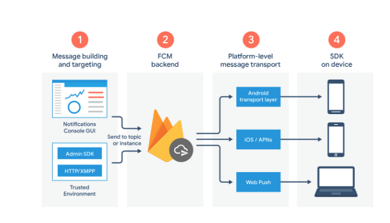
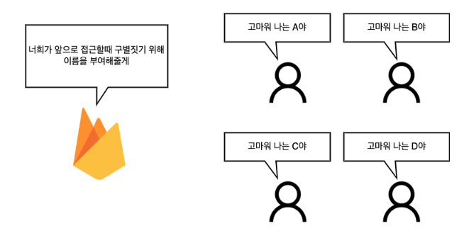
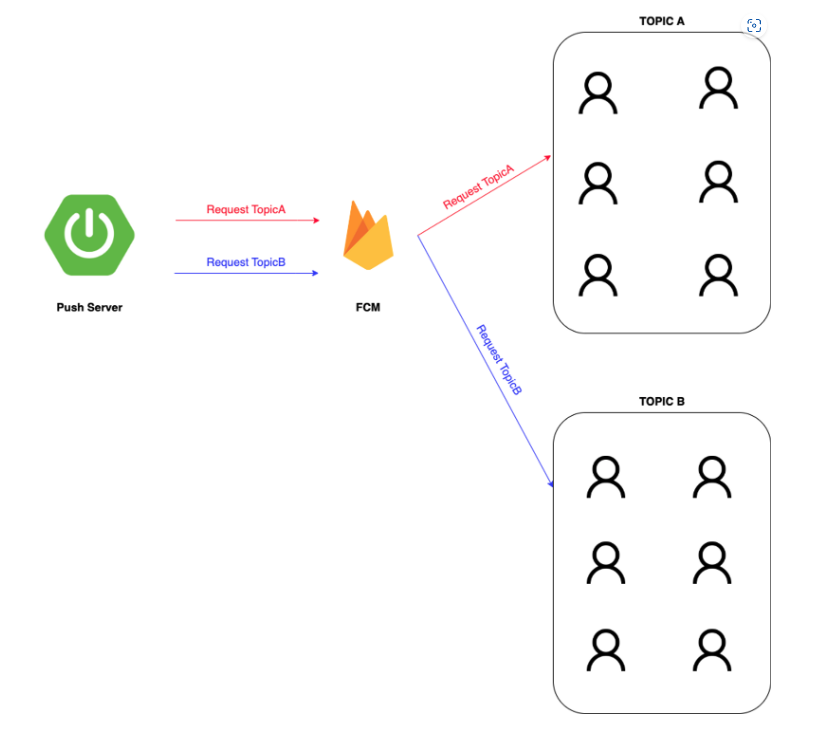

# FCM

[공식문서](https://firebase.google.com/docs/cloud-messaging?hl=ko&authuser=2)

## 정의

Firebase Cloud Messaging

무료로 메세지를 안정적으로 클라이언트 인스턴스에게 전송할 수 있는 교차 플랫폼 메시징 솔루션.



애플리케이션 서버에서 전송된 메세지
->
FCM backend
->
클라이언트

FCM이 중간에 끼어있는 형태.

## 장점

메세징을 클라이언트의 플랫폼(Web, Android, IOS) 별로 개발할 필요가 없음.

플랫폼 종속성 낮음.

### FCM Token



앱이 설치된 디바이스마다 고유하게 가지고 있는 토큰 값. 기기 고유의 ID값이라 보면 된다.

FCM 서버와 앱이 설치된 디바이스가 통신하기 위해 사용되는 식별자.

디바이스마다 고유하기 때문에, FCM은 특정 디바이스에 메시지를 전송할 수 있다.

### FCM Topic



채널의 일종.

topic을 통한 푸시 발송시, 해당 topic을 구독한 디바이스들에게만 메시지를 전송한다.

각 디바이스들은 topic을 구독/구독취소 할 수 있다.

토픽 이름은 한글이 불가하고, unique해야 한다.

## 동작 원리

1. 클라이언트가 FCM 서버에서 고유하게 발급하는 FCM 토큰을 받는다.

2. 서버는 클라리언트로부터 해당 토큰을 전달받는다.

3. 서버에서 메세징을 작성하고 FCM backend에 전달할 때, 클라이언트의 토큰을 같이 전달한다.

4. FCM backend는 전달받은 메세징을 해당 토큰의 클라이언트에게 전달한다.

## 특징

FCM SDK는 HTTPS를 통해 제공되는 페이지에서만 지원된다.

## 서버 체크사항

FCM 토큰을 서버가 관리해야 한다. Firebase에서는 발급 이후에 따로 관리를 하고 있지 않는다.

토픽 역시 서버에서 관리해 줘야 한다.

## FCM 메시지 종류

### 알림메시지(Notification message)

```
FCM이 클라이언트 앱을 대신하여 알림 표시를 처리하도록 할 때 사용.

알림 메시지에는 미리 정의된 키 집합과 사용자 지정 선택적 데이터 페이로드가 있음.

앱이 백그라운드에 있을 때 알림 트레이로 전달됨.

포그라운드에 있는 앱의 경우 콜백 함수로 처리됨.
```

알림메시지 구조

```json
{
  "message": {
    "token": "bk3RNwTe3H0:CI2k_HHwgIpoDKCIZvvDMExUdFQ3P1...",
    "notification": {
      //미리 정의된 키-값 옵션 집합
      "title": "Portugal vs. Denmark",
      "body": "great match!"
    }
  }
}
```

선택적 데이터 페이로드를 포함한 알림메시지

```json
{
  "message": {
    "token": "bk3RNwTe3H0:CI2k_HHwgIpoDKCIZvvDMExUdFQ3P1...",
    "notification": {
      "title": "Portugal vs. Denmark",
      "body": "great match!"
    },
    "data": {
      "Nick": "Mario",
      "Room": "PortugalVSDenmark"
    }
  }
}
```

이 경우,
백그라운드에서 앱은 알림 트리이에서 알림 페이로드를 수신, 사용자가 알림을 탭했을 때 데이터 페이로드를 처리.

포그라운드에서 앱은 둘 모두를 사용할 수 있는 메시지 객체를 수신

### 데이터메세지(Data message)

```
클라이언트 앱에서 메시지를 처리하려는 경우 사용

사용자 지정 키-값을 사용

클라이언트 앱은 콜백 함수에서 데이터메시지 수신.
```

데이터 메시지 구조

```json
{
  "message": {
    "token": "bk3RNwTe3H0:CI2k_HHwgIpoDKCIZvvDMExUdFQ3P1...",
    "data": {
      "Nick": "Mario",
      "body": "great match!",
      "Room": "PortugalVSDenmark"
    }
  }
}
```

## 참고

https://kerobero.tistory.com/38

https://firebase.google.com/docs/cloud-messaging/concept-options?hl=ko&authuser=2

https://zuminternet.github.io/FCM-PUSH/
