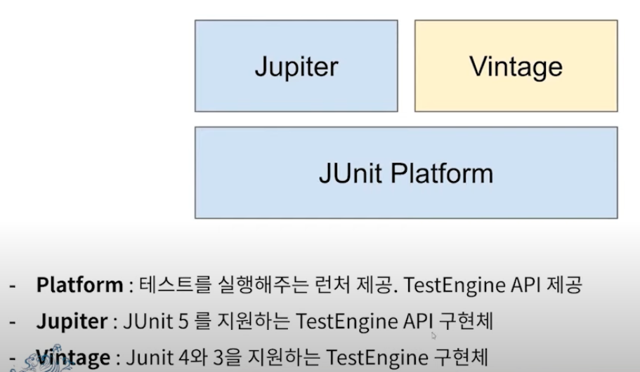

# JUnit5

[Junit5 공식문서](https://junit.org/junit5/docs/current/user-guide/#overview)

## JUnit5 이란? 

Java 생태계에서 가장 유명한 단위 테스트 프레임워크 

스프르이 부트 2.2버전 이상부터 제공 

## JUnit 구성

### JUnit Platform
JVM에서 테스트 프레임워크를 구동하기 위한 런처 제공

클라이언트와 JUnit 사이에 안정적이고 강력한 인터페이스(`TestEngine`)를 정의한다.

## 의존성 추가

스프링부트 

    2.2버전 이상부터는 기본으로 의존성이 추가되어있음.

스프링 

    직접 추가해야함.

~~~java
// https://mvnrepository.com/artifact/org.junit.jupiter/junit-jupiter-api
testImplementation 'org.junit.jupiter:junit-jupiter-api:5.8.2'
~~~    

## Annotations

### @Test
[baeldung](https://www.baeldung.com/junit-5-test-annotation)

테스트 메서더라는 것을 나타내는 어노테이션.

private 이면 안되고, void 여야 한다.

JUnit4와 다르게 어떠한 속성도 선언하지 않음.

~~~java
@Test
void test(){ //앞에 굳이 안적어줘도 됨.
    ...
}
~~~    

### @BeforeAll

해당 클래스에 위치한 모든 테스트 메서드 실행 전에 딱 한 번 실행되는 메서드

비용이 많이 드는 공통 작업을 실행하는 경우 사용.
DB연결이나 서버 시작같은.

`static`여야 한다.

### @AfterAll 

해당 클래스에 위치한 모든 테스트 메서드 실행 후에 딱 한 번 실행되는 메서드 

역시 `static`이어야 한다.

~~~java
@BeforeAll
static void setup() {
    .....
}

@AfterAll
static void tearDown() {
    ....
}
~~~

### @BeforeEach 

해당 클래스에 위치한 모든 테스트 메서드 실행 전에 실행되는 메서드 

테스트마다 조건을 초기화 시켜줘야 할 때 사용.

### @AfterEach

해당 클래스에 위치한 모든 테스트 메서드 실행 후에 실행되는 메서드 

테스트마다 조건을 초기화 시켜줘야 할 때 사용.

~~~java
@BeforeEach 
void init() {
    ....
}

@AfterEach
void teardown() {
    ....
}
~~~
### @Disabled

테스트를 하고 싶지 않은 **클래스나 메서드**에 붙이는 어노테이션 

~~~java
@Test
@Disabled("잠시 중단")
void test(){
    .........
}
~~~    

### @DisplayName

어떤 테스트인지 쉽게 표현할 수 있도록 해주는 어노테이션.

클래스/메서드에 붙일 수 있다.

공백, 이모지, 특수문자 모두 지원 

~~~java
@DisplayName("테스트1")
class DisplayName{
    @Test
    @DisplayName("입력테스트")
    void test(){
        ....
    }
}
~~~

### @RepeatedTest

    특정 테스트를 반복시키고 싶을 때 사용

    반복 횟수와 반복 테스트 이름을 설정 가능 

~~~java
@RepeatedTest
@DisplayNme("반복 테스트")
void repeatedTest(){
    ,,,,
}
~~~    

###@ParameterizedTest

    테스트에 여러 다른 매개변수를 대입해가며 반복 실행할 때 사용하는 어노테이션

~~~java
@ParameterizedTest
void test(){
    ,,,
}
~~~

###@Nested

    테스트 클래스 안에서 내부 클래스를 정의해 테스트를 계층화할 때 사용

    내부 클래스는 부모클래스의 멤버필드에 접근가능

    Before/After와 같은 테스트 생명주기에 관계된 메서드들도 게층에 맞춰 동작    

## Assertions

테스트 케이스의 수행 결과를 판별하는 메서드 

`static 메서드`라서 바로 쓸 수 있다.

**org.junit.jupiter.api.Assertions**에 속해있음.

assertAll

    오류가 나도 끝까지 실행한 뒤 한번에 모아서 출력

~~~java
assertAll(
        () -> assertEquals(content, content2),
        () -> assertEquals(key, content)
);
~~~    

assertThrows(expectedType, executable)

    예외 발생을 확인하는 테스트

    executable의 로직이 실행하는 도중 expectedType의 에러를 발생시키는지 확인

    예외를 반환받아서 예외의 상태까지 검증가능

    예외가 던져지지 않음을 검증하는 assertDoesNotThrow도 있음

~~~java
@Test
void exceptionThrow(){
    Exception e = assertThrows(Exception.class, () -> new Test(-10));
    assertDoesNotThrow(() -> System.out.println("Do Something")); 
}
~~~    

assertTimeout(duration, executable)

    특정 시간 안에 실행이 완료되는지 확인
    Duration : 원하는 시간
    Executable : 테스트할 로직

~~~java
@Rule 
poublic Timeout timeout = Timeout.seconds(5);

class TimeoutExcample{
    @Test
    @DisplayName("타임아웃 준수")
    void timeoutNotExceeded(){
        assertTimeout(ofMinutes(2), () -> Thread.sleep(10)); 
    }
}
~~~

Assumption 

    전제문이 true라면 실행, false라면 종료 

    assumeTrue : false일 떄, 이후 테스트 전체가 실행되지 않음

    assumingThat : 파라미터로 전달된 코드블럭만 실행되지 않음. 

~~~java
void dev_env_only(){
    assumeTrue("DEV".equals(System.getenv("ENV")), () -> "개발 환경이 아닙니다.");
    assertEquals("A", "A"); //단정문이 실행되지 않음. 
}

void some_test(){
    assumingThat("DEV".equals(System.getenc("ENV")), () -> {assertEquals("A","B");});
    //단정문이 실행되지 않음. 

    assertEquals("A", "A"); //단정문이 실행됨
}
~~~    

## 참고 

https://www.youtube.com/watch?v=EwI3E9Natcw

https://www.baeldung.com/junit-5