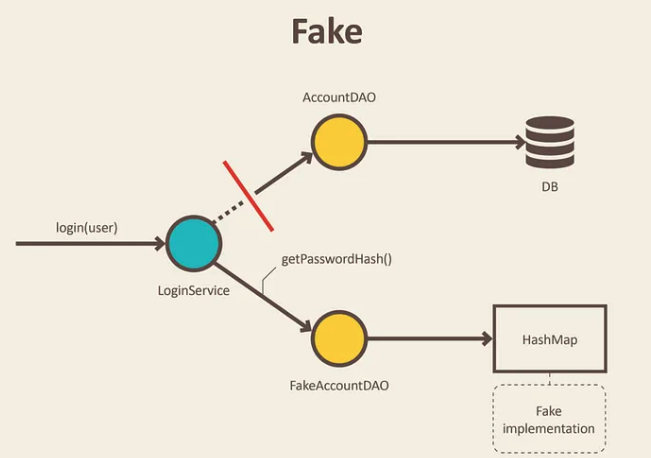
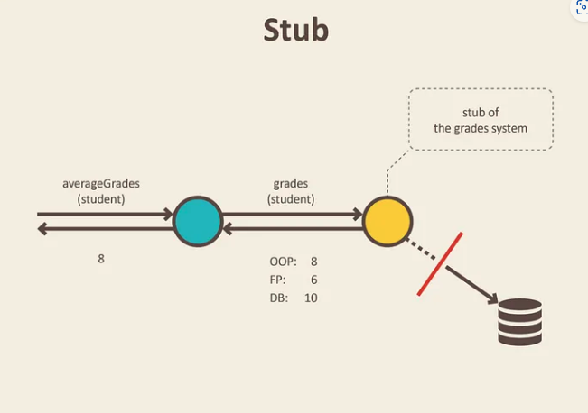
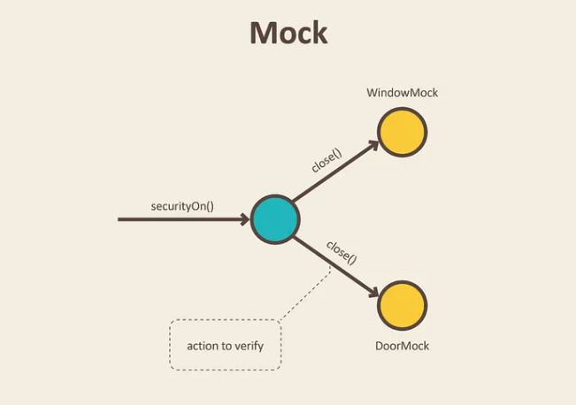

# Test Doubles

## 정의
Stunt Double(스턴트 맨) 에서 유래.

## 개념
테스트 목적으로 객체를 가짜로 교체하는 경우를 뜻.

주로, `Solitary Test`에서 의존관계에 있는 실제 클래스를 쓰지 않기 위해 **TestDoubles**를 사용한다.

## 종류

### Dummy
전달되지만 절대 사용되지 않는 객체.

주로, SUT의 생성자 파라미터 등을 채우기 위해 사용된다.

Test를 위해 껍데기만 있는 클래스를 생성해서 사용한다. 사용되지 않기 때문에, method 구현이 필요없다.

### Fake

실제 작동하는 구현을 하고 있지만, production에서 실제 사용하는 것과 같지는 않은 객체.

보통, 실제 객체보다 간소화된 버전이라 생각하면 된다.

ex) `InMemoryTestDatabase`

production에서는 실제 DB에 연결하지만, 테스트 코드에서는 HashMap으로 대체하는 경우이다.

이를 통해, 실제 DB에 연결하지 않고 시간을 단축시켜 통합 테스트를 진행할 수 있다.

또한, DB 설계에 대한 결정을 미루고, 빠르게 비즈니스 로직을 구현할 수 있다.

### Stub

Dummy가 마치 실제로 동작하는 것처럼 보이게 만든 객체

미리 반환할 데이터가 정의되어 있음.

안에 있는 메소드는 값을 그대로 반환하는 역할만 한다.

주로, DB에서 실제 데이터를 가져와야 하는 객체를 `Stub`으로 만들어서 반환할 데이터를 고정시킨다.

~~~java
Double averageGrades(Student student) {
    return average(gradebook.gradesFor(student));
}

@Test
public void calculates_grades_average_for_student() {
    when(gradebook.gradesFor(student)).thenReturn(grades(8, 6, 10)); //stubbing gradebook
    double averageGrades = new GradesService(gradebook).averageGrades(student);
    assertThat(averageGrades).isEqualTo(8.0);
}
~~~
여기서 `when()`을 사용해서 `gradebook.gradesFor()`을 리턴 값을 지정해주고 있다.

#### Command Query Separation
[설명](../Java/Java%20Method/Query%20and%20Command.md)

`averageGrades()`는 값을 리턴만 하고 상태를 변화시킨 않기 때문에 `Query`이다. 이럴 때, `Stub`을 사용한다.

`Command` 형태의 method는 아래의 `Mock`을 통해 검증한다.

### Mock

받은 호출을 등록하는 객체.

Mock에서 기대되는 동작들을 검증할 수 있다

production code를 호출하고 싶지 않거나, 의도한 코드를 검증할 쉬운 방법이 없는 경우에 Mock을 사용한다.

return도 없고, 상태변화를 확인하기 어려운 production code의 경우에는 검증할 방법이 없기 때문에 `Mock`으로 사용한다.

예를 들어, 이메일 전송 서비스를 생각해볼 수 있다.

실제 테스트마다 이메일이 발송되는 것을 원하지 않기 때문에, 그리고 실제 올바른 이메일이 전송된 것을 검증하기가 어렵다. 유일한 검증 방법은 실체 호출이 일어났냐를 통해 가능하다. 이때, `Mock`을 사용한다.

~~~java
public class SecurityCentral {
    private final Window window;
    private final Door door;

    public SecurityCentral(Window window, Door door) {
        this.window = window;
        this.door = door;
    }

    void securityOn() {
        window.close();
        door.close();
    }
}
~~~

~~~java
public class SecurityCentralTest {
    Window windowMock = mock(Window.class);
    Door doorMock = mock(Door.class);

    @Test
    public void enabling_security_locks_windows_and_doors() {
        SecurityCentral securityCentral = new SecurityCentral(windowMock, doorMock);
        securityCentral.securityOn();
        verify(doorMock).close();
        verify(windowMock).close();
    }
}
~~~
실제 close()가 동작하는 것을 원치 않기 때문에, `Window`와 `Door`는 Mock으로 사용.

`verify()`를 사용해서 `securityOn()` 호출시, `close()`가 각각 호출되었는지를 검증할 수 있다.

실제, close()되었는지는 이 테스트에서 알 필요가 없다. 왜냐하면, 이 테스트는 
SecurityCentral를 위한 테스트이고, close()의 호출에만 책임이 있다. 실제 동작에는 책임이 없기 때문이다.
### Spy
실제 객체를 부분적으로 Stubbing 하면서 동시에 정보를 기록.

메소드 호출 여부, 메소드 호출 횟수 등을 기록한다.

## 참고
https://martinfowler.com/bliki/TestDouble.html

https://martinfowler.com/articles/mocksArentStubs.html

https://blog.pragmatists.com/test-doubles-fakes-mocks-and-stubs-1a7491dfa3da

http://xunitpatterns.com/Test%20Double.html