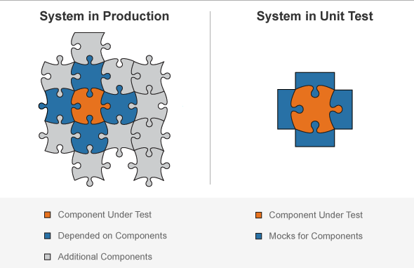
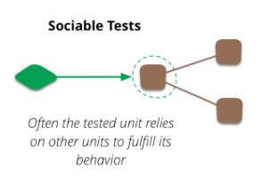
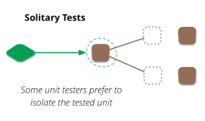

# 단위 테스트

## 정의

1. 소프트웨어 시스템의 작은 부분에 초점을 맞춘 low-level 테스트

2. 테스트 프레임워크를 사용해서 작성

3. 다른 종류의 테스트보다 훨씬 빠르다.

하지만, **Unit**이 무엇이냐에 대해 논쟁이 있다.

하나의 메서드 혹은 하나의 클래스, 혹은 밀접한 클래스들을 Unit으로 취급하는 경우가 있다.

### SUT
System Under Test
테스트 하고자 하는 주요 대상이 되는 Unit

### DOC
Depended on Component
SUT가 의존하고 있는 객체

SUT를 테스트 할 때, DOC가 문제가 되는 경우 [TestDouble](../Test%20Doubles.md)을 사용해서 대체한다.

### Sociable Tests

단위 테스트가 다른 클래스를 의존하고 있는 상태

### Solitary Tests

의존하고 있는 실제 클래스를 쓰지 않기 위해, `TestDoubles`를 쓰게 된다.

Unit Test가 sociable해도 되냐, 아니면 solitary이어야만 하냐에 대한 의견은 여전히 있다.

### Classic style and Mockist style
**Classic style**
sociable test를 선호한다.

**Mockist style**
오직 solitary test만 고집한다. 

## 팁

### FIRST 원칙
Clean Code에서는 좋은 단위 테스트 규칙을 설명하고 있다.

### 계약으로 정해져 있는 것은 테스트 할 필요 없다
JPARepository의 findById 같은 method는 정해져있기 때문에 테스트할 필요 없다.

### 소스 코드
테스트 클래스는 메인 소스코드와 분리하자.
프로덕션 환경에서 테스트 코드가 실행될 가능성도 방지.

`src/test`의 경로에 적어두자.

### 패키지명 convention
테스트 하고자 하는 대상의 package경로와 일치시키자.

### 테스트 케이스 naming convention
이름만 보고도 무엇을 테스트 하는지 알 수 있도록.

### given/when/then format
given : 테스트 개체를 만들고 데이터 입력
when : 특정 작업 및 테스트 시나리오
then : 코드의 출력을 검증

### Expected vs Actual
실제값과 기댓값의 Assertion이 있어야 한다.

Junit이나 AssertJ사용

### 간단한 테스트 케이스를 선호하기
~~~java
@Test 
public void givenRadius_whenCalculateArea_thenReturnArea() {
    double actualArea = Circle.calculateArea(2d);
    double expectedArea = 3.141592653589793 * 2 * 2;
    Assert.assertEquals(expectedArea, actualArea); 
}
~~~
이 경우, 실제값과 예상값을 직접 유사하게 계산해서 검증한다. 항상 일치하는 결과이므로 사실상 의미 없는 테스트 케이스이다.

assertion을 통과하기 위한 production loginc 작성을 피해야 한다.

### 적절한 Assertions
실제값과 기댓값을 비교하기 위해 적절한 Assertions method를 사용하자.

### unit test를 분리하자
하나의 test에는 특정한 시나리오만 검증하기

### Mock 사용하기
Unit test에서 의존관계에 있는 객체가 필요한 경우가 있다.

이때는 Mock을 사용하자.

### 코드 중복 방지
`helper function`을 사용해서 자주 사용되는 개체와 Mock을 생성해 두고 중복되는 곳에서 사용하자.

### Annotations
유용한 어노테이션들을 적절히 사용하자

### 80% 코드 커버리지
**code coverage**가 높을수록 유용하지만, 유일한 목표는 아니다.

대략 80%의 code coverage가 유용하다.

Jacoco, Cobertura를 사용하자.

### 자동화
CI-CD 파이프라인 일부가 되어서 오작동을 알려줘야 한다.

### 비즈니스 로직에 protected method를 쓰자
굳이 public일 필요가 없다면, `protected`를 쓰자.

그러면, 같은패키지에 있는 테스트 코드 에서 쓸 수 있게 된다.

## 참고
https://www.baeldung.com/java-unit-testing-best-practices

https://velog.io/@sdb016/%EC%A2%8B%EC%9D%80-%EB%8B%A8%EC%9C%84-%ED%85%8C%EC%8A%A4%ED%8A%B8-FIRST%EC%97%90-%EB%8C%80%ED%95%98%EC%97%AC

https://martinfowler.com/bliki/UnitTest.html

http://xunitpatterns.com/SUT.html